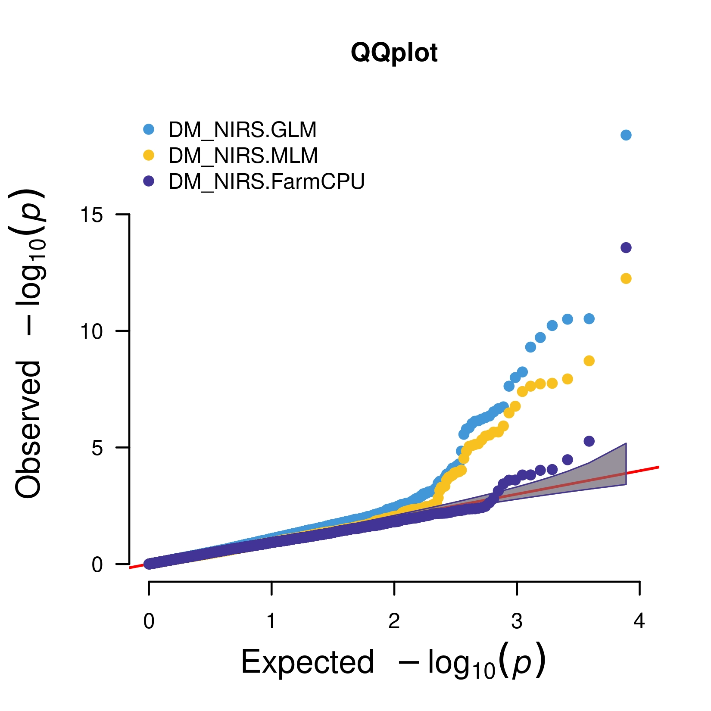
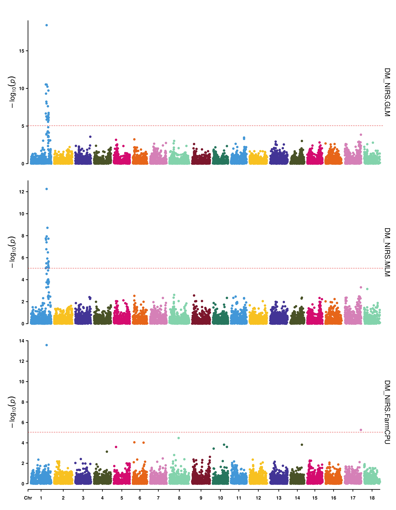
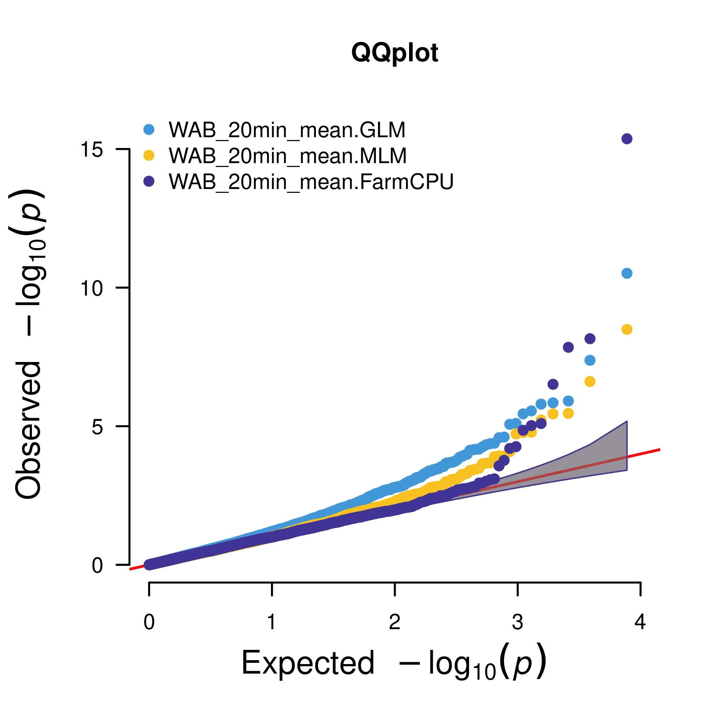
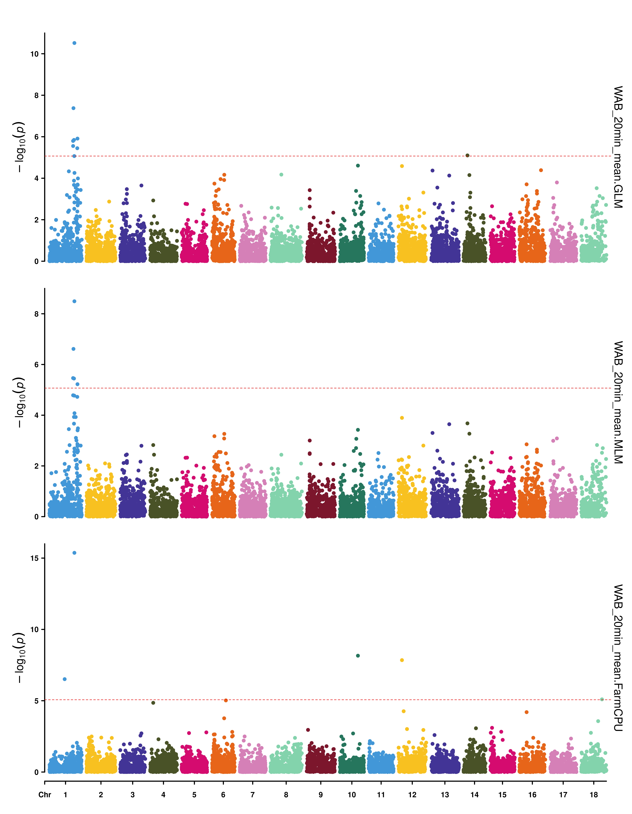
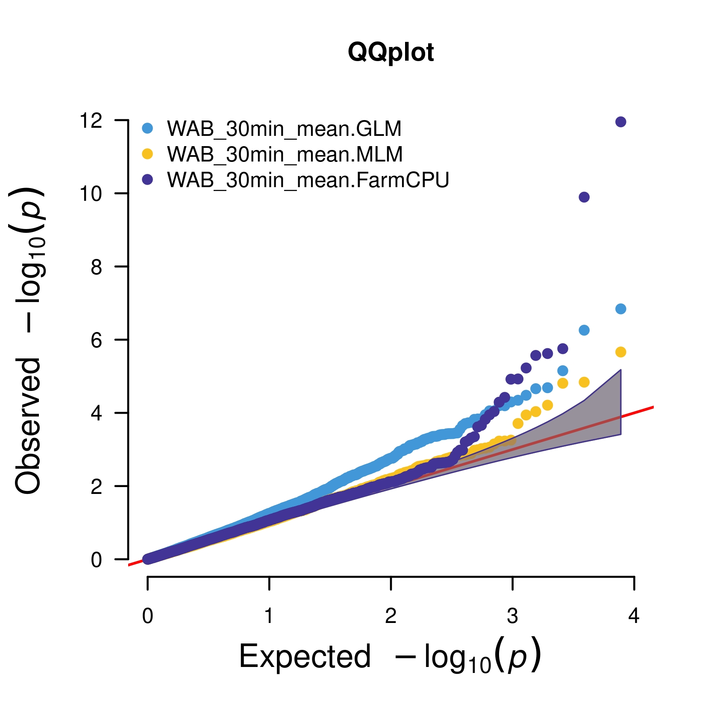

```{r setup, include = FALSE}
knitr::opts_chunk$set(echo = TRUE)
```

# Installing R Packages:

```{r, eval = FALSE}
install.packages(c("tidyverse", "sommer", "PerformanceAnalytics", "vcfR", 
                   "onemap", "devtools", "ggplot2", "statgenGWAS", "bigmemory", 
                   "RColorBrewer", "factoextra", "rMVP"))
devtools::install_github("augusto-garcia/fullsibQTL")
```

# Loading R Packages:

```{r, message = FALSE}
library(tidyverse)
library(ggplot2)
library(sommer)
library(PerformanceAnalytics)
library(vcfR)
library(onemap)
library(fullsibQTL)
library(statgenGWAS)
library(bigmemory)
library(RColorBrewer)
library(factoextra)
library(rMVP)
```

# Introduction

This tutorial reports the phenotypic data analysis and genetic mapping for a Cassava population, which is part of the mapping current studies developed by the CIAT Breeding Program, Colombia. Our aim is to use this population to give a training on quantitative genetics to the CIAT Breeding Team. In general, the used population consists of 381 individuals belonging to five fullsib families, which were phenotyped for cooking quality traits. A total of seven parents were crossed to generate these five families: (i) SM3759-36 x VEN25; (ii) COL2246 x COL1722; (iii) COL1910 x SM3759-36; (iv) COL1910 x COL1505 (and its reciprocal COL1505 x COL1910); and (v) VEN208 x VEN25. Of the total number of individuals, four parents and 226 progenies were genotyped for 8,590,486 single nucleotide polymorphism (SNP) markers, distributed in the entire genome (18 chromosomes + scaffolds). Actually, this amount of markers were obtained for the considered population and also for a second population (370 individuals), which has been studied with the focus on beta-carotene trait. The latter population will not be analyzed in the present training, and its results will be discussed in specific meetings.

The present training is structured as follows: (i) phenotypic analysis of quality traits via mixed models, using three specific traits (DM_NIRS, WAB_20min_mean, and WAB_30min_mean) evaluated in four trials during years 2020 and 2021; (ii) construction of genetic linkage map for one of the five fullsib families (i.e, SM3759-36 x VEN25), which presented the larger amount of genotyped progenies ($n=49$) and both parents genotyped among all families; (iii) quantitative trait loci (QTL) mapping, via composite interval mapping (CIM), for the three considered cooking quality traits; and (iv) genome-wide association study (GWAS) for the same traits, considering all the five fullsib families and not only one of them. To perform mapping, we will explore a set of 9,000 SNP markers randomly collected from the total of markers obtained via genotyping. 

# Phenotypic Analyses via Mixed Models

## Data and Exploratory Analysis

```{r}
data.pheno <- read.csv("01_RTBfoods_progeny_2020_2021_4_env 2022-05-08.csv") 
head(data.pheno)
str(data.pheno)
data.pheno <- data.pheno %>% arrange(trial_harvest, rep_number, col_number, row_number, accession_name)
factors <- c("trial_harvest", "rep_number", "accession_name")
data.pheno[,factors] <- lapply(data.pheno[,factors], factor)
str(data.pheno)
table(data.pheno$trial_harvest)
colnames(data.pheno)
traits <- colnames(data.pheno)[9:30]
traits
```

Let's take a look of checks used in the trials:

```{r}
sort(table(data.pheno$accession_name))
```

The checks consist of seven fullsib parents and the individuals CR138 and PER183.

```{r}
table(data.pheno$check)
data.pheno$check[which(substr(data.pheno$accession_name, 1, 2) == "GM")] <- 0
data.pheno$check[which(substr(data.pheno$accession_name, 1, 2) != "GM")] <- 1
table(data.pheno$check)
data.pheno$pop <- abs(data.pheno$check - 1)
table(data.pheno$pop)
```


```{r, message = FALSE, fig.width = 10, fig.height = 7, dpi = 150}
long.data <- reshape2::melt(data.pheno, measure.vars = traits)
head(long.data)
ggplot(data = long.data, aes(x = trial_harvest, y = value)) + geom_boxplot() +
  geom_point(data = long.data %>% filter(check == 1), aes(color = accession_name), 
             position = "jitter", alpha = 0.5) +
  facet_wrap(~ variable, scales = "free_y", nrow = 3) + theme_bw() +
  theme(axis.text.x = element_text(angle = 90, hjust = 1), legend.position = "bottom")
```


```{r, message = FALSE, fig.width = 10, fig.height = 5, dpi = 150}
traits <- traits[-c(1:9)]
long.data <- long.data %>% filter(variable %in% traits)
long.data$variable <- factor(long.data$variable, levels = traits)
head(long.data)
ggplot(data = long.data, aes(x = trial_harvest, y = value)) +
  geom_boxplot() + geom_point(data = long.data %>% filter(check == 1), aes(color = accession_name), 
                              position = "jitter", alpha = 0.5) +
  facet_wrap(~ variable, scales = "free_y", nrow = 2) + theme_bw() +
  theme(axis.text.x = element_text(angle = 90, hjust = 1), legend.position = "bottom")
```

## Mixed Model Analysis

For the selected traits (DM_NIRS, WAB_20min_mean, and WAB_30min_mean), the mixed model below will be fitted to estimate: (i) variance components, (ii) broad-sense heritability (plant level), and (iii) predictions. Genetic correlations will be also estimated using the predictions. Additionally, the genetic effects will be declared as a fixed term in the model, and the BLUEs of individuals will actually be explored for genetic mapping. The aim is to avoid double shrinkage due to the inclusion of random genetic effects specifically in the GWAS model. 

$$y_{ij} = \mu + t_j + g_i + f(r,c) + \varepsilon_{ij}$$
where 
$y_{ij}$ is the phenotypic observation of genotype $i$ in trial $j$, 
$t_j$ is the fixed effect of trial $j$ ($j=1,\dots,J$; $J=4$),
$g_i$ is the effect of genotype $i$ separated into random effects of progenies ($i=1,\dots,I_g$; $I_g=381$, with $g_i \sim N(0, \sigma^2_g)$, and fixed effects of parental checks ($i=I_g+1,\dots,I_g+I_c$; $I_c=9$, 
$f(r,c)$ is the random effect of irregular trends considering the row and column levels, and 
$\varepsilon_{ij}$ is the residual random error with $\varepsilon_{ij} \sim N(0, \sigma^2)$.

### DM_NIRS

```{r, message = FALSE}
model.DM <- mmer(DM_NIRS ~ trial_harvest + check:accession_name,
                 random = ~ pop:accession_name + spl2Da(row_number, col_number, at.var = trial_harvest),
                 rcov = ~ vsr(dsr(trial_harvest), units), dateWarning = FALSE, date.warning = FALSE,
                 data = data.pheno, verbose = TRUE)
summary(model.DM)
coef.mmer(model.DM)
summary(model.DM)$varcomp
suppressWarnings(plot(model.DM))
BLUPs.DM <- coef.mmer(model.DM)$Estimate[1] + randef(model.DM)[[1]]$DM_NIRS
head(BLUPs.DM, 10)
length(BLUPs.DM)
heritability.DM <- vpredict(model.DM, h2 ~ (V1) / (V1 + (V6+V7+V8+V9)/4))
heritability.DM
```

## WAB_20min_mean

```{r}
model.WAB20 <- mmer(WAB_20min_mean ~ trial_harvest + check:accession_name,
                    random = ~ pop:accession_name + spl2Da(row_number, col_number, at.var = trial_harvest),
                    rcov = ~ vsr(dsr(trial_harvest), units), dateWarning = FALSE, date.warning = FALSE,
                    data = data.pheno, verbose = TRUE)
summary(model.WAB20)
coef.mmer(model.WAB20)
summary(model.WAB20)$varcomp
suppressWarnings(plot(model.WAB20))
BLUPs.WAB20 <- coef.mmer(model.WAB20)$Estimate[1] + randef(model.WAB20)[[1]]$WAB_20min_mean
head(BLUPs.WAB20, 10)
length(BLUPs.WAB20)
heritability.WAB20 <- vpredict(model.WAB20, h2 ~ (V1) / (V1 + (V6+V7+V8+V9)/4))
heritability.WAB20
```

## WAB_30min_mean

```{r, message = FALSE}
model.WAB30 <- mmer(WAB_30min_mean ~ trial_harvest + check:accession_name,
                    random = ~ pop:accession_name + spl2Da(row_number, col_number, at.var = trial_harvest),
                    rcov = ~ vsr(dsr(trial_harvest), units), dateWarning = FALSE, date.warning = FALSE,
                    data = data.pheno, verbose = TRUE)
summary(model.WAB30)
coef.mmer(model.WAB30)
summary(model.WAB30)$varcomp
suppressWarnings(plot(model.WAB30))
BLUPs.WAB30 <- coef.mmer(model.WAB30)$Estimate[1] + randef(model.WAB30)[[1]]$WAB_30min_mean
head(BLUPs.WAB30, 10)
length(BLUPs.WAB30)
heritability.WAB30 <- vpredict(model.WAB30, h2 ~ (V1) / (V1 + (V6+V7+V8+V9)/4))
heritability.WAB30
```


```{r}
heritability <- rbind(heritability.DM, heritability.WAB20, heritability.WAB30)
rownames(heritability) <- c("DM_NIRS", "WAB_20min_mean", "WAB_30min_mean")
knitr::kable(heritability)
```


```{r, message = FALSE, fig.width = 10, fig.height = 5, dpi = 150}
BLUPs.DM.WAB20.WAB30 <- cbind(BLUPs.DM, BLUPs.WAB20, BLUPs.WAB30)
head(BLUPs.DM.WAB20.WAB30, 10)
colnames(BLUPs.DM.WAB20.WAB30) <- c("DM_NIRS", "WAB_20min_mean", "WAB_30min_mean")
correlation <- cor(BLUPs.DM.WAB20.WAB30)
correlation
suppressWarnings(chart.Correlation(BLUPs.DM.WAB20.WAB30, histogram = TRUE, method = "pearson"))
```

# Genetic Linkage Map

As it was said in the introductory section, we will build a genetic linkage map for one of the five fullsib families, which constitute the first population of Cassava. Let's load the VCF file containing the sample of 9,000 markers and the individuals of both populations:

```{r}
vcf.file.P1.P2 <- read.vcfR(file = "samplesnp_1.vcf.gz", verbose = TRUE)
head(vcf.file.P1.P2)
```

To select one of the fullsib families for linkage map, we need to load the information from population and pedigree of the genotyped individuals: 

```{r}
indiv.vcf <- read.csv(file = "Indiv_VCF_File_Info_Pop_Family.csv", header = TRUE)
head(indiv.vcf)
table(indiv.vcf$Population)
P1 <- which(indiv.vcf$Population == "P1")
Pr <- which(indiv.vcf$Population == "Parents")
indiv.vcf.P1 <- indiv.vcf[c(P1, Pr),]
table(indiv.vcf.P1$Population)
```

Let's save the individuals from the first population:

```{r}
corresp.P1 <- colnames(vcf.file.P1.P2@gt) %in% indiv.vcf.P1$Indiv_VCF
columns.to.keep <- c(1,which(corresp.P1 == TRUE))
vcf.file.P1 <- vcf.file.P1.P2 # to get the vcf structure
vcf.file.P1@gt <- vcf.file.P1@gt[,columns.to.keep] 
dim(vcf.file.P1@gt) # 227 + 13
```

Checking the amount of individuals for each fullsib family:

```{r}
number.of.crosses <- rep(NA, times = length(colnames(vcf.file.P1@gt)))
for(i in 2:length(colnames(vcf.file.P1@gt)))
{
  name.break <- unlist(strsplit(colnames(vcf.file.P1@gt)[i], split = ""))
  if(any(which(name.break == "-")))
  {
    number.of.crosses[i] <- paste(name.break[(which(name.break == "-")-3):(which(name.break == "-")-1)], 
                                  collapse = "")
  }
  else
    number.of.crosses[i] <- paste(name.break[(which(name.break == "_")[2] + 1):(length(name.break))], 
                                  collapse = "")
}
table(number.of.crosses)
```

The number 759 above corresponds to the parent SM3759-36. Based on the number of progenies genotyped and the available parents, we will build a genetic linkage map for the fullsib family 159 (SM3759-36 x VEN25). It has 49 individuals and both parents were also genotyped for SNP markers, what was not observed for the other families, except 174 ($n=44$). As we need the parents configuration for estimating linkage phases, we will explore the data from family 159, containing the maximum number of individuals.

```{r}
F159 <- sort(c(which(number.of.crosses == "159"),
               which(number.of.crosses == "759"),
               which(number.of.crosses == "VEN25")[1])) # first sample of the four available.
length(F159) # 49 individuals + 2 parents.
```


```{r}
vcf.file.P1.F159 <- vcf.file.P1
vcf.file.P1.F159@gt <- vcf.file.P1.F159@gt[,c(1,F159)]
dim(vcf.file.P1.F159@gt) # 49 individuals + 2 parents + FORMAT
```

Since we have created the VCF file for the family 159 (SM3759-36 x VEN25), it is possible to read it using the R package `onemap`:

```{r}
data.geno.F159 <- onemap_read_vcfR(vcfR.object = vcf.file.P1.F159, cross = "outcross", 
                                   parent1 = "202023_131_SM3759-36", parent2 = "202023_120_VEN25", 
                                   only_biallelic = TRUE, verbose = TRUE)
```

Checking the markers and their segregation types:

```{r, fig.width = 10, fig.height = 7, dpi = 150}
plot(data.geno.F159)
plot(data.geno.F159, all = FALSE)
```

As showed above, `onemap` has filtered the fullsib family data for the informative SNP markers. Thus, we can use their information of segregation type and coded genotypes to create a new file (extension `.raw`), which is needed to perform QTL mapping via `fullsibQTL`. This file was created out of this tutorial, and to accelerate the construction of linkage map, we have selected a subset of 3,200 SNP markers (out of 3,897). The R codes for this step are not shown here. But, users can take a look into the `.raw` file and check the structure of this.

Since the `.raw` file was created and saved in the current directory, it is possible to read it via `onemap`:

```{r}
data.geno.F159 <- read_onemap(inputfile = "vcf_file_mapping.raw")
data.geno.F159
```

Filtering for 25\% of missing data:

```{r}
data.geno.F159.filtered <- filter_missing(data.geno.F159, threshold = 0.25)
```

Segregation test:

```{r}
segregation <- test_segregation(data.geno.F159.filtered)
head(print(segregation))
plot(segregation)
distorted.markers <- select_segreg(segregation, distorted = TRUE, numbers = FALSE, threshold = 0.05)
distorted.markers
length(distorted.markers)
no.distorted.markers <- select_segreg(segregation, distorted = FALSE, numbers = FALSE, threshold = 0.05)
length(no.distorted.markers)
```

For this moment, we will not remove distorted SNP markers to build the linkage map. Usually, they are initially removed and the map is built only with non-distorted markers. With an acceptable map for each linkage group, the distorted markers are tried to be included into their group (one-by-one), which can extend to be more saturated.

```{r}
set_map_fun(type = "kosambi")
```

Recombination fraction estimation via two-point approach:

```{r}
twopts <- rf_2pts(data.geno.F159.filtered)
```

To build the linkage map, we will consider the Cassava reference genome. In this sense, the linkage groups and the orders of molecular markers will be defined considering the chromosome and position information, which were already registered in the input file. Therefore, for each of the chromosomes and its order, we will only update the linkage phase and recombination fraction estimates via multipoint approach, which considers the use of hidden Markov models (HMM) to build the final linkage map.

```{r, eval = FALSE}
CHR.map.cassava <- list()
for(i in 1:length(unique(data.geno$CHROM)))
{
  print(i)
  CHR.temp <- make_seq(twopts, sort(unique(data.geno$CHROM))[i])
  CHR.map.cassava[[i]] <- map(CHR.temp, tol = 1e-03, verbose = TRUE, rm_unlinked = FALSE, global_error = 0.15)
}
save(CHR.map.cassava, file = "CHR_Map_Cassava.RData")
```


```{r}
load(file = "CHR_Map_Cassava.RData")
```

As an example, let's print the heatmaps of the chromosomes 1, 6, and 17. Usually, they are used as diagnostics to check the map for inconsistencies.

```{r, fig.width = 10, fig.height = 7, dpi = 150}
print(rf_graph_table(CHR.map.cassava[[1]], mrk.axis = "numbers"))

print(rf_graph_table(CHR.map.cassava[[6]], mrk.axis = "numbers"))

print(rf_graph_table(CHR.map.cassava[[17]], mrk.axis = "numbers"))
```

# QTL Mapping

For QTL mapping, we are going to use an extension of the traditional composite interval mapping (CIM), proposed by Zeng (1993). This extension was specifically developed for outcrossing populations, following the model and procedures described by Gazaffi et al. (2014).

Initially, we need to calculate the QTL conditional probabilities for each 1 cM along the map. 

```{r}
fsib.F159 <- create_fullsib(data.geno.F159, map.list = CHR.map.cassava, 
                            step = 1, map.function = "kosambi")
fsib.F159
```


```{r, echo = FALSE}
`%||%` <- function (x, y) {if (is.null(x)) y else x}
```

The first step is to select markers which will be included as cofactors in the QTL model. As it was seen in the theory, they are used to control putative QTL from other intervals, which would be considered as `ghost` QTL. The selection of cofactors is performed using variable selection methods and criteria for model comparison, and the number of markers cannot be excessive ($2\sqrt(n)$) in the model to avoid its super-parametrization.

With the inclusion of cofactors in the model, and definition of a windows size underlying the marker intervals, we can do a genome scan for every cM. LOD profiles will be obtained. However, a threshold should be calculated and defined to detect QTL. Using the R package `fullsibQTL`, a permutation test could be used.

## DM_NIRS:

Cofactor selection:

```{r, fig.width = 10, fig.height = 7, dpi = 150}
cofs.fs.1 <- cof_selection(fsib.F159, pheno.col = 1, k = 2, n.cofactor = 10)
plot(cofs.fs.1)
```

Genome scan:

```{r, fig.width = 10, fig.height = 7, dpi = 150}
cim.1 <- cim_scan(fullsib = cofs.fs.1, lg = "all", ws = 10, pheno.col = 1, LOD = TRUE)
plot(cim.1, col = "red")
```

Permutation test:

```{r, eval = FALSE}
cim.perm.1 <- cim_scan(fullsib = cofs_fs, lg = "all", pheno.col = 1, LOD = TRUE, n.perm = 1000,
                       write.perm = "CIM_Permutations_DM_NIRS.txt")
save(cim.perm.1, file = "CIM_Permutations_DM_NIRS.RData")
```


```{r}
load(file = "CIM_Permutations_DM_NIRS.RData")
```


```{r}
summary(cim.perm.1, alpha = 0.05)
```


```{r, fig.width = 10, fig.height = 7, dpi = 150}
plot(cim.1, lty = 1, lwd = 2, incl.mkr = NULL, cex.incl = 0.7, 
     cex.axis = 0.8, col = "red", ylab = "LOD Score", xlab = "Linkage Group", 
     main = "CIM - DM_NIRS")
abline(h = summary(cim.perm.1, alpha = 0.05)[1,2], col = "blue")
```

As we can see, there is evidence of a putative QTL in the chromosome 1 for DM_NIRS. Let's check if it was placed in any position between two possible SNP markers or exactly in the position of one SNP.

```{r}
head(summary(cim.1))
```

The putative QTL is located at the position of the SNP `chr01_32613009`. We can print its effects:

```{r}
cim.1.QTL <- cim_char(fullsib = cofs.fs.1, lg = 1, pheno.col = 1, pos = "chr01_32613009")
cim.1.QTL
```

Only the additive effect of the parent `p` ($\alpha_{p} = 4.34$) was statistically significant based on the LOD score statistics ($LOD_{H1} = 21.96$), considering a significance level of $5\%$. The parent `p` is the genotype `SM3759-36`, which is classified as a good parent for cooking quality.

QTL segregation:

```{r}
get_segr(cim.1.QTL, probs1 = 0.05, probs2 = 0.05)
```

Map with QTL:

```{r}
cim.1.QTL.draw <- draw_phase(fullsib = cofs.fs.1, fullsib.char = cim.1.QTL)
cim.1.QTL.draw
```

Proportion of variation explained by the QTL:

```{r}
cim.1.QTL.prop <- r2_ls(fsib.F159, pheno.col = 1, lg = 1, pos = "chr01_32613009")
cim.1.QTL.prop
```

The putative QTL located at the position of SNP `chr01_32613009` explains $62.64\%$ of DM_NIRS variation in the background of fullsib family 159 (SM3759-36 x VEN25).

## WAB_20min_mean:

Cofactor selection:

```{r, fig.width = 10, fig.height = 7, dpi = 150}
cofs.fs.2 <- cof_selection(fsib.F159, pheno.col = 2, k = 2, n.cofactor = 10)
plot(cofs.fs.2)
```

Genome scan:

```{r, fig.width = 10, fig.height = 7, dpi = 150}
cim.2 <- cim_scan(fullsib = cofs.fs.2, lg = "all", ws = 10, pheno.col = 2, LOD = TRUE)
plot(cim.2, col = "red", ylim = c(0,20))
```

Permutation test:

```{r, eval = FALSE}
cim.perm.2 <- cim_scan(fullsib = cofs.fs.2, lg = "all", pheno.col = 2, LOD = TRUE, n.perm = 1000,
                       write.perm = "CIM_Permutations_WAB_20min_mean.txt")
save(cim.perm.2, file = "CIM_Permutations_WAB_20min_mean.RData")
```


```{r}
load(file = "CIM_Permutations_WAB_20min_mean.RData")
```


```{r}
summary(cim.perm.2, alpha = 0.05)
```


```{r, fig.width = 10, fig.height = 7, dpi = 150}
plot(cim.2, lty = 1, lwd = 2, incl.mkr = NULL, cex.incl = 0.7, 
     cex.axis = 0.8, col = "red", ylab = "LOD Score", xlab = "Linkage Group", 
     main = "CIM - WAB_20min_mean", ylim = c(0,20))
abline(h = summary(cim.perm.2, alpha = 0.05)[1,2], col = "blue")
```

As we can see, there is evidence of putative QTL in the chromosomes 4 and 15 for WAB_20min_mean. Let's check if it was placed in any position between two possible SNP markers or exactly in the position of one SNP.

```{r}
head(summary(cim.2), 15)
```

Both putative QTL are located at the position between markers (`loc182` and `loc797` for 4 and 15, respectively). We can print their effects:

```{r}
cim.2.QTL.1 <- cim_char(fullsib = cofs.fs.2, lg = 4, pheno.col = 2, pos = "loc182")
cim.2.QTL.1
```

The putative QTL in the chromosome 4 is located between the SNP markers `chr04_2114468` and `chr04_2206358`. Its effect in the phenotypic variation of WAB_20min_mean is due to three statistically significant genetic effects: additive effects of the parents `p` ($\alpha_{p} = -0.075$) and `q` ($\alpha_{q} = -0.273$) and dominance effect involving the alleles of both parents ($\delta_{pq} = -0.438$). As we can see, the present QTL contributes to a reduction of the phenotypic values regarding the trait WAB_20min_mean.

```{r}
cim.2.QTL.2 <- cim_char(fullsib = cofs.fs.2, lg = 15, pheno.col = 2, pos = "loc797")
cim.2.QTL.2
```

As it was verified to the QTL on chr4, the putative QTL located in the chr15 also presented three statistically significant genetic effects: additive effects of the parents `p` ($\alpha_{p} = 0.432$) and `q` ($\alpha_{q} = -0.276$) and dominance effect involving the alleles of both parents ($\delta_{pq} = 0.077$). However, while the parent `q` (VEN25) contributes to a reduction of the phenotypic values for the trait WAB_20min_mean, the parent `p` (SM3759-36) contributes to a increase of the phenotypic values. Moreover, the variation of this trait also can be explained by the dominance effect between the alleles of both parents. 

QTL segregation:

```{r}
get_segr(cim.2.QTL.1, probs1 = 0.05, probs2 = 0.05)

get_segr(cim.2.QTL.2, probs1 = 0.05, probs2 = 0.05)
```

Map with QTL:

```{r}
cim.2.QTL.1.draw <- draw_phase(fullsib = cofs.fs.2, fullsib.char = cim.2.QTL.1)
cim.2.QTL.1.draw

cim.2.QTL.2.draw <- draw_phase(fullsib = cofs.fs.2, fullsib.char = cim.2.QTL.2)
cim.2.QTL.2.draw
```

Proportion of variation explained by the QTL:

```{r}
cim.2.QTL.1.prop <- r2_ls(fsib.F159, pheno.col = 2, lg = 4, pos = "loc182")
cim.2.QTL.1.prop

cim.2.QTL.2.prop <- r2_ls(fsib.F159, pheno.col = 2, lg = 15, pos = "loc797")
cim.2.QTL.2.prop
```

The putative QTL located in the chromosomes 4 and 15 explain $17.06\%$ and $11.95\%$ of WAB_20min_mean variation in the background of fullsib family 159 (SM3759-36 x VEN25).

## WAB_30min_mean:

Cofactor selection:

```{r, fig.width = 10, fig.height = 7, dpi = 150}
cofs.fs.3 <- cof_selection(fsib.F159, pheno.col = 3, k = 2, n.cofactor = 10)
plot(cofs.fs.3)
```

Genome scan:

```{r, fig.width = 10, fig.height = 7, dpi = 150}
cim.3 <- cim_scan(fullsib = cofs.fs.3, lg = "all", ws = 10, pheno.col = 3, LOD = TRUE)
plot(cim.3, col = "red", ylim = c(0,20))
```

Permutation test:

```{r, eval = FALSE}
cim.perm.3 <- cim_scan(fullsib = cofs.fs.3, lg = "all", pheno.col = 3, LOD = TRUE, n.perm = 1000,
                       write.perm = "CIM_Permutations_WAB_30min_mean.txt")
save(cim.perm.3, file = "CIM_Permutations_WAB_30min_mean.RData")
```


```{r}
load(file = "CIM_Permutations_WAB_30min_mean.RData")
```


```{r}
summary(cim.perm.3, alpha = 0.05)
```


```{r, fig.width = 10, fig.height = 7, dpi = 150}
plot(cim.3, lty = 1, lwd = 2, incl.mkr = NULL, cex.incl = 0.7, 
     cex.axis = 0.8, col = "red", ylab = "LOD Score", xlab = "Linkage Group", 
     main = "CIM - WAB_30min_mean", ylim = c(0,20))
abline(h = summary(cim.perm.3, alpha = 0.05)[1,2], col = "blue")
```

As we can see, no QTL was detected for the trait WAB_30min_mean in the fullsib family 159 (SM3759-36 x VEN25).

# Genome-Wide Association Study (GWAS)

To perform association mapping, we need to extract the genotypic data from the original VCF file:

```{r}
vcf.file.P1.geno <- extract.gt(vcf.file.P1, element = "GT", as.numeric = FALSE, return.alleles = FALSE,
                               IDtoRowNames = TRUE, extract = TRUE, convertNA = FALSE)
vcf.file.P1.geno[1:5,1:5]
vcf.file.P1.geno <- apply(vcf.file.P1.geno, 2, function(x) unlist(lapply(strsplit(x, split = ""), 
                                                                         function(y) paste(y[c(1,3)], 
                                                                                           collapse = ""))))
for(i in 1:nrow(vcf.file.P1.geno))
{
  vcf.file.P1.geno[i,][which(vcf.file.P1.geno[i,] == "..")] <- NA
}
vcf.file.P1.geno[1:5,1:5]
```

Let's check which genotypes were really phenotyped for the traits and only use them to perform GWAS:

```{r}
BLUEs.DM.WAB <- read.csv(file = "BLUEs_DM_WAB.csv", header = TRUE)
head(BLUEs.DM.WAB)
```


```{r}
corresp <- colnames(vcf.file.P1.geno) %in% BLUEs.DM.WAB$genotype
vcf.file.P1.geno.DM.WAB <- vcf.file.P1.geno[,which(corresp == TRUE)]
dim(vcf.file.P1.geno.DM.WAB)
```

Since we will use a numeric format (0, 1, 2) for the genotypic data, it is need to convert the original data from a VCF file. The users can transform the data by their own and also filter them for some parameters, such as minor allele frequency (MAF), number of genotypes and markers to be considered following some proportion of missing data, and so on. Moreover, a imputation can be done for missing data. For now, we will transform and filter genotypic data for the numeric format using the R package `statgenGWAS`.

```{r}
# Geno:
vcf.file.P1.geno.DM.WAB <- t(vcf.file.P1.geno.DM.WAB)
dim(vcf.file.P1.geno.DM.WAB)
vcf.file.P1.geno.DM.WAB[1:5,1:5]
vcf.file.P1.geno.DM.WAB <- vcf.file.P1.geno.DM.WAB[,order(colnames(vcf.file.P1.geno.DM.WAB))]
vcf.file.P1.geno.DM.WAB[1:5,1:5]
```


```{r}
# Map:
spliting.names <- strsplit(colnames(vcf.file.P1.geno.DM.WAB), split = "")
chr <- unlist(lapply(spliting.names, function(x) paste(x[(which(x == "_")-2):(which(x == "_")-1)],
                                                       collapse = "")))
pos <- unlist(lapply(spliting.names, function(x) paste(x[(which(x == "_")+1):(length(x))],
                                                       collapse = "")))
table(chr)
map <- data.frame(chr = chr, pos = pos)
head(map)
dim(map)
rownames(map) <- colnames(vcf.file.P1.geno.DM.WAB)
head(map)
str(map)
map$pos <- as.numeric(map$pos)
```


```{r}
cassava.data <- createGData(geno = vcf.file.P1.geno.DM.WAB, map = map)
```


```{r}
cassava.data.coded <- codeMarkers(gData = cassava.data, refAll = rep("0", times = ncol(vcf.file.P1.geno.DM.WAB)),
                                  nMissGeno = 0.40, nMiss = 0.50, impute = TRUE, imputeType = "fixed", fixedValue = 1,
                                  MAF = 0.05, removeDuplicates = TRUE, verbose = TRUE)
```

With the genotypic data in numeric format, we can prepare the files for running GWAS in the R package `rMVP`.

```{r}
# Geno:
data.for.rMVP <- cassava.data.coded$markers
dim(data.for.rMVP)
data.for.rMVP[1:5,1:5]
data.for.rMVP <- t(data.for.rMVP)
dim(data.for.rMVP)
data.for.rMVP[1:5,1:5]
```


```{r}
# Map:
map.for.rMVP <- map
dim(map.for.rMVP)
head(map.for.rMVP)
map.for.rMVP$Pos <- map.for.rMVP$pos
map.for.rMVP <- map.for.rMVP[,-2]
map.for.rMVP$SNP <- rownames(map.for.rMVP)
map.for.rMVP <- map.for.rMVP[rownames(data.for.rMVP),]
rownames(map.for.rMVP) <- 1:nrow(map.for.rMVP)
colnames(map.for.rMVP)[1] <- "Chr"
map.for.rMVP <- map.for.rMVP[,c("SNP","Chr","Pos")]
head(map.for.rMVP)
str(map.for.rMVP)
dim(map.for.rMVP)
```


```{r}
write.table(map.for.rMVP, file = "Map_For_rMVP.txt", row.names = FALSE, sep = "\t")
```

For a suitable reading of data from R package `rMVP`, it is needed to save the file as a big matrix:

```{r}
data.for.rMVP <- as.matrix(data.for.rMVP)
data.for.rMVP[1:5,1:5]
data.for.rMVP <- as.big.matrix(data.for.rMVP)
data.for.rMVP[1:5,1:5]
```


```{r}
write.big.matrix(data.for.rMVP, file = "Data_For_rMVP.txt", row.names = FALSE, sep = "\t")
```

Preparing files in the R package `rMVP` for run GWAS:

```{r}
MVP.Data(fileNum = "Data_For_rMVP.txt", filePhe = "BLUEs_DM_WAB.csv", fileMap = "Map_For_rMVP.txt",
         sep.num = "\t", sep.phe = ",", sep.map = "\t", SNP.impute = NULL, fileKin = FALSE, filePC = FALSE, 
         out = "mvp", priority = "speed", verbose = TRUE)
MVP.Data.Kin(fileKin = TRUE, sep = "\t", mvp_prefix = "mvp", out = "mvp",
             priority = "speed", verbose = TRUE)
MVP.Data.PC(filePC = TRUE, sep = "\t", pcs.keep = 5, mvp_prefix = "mvp", out = "mvp", 
            priority = "speed", verbose = TRUE)
```

Let's load the files created by R package `rMVP` in the current directory:

```{r}
genotype <- attach.big.matrix("mvp.geno.desc")
phenotype <- read.table("mvp.phe", head = TRUE)
map <- read.table("mvp.geno.map", head = TRUE)
kinship <- attach.big.matrix("mvp.kin.desc")
```

## Genomic-based Relationship Matrix (K Matrix)

```{r, fig.width = 10, fig.height = 7, dpi = 150}
kinship.plot <- MVP.K.VanRaden(M = genotype, priority = "speed", cpu = 1, verbose = TRUE)
dim(kinship.plot)
kinship.plot[1:5,1:5]
rownames(kinship.plot) <- colnames(data.for.rMVP)
colnames(kinship.plot) <- colnames(data.for.rMVP)
heatmap(kinship.plot, Rowv = TRUE, Colv = TRUE)
```

## Population Structure (Q Matrix)

Although the R package `rMVP` will automatically create a PCA plot in the current directory, from the run of its GWAS function, we will build it by ourselves using the principal components calculated by `rMVP`. Thus, it will be possible to input and view the clustering patterns considering particular filtering, such as different fullsib families, which constitute the first population (P1):

```{r}
pca <- MVP.PCA(M = genotype, priority = "speed", pcs.keep = 5, cpu = 1, verbose = TRUE)
head(pca)
dim(pca)
rownames(pca) <- colnames(data.for.rMVP)
colnames(pca) <- c("PC1", "PC2", "PC3", "PC4", "PC5")
head(pca)
pca <- as.data.frame(pca)
indiv.vcf.P1.pca <- indiv.vcf.P1[which(indiv.vcf.P1$Indiv_VCF %in% rownames(pca) == TRUE),]
indiv.vcf.P1.pca <- indiv.vcf.P1.pca[order(indiv.vcf.P1.pca$Indiv_VCF),]
pca <- pca[order(rownames(pca)),]
head(cbind(indiv.vcf.P1.pca$Indiv_VCF, rownames(pca)), 20)
pca$Family <- indiv.vcf.P1.pca$Family
head(pca)
```


```{r, fig.width = 10, fig.height = 7, dpi = 150}
ggplot(pca, aes(PC1, PC2, colour = Family)) + geom_point(size = 4.0) +
  scale_color_manual(values = brewer.pal(n = 11, "Paired")) +
  xlab("PC1") + ylab("PC2") +
  theme(axis.text.x = element_text(angle = 90, size = 25.0),
        axis.text.y = element_text(size = 25.0),
        strip.text.x = element_text(size = 30.0, face = "bold"),
        strip.text.y = element_text(size = 30.0, face = "bold"),
        legend.title = element_text(size = 20),
        legend.text = element_text(size = 18)) +
        theme_bw()
```

Let's check the proportion explained by the first three principal components. We are going to run PCA again using the R function `prcomp`, because the function from `rMVP` does not provide the variance of these components.   

```{r}
prin.comp <- prcomp(kinship.plot, scale = TRUE)
eig <- get_eigenvalue(prin.comp)
round(sum(eig$variance.percent[1]),1)
round(sum(eig$variance.percent[2]),1)
round(sum(eig$variance.percent[1:3]),1)
```


```{r, fig.width = 10, fig.height = 7, dpi = 150}
fviz_eig(prin.comp)
```

## GWAS Analyses

Running GWAS analyses for the traits `DM_NIRS`, `WAB_20min_mean`, and `WAB_30min_mean`:

```{r}
GWAS.rMVP <- vector("list", ncol(phenotype)-1)
for(i in 2:ncol(phenotype))
{
  GWAS.rMVP[[i-1]] <- MVP(phe = phenotype[,c(1,i)],
                          geno = genotype,
                          map = map,
                          K = kinship,
                          nPC.GLM = 5,
                          nPC.MLM = 3,
                          nPC.FarmCPU = 3,
                          #CV.GLM = NULL,
                          #CV.MLM = NULL,
                          #CV.FarmCPU = NULL,
                          priority = "speed",
                          ncpus = 1,
                          vc.method = "BRENT",
                          maxLoop = 12,
                          method.bin = "static",
                          permutation.threshold = TRUE,
                          permutation.rep = 1000,
                          method = c("GLM","MLM","FarmCPU"),
                          file.output = c("pmap","pmap.signal","plot","log"),
                          verbose = FALSE)
}
save(GWAS.rMVP, file = "GWAS_rMVP.RData")
```

Density Plot:

```{r, echo = FALSE, out.width = "100%"}
knitr::include_graphics("DM_NIRS.GLM.DM_NIRS.MLM.DM_NIRS.FarmCPU.SNP-Density.jpg")
```

Let's investigate the GWAS results for the traits `DM_NIRS`, `WAB_20min_mean`, and `WAB_30min_mean`, which were also considered for QTL mapping.

### DM_NIRS:

QQplot of GWAS models for DM_NIRS:

```{r, echo = FALSE, out.width = "100%"}

```

Manhattan Plot of GWAS models for DM_NIRS:

```{r, echo = FALSE, out.width = "100%"}

```

Statistically significant SNPs additive effects for DM_NIRS:

```{r}
DM.NIRS.GLM.signals <- read.csv(file = "DM_NIRS.GLM_signals.csv", header = TRUE)
DM.NIRS.GLM.signals
DM.NIRS.MLM.signals <- read.csv(file = "DM_NIRS.MLM_signals.csv", header = TRUE)
DM.NIRS.MLM.signals
DM.NIRS.FarmCPU.signals <- read.csv(file = "DM_NIRS.FarmCPU_signals.csv", header = TRUE)
DM.NIRS.FarmCPU.signals
```

### WAB_20min_mean:

QQplot of GWAS models for WAB_20min_mean:

```{r, echo = FALSE, out.width = "100%"}

```

Manhattan Plot of GWAS models for WAB_20min_mean:

```{r, echo = FALSE, out.width = "100%"}

```

Statistically significant SNPs additive effects for WAB_20min_mean:

```{r}
WAB.20min.mean.GLM.signals <- read.csv(file = "WAB_20min_mean.GLM_signals.csv", header = TRUE)
WAB.20min.mean.GLM.signals
WAB.20min.mean.MLM.signals <- read.csv(file = "WAB_20min_mean.MLM_signals.csv", header = TRUE)
WAB.20min.mean.MLM.signals
WAB.20min.mean.FarmCPU.signals <- read.csv(file = "WAB_20min_mean.FarmCPU_signals.csv", header = TRUE)
WAB.20min.mean.FarmCPU.signals
```

### WAB_30min_mean:

QQplot of GWAS models for WAB_30min_mean:

```{r, echo = FALSE, out.width = "100%"}

```

Manhattan Plot of GWAS models for WAB_30min_mean:

```{r, echo = FALSE, out.width = "100%"}
knitr::include_graphics("WAB_30min_mean.GLM.WAB_30min_mean.MLM.WAB_30min_mean.FarmCPU.Multracks-Manhattan.jpg")
```

Statistically significant SNPs additive effects for WAB_30min_mean:

```{r}
WAB.30min.mean.GLM.signals <- read.csv(file = "WAB_30min_mean.GLM_signals.csv", header = TRUE)
WAB.30min.mean.GLM.signals
WAB.30min.mean.MLM.signals <- read.csv(file = "WAB_30min_mean.MLM_signals.csv", header = TRUE)
WAB.30min.mean.MLM.signals
WAB.30min.mean.FarmCPU.signals <- read.csv(file = "WAB_30min_mean.FarmCPU_signals.csv", header = TRUE)
WAB.30min.mean.FarmCPU.signals
```