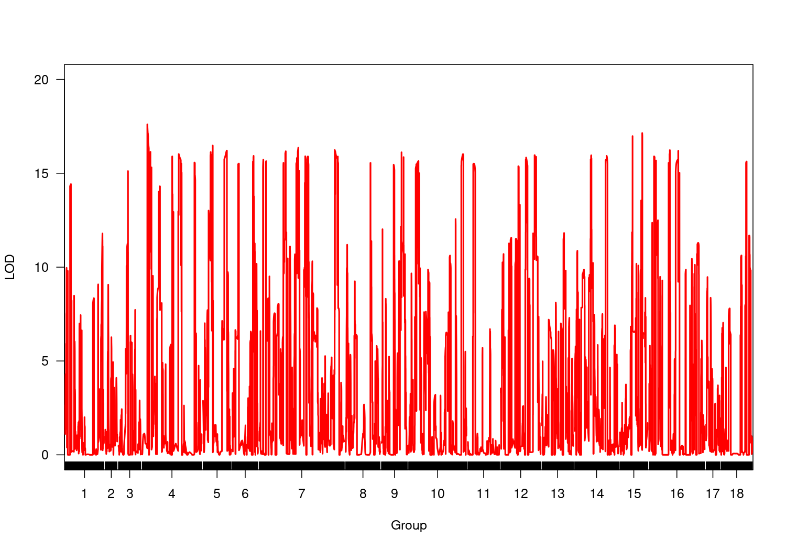
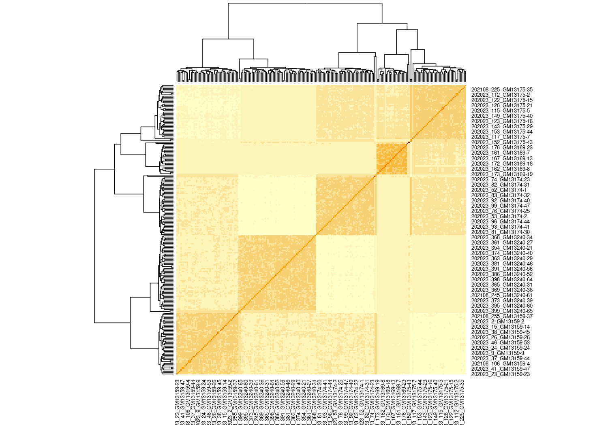

# Installing R Packages:


```r
install.packages(c("tidyverse", "sommer", "PerformanceAnalytics", "vcfR", 
                   "onemap", "devtools", "ggplot2", "statgenGWAS", "bigmemory", 
                   "RColorBrewer", "factoextra", "rMVP"))
devtools::install_github("augusto-garcia/fullsibQTL")
```

# Loading R Packages:


```r
library(tidyverse)
library(ggplot2)
library(sommer)
library(PerformanceAnalytics)
library(vcfR)
library(onemap)
library(fullsibQTL)
library(statgenGWAS)
library(bigmemory)
library(RColorBrewer)
library(factoextra)
library(rMVP)
```

# Introduction

This tutorial reports the phenotypic data analysis and genetic mapping for a Cassava population, which is part of the mapping current studies developed by the CIAT Breeding Program, Colombia. Our aim is to use this population to give a training on quantitative genetics to the CIAT Breeding Team. In general, the used population consists of 381 individuals belonging to five fullsib families, which were phenotyped for cooking quality traits. A total of seven parents were crossed to generate these five families: (i) SM3759-36 x VEN25; (ii) COL2246 x COL1722; (iii) COL1910 x SM3759-36; (iv) COL1910 x COL1505 (and its reciprocal COL1505 x COL1910); and (v) VEN208 x VEN25. Of the total number of individuals, four parents and 226 progenies were genotyped for 8,590,486 single nucleotide polymorphism (SNP) markers, distributed in the entire genome (18 chromosomes + scaffolds). Actually, this amount of markers were obtained for the considered population and also for a second population (370 individuals), which has been studied with the focus on beta-carotene trait. The latter population will not be analyzed in the present training, and its results will be discussed in specific meetings.

The present training is structured as follows: (i) phenotypic analysis of quality traits via mixed models, using three specific traits (DM_NIRS, WAB_20min_mean, and WAB_30min_mean) evaluated in four trials during years 2020 and 2021; (ii) construction of genetic linkage map for one of the five fullsib families (i.e, SM3759-36 x VEN25), which presented the larger amount of genotyped progenies ($n=49$) and both parents genotyped among all families; (iii) quantitative trait loci (QTL) mapping, via composite interval mapping (CIM), for the three considered cooking quality traits; and (iv) genome-wide association study (GWAS) for the same traits, considering all the five fullsib families and not only one of them. To perform mapping, we will explore a set of 9,000 SNP markers randomly collected from the total of markers obtained via genotyping. 

# Phenotypic Analyses via Mixed Models

## Data and Exploratory Analysis


```r
data.pheno <- read.csv("01_RTBfoods_progeny_2020_2021_4_env 2022-05-08.csv") 
head(data.pheno)
```

```
##                           plot_name trial_harvest plot_number rep_number
## 1 202002CQQU1_ciat_rep1_GM13159-1_1        D1_1st           1          1
## 2 202002CQQU1_ciat_rep1_GM13159-4_2        D1_1st           2          1
## 3 202002CQQU1_ciat_rep1_GM13159-6_3        D1_1st           3          1
## 4 202002CQQU1_ciat_rep1_GM13159-7_4        D1_1st           4          1
## 5 202002CQQU1_ciat_rep1_GM13159-8_5        D1_1st           5          1
## 6 202002CQQU1_ciat_rep1_GM13159-9_6        D1_1st           6          1
##   accession_name col_number row_number check number_germinated number_planted
## 1      GM13159-1          1          1    NA                 6              6
## 2      GM13159-4          1          2    NA                 5              4
## 3      GM13159-6          1          3    NA                 6              6
## 4      GM13159-7          1          4    NA                 4              4
## 5      GM13159-8          1          5    NA                 6              6
## 6      GM13159-9          1          6    NA                 5              5
##   germ_perc lodging vigor number_branch plant_type root_color root_type
## 1       100       1    NA             3          3          3         3
## 2       125       1    NA             4          3          3         3
## 3       100       1    NA             2          4          3         2
## 4       100       1    NA             4          3          3         2
## 5       100       1    NA             3          3          3         2
## 6       100       1    NA             2          4          3         3
##    DM_NIRS DM_oven_1 DM_oven_2 DM_oven_mean HCN_rep1 HCN_rep2 HCN_mean
## 1 40.97823  41.34744  41.46142     41.40443       NA       NA       NA
## 2 41.77826  42.61983  42.56000     42.58992       NA       NA       NA
## 3 45.29284  43.47788  43.66805     43.57296       NA       NA       NA
## 4 43.35637  42.63282  42.66809     42.65046       NA       NA       NA
## 5 43.76374  42.55326  43.01971     42.78648       NA       NA       NA
## 6 43.24713  42.48462  42.81179     42.64821       NA       NA       NA
##   WAB_20min_rep1 WAB_20min_rep2 WAB_20min_mean WAB_30min_rep1 WAB_30min_rep2
## 1       1.454041       1.746310       1.600175       3.451960       5.019413
## 2       1.811940       2.430337       2.121139       3.280565       3.582652
## 3       4.184988       4.113949       4.149469      12.017386      13.360680
## 4       2.244308       2.270785       2.257546       5.345699       5.129318
## 5       2.515546       2.367617       2.441581       5.016959       4.175153
## 6       2.202935       2.200254       2.201595       5.122711       4.359793
##   WAB_30min_mean
## 1       4.235686
## 2       3.431608
## 3      12.689033
## 4       5.237508
## 5       4.596056
## 6       4.741252
```

```r
str(data.pheno)
```

```
## 'data.frame':	1468 obs. of  30 variables:
##  $ plot_name        : chr  "202002CQQU1_ciat_rep1_GM13159-1_1" "202002CQQU1_ciat_rep1_GM13159-4_2" "202002CQQU1_ciat_rep1_GM13159-6_3" "202002CQQU1_ciat_rep1_GM13159-7_4" ...
##  $ trial_harvest    : chr  "D1_1st" "D1_1st" "D1_1st" "D1_1st" ...
##  $ plot_number      : int  1 2 3 4 5 6 7 8 9 10 ...
##  $ rep_number       : int  1 1 1 1 1 1 1 1 1 1 ...
##  $ accession_name   : chr  "GM13159-1" "GM13159-4" "GM13159-6" "GM13159-7" ...
##  $ col_number       : int  1 1 1 1 1 1 1 1 2 2 ...
##  $ row_number       : int  1 2 3 4 5 6 7 8 8 7 ...
##  $ check            : int  NA NA NA NA NA NA NA NA NA 1 ...
##  $ number_germinated: int  6 5 6 4 6 5 5 6 6 3 ...
##  $ number_planted   : int  6 4 6 4 6 5 6 6 6 6 ...
##  $ germ_perc        : num  100 125 100 100 100 ...
##  $ lodging          : int  1 1 1 1 1 1 1 1 1 1 ...
##  $ vigor            : int  NA NA NA NA NA NA NA NA NA NA ...
##  $ number_branch    : int  3 4 2 4 3 2 3 4 2 2 ...
##  $ plant_type       : int  3 3 4 3 3 4 4 4 3 5 ...
##  $ root_color       : int  3 3 3 3 3 3 2 3 3 3 ...
##  $ root_type        : int  3 3 2 2 2 3 2 3 3 5 ...
##  $ DM_NIRS          : num  41 41.8 45.3 43.4 43.8 ...
##  $ DM_oven_1        : num  41.3 42.6 43.5 42.6 42.6 ...
##  $ DM_oven_2        : num  41.5 42.6 43.7 42.7 43 ...
##  $ DM_oven_mean     : num  41.4 42.6 43.6 42.7 42.8 ...
##  $ HCN_rep1         : num  NA NA NA NA NA NA NA NA NA NA ...
##  $ HCN_rep2         : num  NA NA NA NA NA NA NA NA NA NA ...
##  $ HCN_mean         : num  NA NA NA NA NA NA NA NA NA NA ...
##  $ WAB_20min_rep1   : num  1.45 1.81 4.18 2.24 2.52 ...
##  $ WAB_20min_rep2   : num  1.75 2.43 4.11 2.27 2.37 ...
##  $ WAB_20min_mean   : num  1.6 2.12 4.15 2.26 2.44 ...
##  $ WAB_30min_rep1   : num  3.45 3.28 12.02 5.35 5.02 ...
##  $ WAB_30min_rep2   : num  5.02 3.58 13.36 5.13 4.18 ...
##  $ WAB_30min_mean   : num  4.24 3.43 12.69 5.24 4.6 ...
```

```r
data.pheno <- data.pheno %>% arrange(trial_harvest, rep_number, col_number, row_number, accession_name)
factors <- c("trial_harvest", "rep_number", "accession_name")
data.pheno[,factors] <- lapply(data.pheno[,factors], factor)
str(data.pheno)
```

```
## 'data.frame':	1468 obs. of  30 variables:
##  $ plot_name        : chr  "202002CQQU1_ciat_rep1_GM13159-1_1" "202002CQQU1_ciat_rep1_GM13159-4_2" "202002CQQU1_ciat_rep1_GM13159-6_3" "202002CQQU1_ciat_rep1_GM13159-7_4" ...
##  $ trial_harvest    : Factor w/ 4 levels "D1_1st","D1_2nd",..: 1 1 1 1 1 1 1 1 1 1 ...
##  $ plot_number      : int  1 2 3 4 5 6 7 8 16 15 ...
##  $ rep_number       : Factor w/ 9 levels "1","2","3","4",..: 1 1 1 1 1 1 1 1 1 1 ...
##  $ accession_name   : Factor w/ 390 levels "COL1505","COL1722",..: 6 36 55 56 57 58 8 9 16 15 ...
##  $ col_number       : int  1 1 1 1 1 1 1 1 2 2 ...
##  $ row_number       : int  1 2 3 4 5 6 7 8 1 2 ...
##  $ check            : int  NA NA NA NA NA NA NA NA NA NA ...
##  $ number_germinated: int  6 5 6 4 6 5 5 6 6 5 ...
##  $ number_planted   : int  6 4 6 4 6 5 6 6 6 6 ...
##  $ germ_perc        : num  100 125 100 100 100 ...
##  $ lodging          : int  1 1 1 1 1 1 1 1 1 1 ...
##  $ vigor            : int  NA NA NA NA NA NA NA NA NA NA ...
##  $ number_branch    : int  3 4 2 4 3 2 3 4 4 3 ...
##  $ plant_type       : int  3 3 4 3 3 4 4 4 3 3 ...
##  $ root_color       : int  3 3 3 3 3 3 2 3 3 3 ...
##  $ root_type        : int  3 3 2 2 2 3 2 3 3 3 ...
##  $ DM_NIRS          : num  41 41.8 45.3 43.4 43.8 ...
##  $ DM_oven_1        : num  41.3 42.6 43.5 42.6 42.6 ...
##  $ DM_oven_2        : num  41.5 42.6 43.7 42.7 43 ...
##  $ DM_oven_mean     : num  41.4 42.6 43.6 42.7 42.8 ...
##  $ HCN_rep1         : num  NA NA NA NA NA NA NA NA NA NA ...
##  $ HCN_rep2         : num  NA NA NA NA NA NA NA NA NA NA ...
##  $ HCN_mean         : num  NA NA NA NA NA NA NA NA NA NA ...
##  $ WAB_20min_rep1   : num  1.45 1.81 4.18 2.24 2.52 ...
##  $ WAB_20min_rep2   : num  1.75 2.43 4.11 2.27 2.37 ...
##  $ WAB_20min_mean   : num  1.6 2.12 4.15 2.26 2.44 ...
##  $ WAB_30min_rep1   : num  3.45 3.28 12.02 5.35 5.02 ...
##  $ WAB_30min_rep2   : num  5.02 3.58 13.36 5.13 4.18 ...
##  $ WAB_30min_mean   : num  4.24 3.43 12.69 5.24 4.6 ...
```

```r
table(data.pheno$trial_harvest)
```

```
## 
## D1_1st D1_2nd P1_1st P1_2nd 
##    334    334    400    400
```

```r
colnames(data.pheno)
```

```
##  [1] "plot_name"         "trial_harvest"     "plot_number"      
##  [4] "rep_number"        "accession_name"    "col_number"       
##  [7] "row_number"        "check"             "number_germinated"
## [10] "number_planted"    "germ_perc"         "lodging"          
## [13] "vigor"             "number_branch"     "plant_type"       
## [16] "root_color"        "root_type"         "DM_NIRS"          
## [19] "DM_oven_1"         "DM_oven_2"         "DM_oven_mean"     
## [22] "HCN_rep1"          "HCN_rep2"          "HCN_mean"         
## [25] "WAB_20min_rep1"    "WAB_20min_rep2"    "WAB_20min_mean"   
## [28] "WAB_30min_rep1"    "WAB_30min_rep2"    "WAB_30min_mean"
```

```r
traits <- colnames(data.pheno)[9:30]
traits
```

```
##  [1] "number_germinated" "number_planted"    "germ_perc"        
##  [4] "lodging"           "vigor"             "number_branch"    
##  [7] "plant_type"        "root_color"        "root_type"        
## [10] "DM_NIRS"           "DM_oven_1"         "DM_oven_2"        
## [13] "DM_oven_mean"      "HCN_rep1"          "HCN_rep2"         
## [16] "HCN_mean"          "WAB_20min_rep1"    "WAB_20min_rep2"   
## [19] "WAB_20min_mean"    "WAB_30min_rep1"    "WAB_30min_rep2"   
## [22] "WAB_30min_mean"
```

Let's take a look of checks used in the trials:


```r
sort(table(data.pheno$accession_name))
```

```
## 
##  GM13159-10  GM13159-15  GM13159-16   GM13159-2  GM13159-29   GM13159-3 
##           2           2           2           2           2           2 
##  GM13159-31  GM13159-34  GM13159-35  GM13159-37  GM13159-41  GM13159-42 
##           2           2           2           2           2           2 
##  GM13159-44  GM13159-45  GM13159-48   GM13159-5  GM13159-52   GM13169-1 
##           2           2           2           2           2           2 
##  GM13169-15  GM13169-20  GM13169-29   GM13169-4   GM13169-5  GM13174-25 
##           2           2           2           2           2           2 
##  GM13174-26  GM13174-52   GM13174-8  GM13175-10  GM13175-12  GM13175-13 
##           2           2           2           2           2           2 
##  GM13175-14  GM13175-15  GM13175-17   GM13175-2  GM13175-20  GM13175-21 
##           2           2           2           2           2           2 
##  GM13175-23  GM13175-24  GM13175-31  GM13175-32  GM13175-33  GM13175-35 
##           2           2           2           2           2           2 
##  GM13175-36  GM13175-39  GM13175-47  GM13175-49   GM13196-1 GM13196-100 
##           2           2           2           2           2           2 
## GM13196-101 GM13196-102 GM13196-104 GM13196-106 GM13196-109 GM13196-110 
##           2           2           2           2           2           2 
## GM13196-112 GM13196-113 GM13196-115 GM13196-116 GM13196-121 GM13196-123 
##           2           2           2           2           2           2 
## GM13196-125  GM13196-14 GM13196-140 GM13196-143 GM13196-147 GM13196-148 
##           2           2           2           2           2           2 
## GM13196-149 GM13196-150 GM13196-151 GM13196-155 GM13196-156 GM13196-160 
##           2           2           2           2           2           2 
## GM13196-163  GM13196-21  GM13196-23  GM13196-24  GM13196-26  GM13196-32 
##           2           2           2           2           2           2 
##  GM13196-42  GM13196-43  GM13196-44  GM13196-45  GM13196-46  GM13196-47 
##           2           2           2           2           2           2 
##  GM13196-48  GM13196-49   GM13196-5  GM13196-53  GM13196-54  GM13196-56 
##           2           2           2           2           2           2 
##  GM13196-57  GM13196-58  GM13196-59  GM13196-61  GM13196-64  GM13196-65 
##           2           2           2           2           2           2 
##  GM13196-66  GM13196-70  GM13196-72  GM13196-76  GM13196-77  GM13196-80 
##           2           2           2           2           2           2 
##  GM13196-81  GM13196-83  GM13196-85  GM13196-87  GM13196-88  GM13196-89 
##           2           2           2           2           2           2 
##  GM13196-90  GM13196-91  GM13196-92  GM13196-93  GM13196-94  GM13196-95 
##           2           2           2           2           2           2 
##  GM13196-96  GM13196-97  GM13196-98  GM13240-10  GM13240-11  GM13240-12 
##           2           2           2           2           2           2 
##  GM13240-16  GM13240-20  GM13240-22  GM13240-31  GM13240-35  GM13240-36 
##           2           2           2           2           2           2 
##  GM13240-37  GM13240-45   GM13240-5  GM13240-57  GM13240-59  GM13240-61 
##           2           2           2           2           2           2 
##   GM13240-7   GM13240-9   GM13159-1  GM13159-11  GM13159-12  GM13159-13 
##           2           2           4           4           4           4 
##  GM13159-14  GM13159-17  GM13159-18  GM13159-19  GM13159-20  GM13159-21 
##           4           4           4           4           4           4 
##  GM13159-22  GM13159-23  GM13159-24  GM13159-25  GM13159-26  GM13159-27 
##           4           4           4           4           4           4 
##  GM13159-28  GM13159-30  GM13159-32  GM13159-33   GM13159-4  GM13159-43 
##           4           4           4           4           4           4 
##  GM13159-46  GM13159-47  GM13159-49  GM13159-50  GM13159-51  GM13159-53 
##           4           4           4           4           4           4 
##  GM13159-54  GM13159-55  GM13159-56  GM13159-57   GM13159-6   GM13159-7 
##           4           4           4           4           4           4 
##   GM13159-8   GM13159-9  GM13169-10  GM13169-11  GM13169-12  GM13169-13 
##           4           4           4           4           4           4 
##  GM13169-14  GM13169-16  GM13169-18  GM13169-19   GM13169-2  GM13169-21 
##           4           4           4           4           4           4 
##  GM13169-22  GM13169-23  GM13169-24  GM13169-25  GM13169-26   GM13169-7 
##           4           4           4           4           4           4 
##   GM13169-8   GM13169-9   GM13174-1  GM13174-10  GM13174-11  GM13174-12 
##           4           4           4           4           4           4 
##  GM13174-13  GM13174-14  GM13174-15  GM13174-16  GM13174-17  GM13174-18 
##           4           4           4           4           4           4 
##   GM13174-2  GM13174-20  GM13174-21  GM13174-22  GM13174-23  GM13174-24 
##           4           4           4           4           4           4 
##  GM13174-27  GM13174-28  GM13174-29   GM13174-3  GM13174-30  GM13174-31 
##           4           4           4           4           4           4 
##  GM13174-32  GM13174-33  GM13174-34  GM13174-35  GM13174-36  GM13174-37 
##           4           4           4           4           4           4 
##  GM13174-38  GM13174-39   GM13174-4  GM13174-40  GM13174-41  GM13174-42 
##           4           4           4           4           4           4 
##  GM13174-43  GM13174-44  GM13174-45  GM13174-46  GM13174-47  GM13174-48 
##           4           4           4           4           4           4 
##  GM13174-49  GM13174-50  GM13174-51  GM13174-53  GM13174-54  GM13174-55 
##           4           4           4           4           4           4 
##  GM13174-56   GM13174-6   GM13174-7   GM13174-9   GM13175-1  GM13175-16 
##           4           4           4           4           4           4 
##  GM13175-19  GM13175-22  GM13175-25  GM13175-26  GM13175-27  GM13175-28 
##           4           4           4           4           4           4 
##  GM13175-29   GM13175-3  GM13175-30  GM13175-38   GM13175-4  GM13175-40 
##           4           4           4           4           4           4 
##  GM13175-42  GM13175-43  GM13175-44  GM13175-45  GM13175-46  GM13175-48 
##           4           4           4           4           4           4 
##   GM13175-5   GM13175-6   GM13175-7   GM13175-8   GM13175-9  GM13196-10 
##           4           4           4           4           4           4 
## GM13196-105 GM13196-107 GM13196-111 GM13196-118 GM13196-119  GM13196-12 
##           4           4           4           4           4           4 
## GM13196-120 GM13196-122 GM13196-124 GM13196-126 GM13196-127 GM13196-128 
##           4           4           4           4           4           4 
## GM13196-129  GM13196-13 GM13196-130 GM13196-131 GM13196-132 GM13196-133 
##           4           4           4           4           4           4 
## GM13196-134 GM13196-135 GM13196-136 GM13196-137 GM13196-138 GM13196-139 
##           4           4           4           4           4           4 
## GM13196-141 GM13196-142 GM13196-145 GM13196-152 GM13196-153 GM13196-154 
##           4           4           4           4           4           4 
## GM13196-157 GM13196-158 GM13196-159  GM13196-16 GM13196-161 GM13196-162 
##           4           4           4           4           4           4 
## GM13196-164 GM13196-165 GM13196-166   GM13196-2  GM13196-20  GM13196-27 
##           4           4           4           4           4           4 
##  GM13196-28  GM13196-29   GM13196-3  GM13196-30  GM13196-31  GM13196-33 
##           4           4           4           4           4           4 
##  GM13196-35  GM13196-36  GM13196-37  GM13196-38  GM13196-39   GM13196-4 
##           4           4           4           4           4           4 
##  GM13196-41  GM13196-52  GM13196-60  GM13196-62  GM13196-67  GM13196-68 
##           4           4           4           4           4           4 
##   GM13196-7  GM13196-73  GM13196-74  GM13196-75  GM13196-78  GM13196-79 
##           4           4           4           4           4           4 
##   GM13196-8  GM13196-82  GM13196-84   GM13196-9  GM13196-99   GM13240-1 
##           4           4           4           4           4           4 
##  GM13240-13  GM13240-14  GM13240-15  GM13240-17  GM13240-18  GM13240-19 
##           4           4           4           4           4           4 
##   GM13240-2  GM13240-21  GM13240-23  GM13240-24  GM13240-25  GM13240-26 
##           4           4           4           4           4           4 
##  GM13240-27  GM13240-28  GM13240-29   GM13240-3  GM13240-30  GM13240-32 
##           4           4           4           4           4           4 
##  GM13240-33  GM13240-34  GM13240-38  GM13240-39  GM13240-40  GM13240-41 
##           4           4           4           4           4           4 
##  GM13240-42  GM13240-43  GM13240-44  GM13240-46  GM13240-47  GM13240-48 
##           4           4           4           4           4           4 
##  GM13240-49  GM13240-51  GM13240-52  GM13240-53  GM13240-54  GM13240-55 
##           4           4           4           4           4           4 
##  GM13240-56  GM13240-58   GM13240-6  GM13240-60  GM13240-62  GM13240-63 
##           4           4           4           4           4           4 
##  GM13240-64  GM13240-65   GM13240-8     COL1505     COL2246       CR138 
##           4           4           4           8           8           8 
##   SM3759-36      VEN208      PER183     COL1722       VEN25     COL1910 
##           8           8          38          44          44          46
```

The checks consist of seven fullsib parents and the individuals CR138 and PER183.


```r
table(data.pheno$check)
```

```
## 
##  1 
## 68
```

```r
data.pheno$check[which(substr(data.pheno$accession_name, 1, 2) == "GM")] <- 0
data.pheno$check[which(substr(data.pheno$accession_name, 1, 2) != "GM")] <- 1
table(data.pheno$check)
```

```
## 
##    0    1 
## 1256  212
```

```r
data.pheno$pop <- abs(data.pheno$check - 1)
table(data.pheno$pop)
```

```
## 
##    0    1 
##  212 1256
```


```r
long.data <- reshape2::melt(data.pheno, measure.vars = traits)
head(long.data)
```

```
##                           plot_name trial_harvest plot_number rep_number
## 1 202002CQQU1_ciat_rep1_GM13159-1_1        D1_1st           1          1
## 2 202002CQQU1_ciat_rep1_GM13159-4_2        D1_1st           2          1
## 3 202002CQQU1_ciat_rep1_GM13159-6_3        D1_1st           3          1
## 4 202002CQQU1_ciat_rep1_GM13159-7_4        D1_1st           4          1
## 5 202002CQQU1_ciat_rep1_GM13159-8_5        D1_1st           5          1
## 6 202002CQQU1_ciat_rep1_GM13159-9_6        D1_1st           6          1
##   accession_name col_number row_number check pop          variable value
## 1      GM13159-1          1          1     0   1 number_germinated     6
## 2      GM13159-4          1          2     0   1 number_germinated     5
## 3      GM13159-6          1          3     0   1 number_germinated     6
## 4      GM13159-7          1          4     0   1 number_germinated     4
## 5      GM13159-8          1          5     0   1 number_germinated     6
## 6      GM13159-9          1          6     0   1 number_germinated     5
```

```r
ggplot(data = long.data, aes(x = trial_harvest, y = value)) + geom_boxplot() +
  geom_point(data = long.data %>% filter(check == 1), aes(color = accession_name), 
             position = "jitter", alpha = 0.5) +
  facet_wrap(~ variable, scales = "free_y", nrow = 3) + theme_bw() +
  theme(axis.text.x = element_text(angle = 90, hjust = 1), legend.position = "bottom")
```

```
## Warning: Removed 12204 rows containing non-finite values (`stat_boxplot()`).
```

```
## Warning: Removed 1798 rows containing missing values (`geom_point()`).
```

<!-- -->


```r
traits <- traits[-c(1:9)]
long.data <- long.data %>% filter(variable %in% traits)
long.data$variable <- factor(long.data$variable, levels = traits)
head(long.data)
```

```
##                           plot_name trial_harvest plot_number rep_number
## 1 202002CQQU1_ciat_rep1_GM13159-1_1        D1_1st           1          1
## 2 202002CQQU1_ciat_rep1_GM13159-4_2        D1_1st           2          1
## 3 202002CQQU1_ciat_rep1_GM13159-6_3        D1_1st           3          1
## 4 202002CQQU1_ciat_rep1_GM13159-7_4        D1_1st           4          1
## 5 202002CQQU1_ciat_rep1_GM13159-8_5        D1_1st           5          1
## 6 202002CQQU1_ciat_rep1_GM13159-9_6        D1_1st           6          1
##   accession_name col_number row_number check pop variable    value
## 1      GM13159-1          1          1     0   1  DM_NIRS 40.97823
## 2      GM13159-4          1          2     0   1  DM_NIRS 41.77826
## 3      GM13159-6          1          3     0   1  DM_NIRS 45.29284
## 4      GM13159-7          1          4     0   1  DM_NIRS 43.35637
## 5      GM13159-8          1          5     0   1  DM_NIRS 43.76374
## 6      GM13159-9          1          6     0   1  DM_NIRS 43.24713
```

```r
ggplot(data = long.data, aes(x = trial_harvest, y = value)) +
  geom_boxplot() + geom_point(data = long.data %>% filter(check == 1), aes(color = accession_name), 
                              position = "jitter", alpha = 0.5) +
  facet_wrap(~ variable, scales = "free_y", nrow = 2) + theme_bw() +
  theme(axis.text.x = element_text(angle = 90, hjust = 1), legend.position = "bottom")
```

```
## Warning: Removed 11042 rows containing non-finite values (`stat_boxplot()`).
```

```
## Warning: Removed 1654 rows containing missing values (`geom_point()`).
```

<!-- -->

## Mixed Model Analysis

For the selected traits (DM_NIRS, WAB_20min_mean, and WAB_30min_mean), the mixed model below will be fitted to estimate: (i) variance components, (ii) broad-sense heritability (plant level), and (iii) predictions. Genetic correlations will be also estimated using the predictions. Additionally, the genetic effects will be declared as a fixed term in the model, and the BLUEs of individuals will actually be explored for genetic mapping. The aim is to avoid double shrinkage due to the inclusion of random genetic effects specifically in the GWAS model. 

$$y_{ij} = \mu + t_j + g_i + f(r,c) + \varepsilon_{ij}$$
where 
$y_{ij}$ is the phenotypic observation of genotype $i$ in trial $j$, 
$t_j$ is the fixed effect of trial $j$ ($j=1,\dots,J$; $J=4$),
$g_i$ is the effect of genotype $i$ separated into random effects of progenies ($i=1,\dots,I_g$; $I_g=381$, with $g_i \sim N(0, \sigma^2_g)$, and fixed effects of parental checks ($i=I_g+1,\dots,I_g+I_c$; $I_c=9$, 
$f(r,c)$ is the random effect of irregular trends considering the row and column levels, and 
$\varepsilon_{ij}$ is the residual random error with $\varepsilon_{ij} \sim N(0, \sigma^2)$.

### DM_NIRS


```r
model.DM <- mmer(DM_NIRS ~ trial_harvest + check:accession_name,
                 random = ~ pop:accession_name + spl2Da(row_number, col_number, at.var = trial_harvest),
                 rcov = ~ vsr(dsr(trial_harvest), units), dateWarning = FALSE, date.warning = FALSE,
                 data = data.pheno, verbose = TRUE)
```

```
## Warning: fixed-effect model matrix is rank deficient so dropping 381 columns / coefficients
```

```
## iteration    LogLik     wall    cpu(sec)   restrained
##     1      -176.996   15:58:47      14           0
##     2      -41.3007   15:59:2      29           0
##     3      -29.2857   15:59:16      43           0
##     4      -28.1131   15:59:30      57           0
##     5      -28.0385   15:59:44      71           0
##     6      -28.0296   15:59:58      85           0
##     7      -28.0284   16:0:12      99           0
##     8      -28.0282   16:0:27      114           0
```

```r
summary(model.DM)
```

```
## ====================================================================
##              Multivariate Linear Mixed Model fit by REML             
## **************************  sommer 4.3  ************************** 
## ====================================================================
##         logLik     AIC      BIC Method Converge
## Value -28.0282 82.0564 146.9417     NR     TRUE
## ====================================================================
## Variance-Covariance components:
##                                    VarComp VarCompSE Zratio Constraint
## pop:accession_name.DM_NIRS-DM_NIRS  15.131    1.5449  9.794   Positive
## D1_1st:all.DM_NIRS-DM_NIRS          32.358    9.8910  3.271   Positive
## D1_2nd:all.DM_NIRS-DM_NIRS          46.956   14.3520  3.272   Positive
## P1_1st:all.DM_NIRS-DM_NIRS          14.691    4.6024  3.192   Positive
## P1_2nd:all.DM_NIRS-DM_NIRS          16.321    6.0774  2.685   Positive
## D1_1st:units.DM_NIRS-DM_NIRS        11.750    1.5606  7.529   Positive
## D1_2nd:units.DM_NIRS-DM_NIRS        17.334    2.2024  7.871   Positive
## P1_1st:units.DM_NIRS-DM_NIRS         6.721    0.9278  7.244   Positive
## P1_2nd:units.DM_NIRS-DM_NIRS         7.210    1.1300  6.380   Positive
## ====================================================================
## Fixed effects:
##     Trait                      Effect Estimate Std.Error t.value
## 1 DM_NIRS                 (Intercept)   40.242    0.4162  96.694
## 2 DM_NIRS         trial_harvestD1_2nd   -2.187    0.5367  -4.075
## 3 DM_NIRS         trial_harvestP1_1st    5.567    0.4081  13.640
## 4 DM_NIRS         trial_harvestP1_2nd    1.906    0.4386   4.345
## 5 DM_NIRS check:accession_nameCOL1505    1.447    1.3013   1.112
## 6 DM_NIRS check:accession_nameCOL1722    6.103    0.6226   9.803
## 7 DM_NIRS check:accession_nameCOL1910  -11.095    0.6402 -17.331
## 8 DM_NIRS check:accession_nameCOL2246   -5.027    1.2687  -3.962
##    ... please access the object to see more
## ====================================================================
## Groups and observations:
##                    DM_NIRS
## pop:accession_name     390
## D1_1st:all             168
## D1_2nd:all             168
## P1_1st:all             168
## P1_2nd:all             168
## ====================================================================
## Use the '$' sign to access results and parameters
```

```r
coef.mmer(model.DM)
```

```
##      Trait                        Effect   Estimate
## 1  DM_NIRS                   (Intercept)  40.241681
## 2  DM_NIRS           trial_harvestD1_2nd  -2.187065
## 3  DM_NIRS           trial_harvestP1_1st   5.566800
## 4  DM_NIRS           trial_harvestP1_2nd   1.905547
## 5  DM_NIRS   check:accession_nameCOL1505   1.447390
## 6  DM_NIRS   check:accession_nameCOL1722   6.102948
## 7  DM_NIRS   check:accession_nameCOL1910 -11.094830
## 8  DM_NIRS   check:accession_nameCOL2246  -5.026892
## 9  DM_NIRS     check:accession_nameCR138  -4.030616
## 10 DM_NIRS    check:accession_namePER183  -3.676844
## 11 DM_NIRS check:accession_nameSM3759-36  -3.171123
## 12 DM_NIRS    check:accession_nameVEN208   3.018480
## 13 DM_NIRS     check:accession_nameVEN25   4.809622
```

```r
summary(model.DM)$varcomp
```

```
##                                      VarComp  VarCompSE   Zratio Constraint
## pop:accession_name.DM_NIRS-DM_NIRS 15.130533  1.5448694 9.794053   Positive
## D1_1st:all.DM_NIRS-DM_NIRS         32.358140  9.8910195 3.271467   Positive
## D1_2nd:all.DM_NIRS-DM_NIRS         46.956028 14.3520160 3.271737   Positive
## P1_1st:all.DM_NIRS-DM_NIRS         14.690987  4.6024254 3.192010   Positive
## P1_2nd:all.DM_NIRS-DM_NIRS         16.320737  6.0774459 2.685460   Positive
## D1_1st:units.DM_NIRS-DM_NIRS       11.750305  1.5605936 7.529382   Positive
## D1_2nd:units.DM_NIRS-DM_NIRS       17.334311  2.2023727 7.870744   Positive
## P1_1st:units.DM_NIRS-DM_NIRS        6.721113  0.9278185 7.243995   Positive
## P1_2nd:units.DM_NIRS-DM_NIRS        7.209525  1.1300192 6.380002   Positive
```

```r
suppressWarnings(plot(model.DM))
```

```
## Version out of date. Please update sommer to the newest version using:
## install.packages('sommer') in a new session
##  Use the 'dateWarning' argument to disable the warning message.Version out of date. Please update sommer to the newest version using:
## install.packages('sommer') in a new session
##  Use the 'dateWarning' argument to disable the warning message.Version out of date. Please update sommer to the newest version using:
## install.packages('sommer') in a new session
##  Use the 'dateWarning' argument to disable the warning message.
```

<!-- -->

```r
BLUPs.DM <- coef.mmer(model.DM)$Estimate[1] + randef(model.DM)[[1]]$DM_NIRS
head(BLUPs.DM, 10)
```

```
##    pop:accession_nameCOL1505    pop:accession_nameCOL1722 
##                     40.24168                     40.24168 
##    pop:accession_nameCOL1910    pop:accession_nameCOL2246 
##                     40.24168                     40.24168 
##      pop:accession_nameCR138  pop:accession_nameGM13159-1 
##                     40.24168                     35.89062 
## pop:accession_nameGM13159-10 pop:accession_nameGM13159-11 
##                     33.67843                     37.55593 
## pop:accession_nameGM13159-12 pop:accession_nameGM13159-13 
##                     34.66427                     37.01552
```

```r
length(BLUPs.DM)
```

```
## [1] 390
```

```r
heritability.DM <- vpredict(model.DM, h2 ~ (V1) / (V1 + (V6+V7+V8+V9)/4))
heritability.DM
```

```
##     Estimate         SE
## h2 0.5845437 0.03113292
```

## WAB_20min_mean


```r
model.WAB20 <- mmer(WAB_20min_mean ~ trial_harvest + check:accession_name,
                    random = ~ pop:accession_name + spl2Da(row_number, col_number, at.var = trial_harvest),
                    rcov = ~ vsr(dsr(trial_harvest), units), dateWarning = FALSE, date.warning = FALSE,
                    data = data.pheno, verbose = TRUE)
```

```
## Warning: fixed-effect model matrix is rank deficient so dropping 381 columns / coefficients
```

```
## iteration    LogLik     wall    cpu(sec)   restrained
##     1      -307.56   16:0:57      7           0
##     2      -237.841   16:1:5      15           0
##     3      -224.149   16:1:12      22           0
##     4      -222.496   16:1:19      29           0
##     5      -222.352   16:1:26      36           0
##     6      -222.338   16:1:34      44           0
##     7      -222.337   16:1:41      51           0
##     8      -222.337   16:1:48      58           0
```

```r
summary(model.WAB20)
```

```
## ==================================================================================
##                     Multivariate Linear Mixed Model fit by REML                    
## *********************************  sommer 4.3  ********************************* 
## ==================================================================================
##          logLik      AIC     BIC Method Converge
## Value -222.3366 470.6731 532.738     NR     TRUE
## ==================================================================================
## Variance-Covariance components:
##                                                  VarComp VarCompSE Zratio
## pop:accession_name.WAB_20min_mean-WAB_20min_mean  1.1262   0.13950  8.074
## D1_1st:all.WAB_20min_mean-WAB_20min_mean          3.1397   1.22137  2.571
## D1_2nd:all.WAB_20min_mean-WAB_20min_mean          5.5928   2.01235  2.779
## P1_1st:all.WAB_20min_mean-WAB_20min_mean          0.6414   0.33938  1.890
## P1_2nd:all.WAB_20min_mean-WAB_20min_mean          1.2842   0.73352  1.751
## D1_1st:units.WAB_20min_mean-WAB_20min_mean        2.0035   0.25949  7.721
## D1_2nd:units.WAB_20min_mean-WAB_20min_mean        2.2295   0.34065  6.545
## P1_1st:units.WAB_20min_mean-WAB_20min_mean        0.3999   0.09866  4.054
## P1_2nd:units.WAB_20min_mean-WAB_20min_mean        1.5814   0.20888  7.571
##                                                  Constraint
## pop:accession_name.WAB_20min_mean-WAB_20min_mean   Positive
## D1_1st:all.WAB_20min_mean-WAB_20min_mean           Positive
## D1_2nd:all.WAB_20min_mean-WAB_20min_mean           Positive
## P1_1st:all.WAB_20min_mean-WAB_20min_mean           Positive
## P1_2nd:all.WAB_20min_mean-WAB_20min_mean           Positive
## D1_1st:units.WAB_20min_mean-WAB_20min_mean         Positive
## D1_2nd:units.WAB_20min_mean-WAB_20min_mean         Positive
## P1_1st:units.WAB_20min_mean-WAB_20min_mean         Positive
## P1_2nd:units.WAB_20min_mean-WAB_20min_mean         Positive
## ==================================================================================
## Fixed effects:
##            Trait                      Effect Estimate Std.Error t.value
## 1 WAB_20min_mean                 (Intercept)  2.97681    0.1480 20.1168
## 2 WAB_20min_mean         trial_harvestD1_2nd -0.30346    0.2136 -1.4206
## 3 WAB_20min_mean         trial_harvestP1_1st -0.72974    0.1469 -4.9677
## 4 WAB_20min_mean         trial_harvestP1_2nd -0.66537    0.1695 -3.9249
## 5 WAB_20min_mean check:accession_nameCOL1505  1.09802    0.5152  2.1312
## 6 WAB_20min_mean check:accession_nameCOL1722  2.62248    0.4030  6.5078
## 7 WAB_20min_mean check:accession_nameCOL1910 -2.11103    0.4188 -5.0405
## 8 WAB_20min_mean check:accession_nameCOL2246 -0.06319    0.4888 -0.1293
##    ... please access the object to see more
## ==================================================================================
## Groups and observations:
##                    WAB_20min_mean
## pop:accession_name            390
## D1_1st:all                    168
## D1_2nd:all                    168
## P1_1st:all                    168
## P1_2nd:all                    168
## ==================================================================================
## Use the '$' sign to access results and parameters
```

```r
coef.mmer(model.WAB20)
```

```
##             Trait                        Effect    Estimate
## 1  WAB_20min_mean                   (Intercept)  2.97681434
## 2  WAB_20min_mean           trial_harvestD1_2nd -0.30346064
## 3  WAB_20min_mean           trial_harvestP1_1st -0.72974129
## 4  WAB_20min_mean           trial_harvestP1_2nd -0.66537459
## 5  WAB_20min_mean   check:accession_nameCOL1505  1.09802428
## 6  WAB_20min_mean   check:accession_nameCOL1722  2.62247758
## 7  WAB_20min_mean   check:accession_nameCOL1910 -2.11103481
## 8  WAB_20min_mean   check:accession_nameCOL2246 -0.06318821
## 9  WAB_20min_mean     check:accession_nameCR138 -0.79405727
## 10 WAB_20min_mean    check:accession_namePER183  1.09423461
## 11 WAB_20min_mean check:accession_nameSM3759-36  7.57136670
## 12 WAB_20min_mean    check:accession_nameVEN208  1.93686713
## 13 WAB_20min_mean     check:accession_nameVEN25 -0.95536879
```

```r
summary(model.WAB20)$varcomp
```

```
##                                                    VarComp  VarCompSE   Zratio
## pop:accession_name.WAB_20min_mean-WAB_20min_mean 1.1262473 0.13949616 8.073680
## D1_1st:all.WAB_20min_mean-WAB_20min_mean         3.1397479 1.22137294 2.570671
## D1_2nd:all.WAB_20min_mean-WAB_20min_mean         5.5927599 2.01234638 2.779223
## P1_1st:all.WAB_20min_mean-WAB_20min_mean         0.6413824 0.33938442 1.889840
## P1_2nd:all.WAB_20min_mean-WAB_20min_mean         1.2841542 0.73352499 1.750662
## D1_1st:units.WAB_20min_mean-WAB_20min_mean       2.0034839 0.25949231 7.720783
## D1_2nd:units.WAB_20min_mean-WAB_20min_mean       2.2294915 0.34064789 6.544856
## P1_1st:units.WAB_20min_mean-WAB_20min_mean       0.3999497 0.09866029 4.053806
## P1_2nd:units.WAB_20min_mean-WAB_20min_mean       1.5813521 0.20887573 7.570779
##                                                  Constraint
## pop:accession_name.WAB_20min_mean-WAB_20min_mean   Positive
## D1_1st:all.WAB_20min_mean-WAB_20min_mean           Positive
## D1_2nd:all.WAB_20min_mean-WAB_20min_mean           Positive
## P1_1st:all.WAB_20min_mean-WAB_20min_mean           Positive
## P1_2nd:all.WAB_20min_mean-WAB_20min_mean           Positive
## D1_1st:units.WAB_20min_mean-WAB_20min_mean         Positive
## D1_2nd:units.WAB_20min_mean-WAB_20min_mean         Positive
## P1_1st:units.WAB_20min_mean-WAB_20min_mean         Positive
## P1_2nd:units.WAB_20min_mean-WAB_20min_mean         Positive
```

```r
suppressWarnings(plot(model.WAB20))
```

```
## Version out of date. Please update sommer to the newest version using:
## install.packages('sommer') in a new session
##  Use the 'dateWarning' argument to disable the warning message.Version out of date. Please update sommer to the newest version using:
## install.packages('sommer') in a new session
##  Use the 'dateWarning' argument to disable the warning message.Version out of date. Please update sommer to the newest version using:
## install.packages('sommer') in a new session
##  Use the 'dateWarning' argument to disable the warning message.
```

<!-- -->

```r
BLUPs.WAB20 <- coef.mmer(model.WAB20)$Estimate[1] + randef(model.WAB20)[[1]]$WAB_20min_mean
head(BLUPs.WAB20, 10)
```

```
##    pop:accession_nameCOL1505    pop:accession_nameCOL1722 
##                     2.976814                     2.976814 
##    pop:accession_nameCOL1910    pop:accession_nameCOL2246 
##                     2.976814                     2.976814 
##      pop:accession_nameCR138  pop:accession_nameGM13159-1 
##                     2.976814                     1.576216 
## pop:accession_nameGM13159-10 pop:accession_nameGM13159-11 
##                     2.134595                     5.993458 
## pop:accession_nameGM13159-12 pop:accession_nameGM13159-13 
##                     1.607380                     2.875990
```

```r
length(BLUPs.WAB20)
```

```
## [1] 390
```

```r
heritability.WAB20 <- vpredict(model.WAB20, h2 ~ (V1) / (V1 + (V6+V7+V8+V9)/4))
heritability.WAB20
```

```
##     Estimate         SE
## h2 0.4202703 0.03725122
```

## WAB_30min_mean


```r
model.WAB30 <- mmer(WAB_30min_mean ~ trial_harvest + check:accession_name,
                    random = ~ pop:accession_name + spl2Da(row_number, col_number, at.var = trial_harvest),
                    rcov = ~ vsr(dsr(trial_harvest), units), dateWarning = FALSE, date.warning = FALSE,
                    data = data.pheno, verbose = TRUE)
```

```
## Warning: fixed-effect model matrix is rank deficient so dropping 381 columns / coefficients
```

```
## iteration    LogLik     wall    cpu(sec)   restrained
##     1      -295.345   16:2:8      8           0
##     2      -251.068   16:2:15      15           0
##     3      -238.472   16:2:23      23           0
##     4      -235.377   16:2:30      30           0
##     5      -234.965   16:2:37      37           0
##     6      -234.909   16:2:45      45           0
##     7      -234.902   16:2:52      52           0
##     8      -234.9   16:2:59      59           0
##     9      -234.9   16:3:6      66           0
```

```r
summary(model.WAB30)
```

```
## ==================================================================================
##                     Multivariate Linear Mixed Model fit by REML                    
## *********************************  sommer 4.3  ********************************* 
## ==================================================================================
##          logLik      AIC      BIC Method Converge
## Value -234.9002 495.8004 557.8653     NR     TRUE
## ==================================================================================
## Variance-Covariance components:
##                                                  VarComp VarCompSE Zratio
## pop:accession_name.WAB_30min_mean-WAB_30min_mean   6.691    0.9270  7.218
## D1_1st:all.WAB_30min_mean-WAB_30min_mean          23.001    9.7289  2.364
## D1_2nd:all.WAB_30min_mean-WAB_30min_mean          43.803   14.6018  3.000
## P1_1st:all.WAB_30min_mean-WAB_30min_mean           6.037    2.9364  2.056
## P1_2nd:all.WAB_30min_mean-WAB_30min_mean           9.290    4.5056  2.062
## D1_1st:units.WAB_30min_mean-WAB_30min_mean        18.224    2.2608  8.061
## D1_2nd:units.WAB_30min_mean-WAB_30min_mean        14.224    2.2221  6.401
## P1_1st:units.WAB_30min_mean-WAB_30min_mean         4.277    0.8263  5.176
## P1_2nd:units.WAB_30min_mean-WAB_30min_mean         7.795    1.1362  6.860
##                                                  Constraint
## pop:accession_name.WAB_30min_mean-WAB_30min_mean   Positive
## D1_1st:all.WAB_30min_mean-WAB_30min_mean           Positive
## D1_2nd:all.WAB_30min_mean-WAB_30min_mean           Positive
## P1_1st:all.WAB_30min_mean-WAB_30min_mean           Positive
## P1_2nd:all.WAB_30min_mean-WAB_30min_mean           Positive
## D1_1st:units.WAB_30min_mean-WAB_30min_mean         Positive
## D1_2nd:units.WAB_30min_mean-WAB_30min_mean         Positive
## P1_1st:units.WAB_30min_mean-WAB_30min_mean         Positive
## P1_2nd:units.WAB_30min_mean-WAB_30min_mean         Positive
## ==================================================================================
## Fixed effects:
##            Trait                      Effect Estimate Std.Error t.value
## 1 WAB_30min_mean                 (Intercept)   7.2328    0.4160  17.386
## 2 WAB_30min_mean         trial_harvestD1_2nd  -0.8794    0.5859  -1.501
## 3 WAB_30min_mean         trial_harvestP1_1st  -2.6873    0.4270  -6.293
## 4 WAB_30min_mean         trial_harvestP1_2nd  -2.7938    0.4567  -6.117
## 5 WAB_30min_mean check:accession_nameCOL1505   5.3769    1.4351   3.747
## 6 WAB_30min_mean check:accession_nameCOL1722   4.3541    1.0047   4.333
## 7 WAB_30min_mean check:accession_nameCOL1910  -4.4002    1.0788  -4.079
## 8 WAB_30min_mean check:accession_nameCOL2246   0.2657    1.3623   0.195
##    ... please access the object to see more
## ==================================================================================
## Groups and observations:
##                    WAB_30min_mean
## pop:accession_name            390
## D1_1st:all                    168
## D1_2nd:all                    168
## P1_1st:all                    168
## P1_2nd:all                    168
## ==================================================================================
## Use the '$' sign to access results and parameters
```

```r
coef.mmer(model.WAB30)
```

```
##             Trait                        Effect   Estimate
## 1  WAB_30min_mean                   (Intercept)  7.2328264
## 2  WAB_30min_mean           trial_harvestD1_2nd -0.8793716
## 3  WAB_30min_mean           trial_harvestP1_1st -2.6872744
## 4  WAB_30min_mean           trial_harvestP1_2nd -2.7937701
## 5  WAB_30min_mean   check:accession_nameCOL1505  5.3768630
## 6  WAB_30min_mean   check:accession_nameCOL1722  4.3540543
## 7  WAB_30min_mean   check:accession_nameCOL1910 -4.4001725
## 8  WAB_30min_mean   check:accession_nameCOL2246  0.2656987
## 9  WAB_30min_mean     check:accession_nameCR138 -0.7716785
## 10 WAB_30min_mean    check:accession_namePER183  6.1056026
## 11 WAB_30min_mean check:accession_nameSM3759-36 19.4551315
## 12 WAB_30min_mean    check:accession_nameVEN208  7.2631540
## 13 WAB_30min_mean     check:accession_nameVEN25 -2.9688210
```

```r
summary(model.WAB30)$varcomp
```

```
##                                                    VarComp  VarCompSE   Zratio
## pop:accession_name.WAB_30min_mean-WAB_30min_mean  6.690933  0.9270149 7.217719
## D1_1st:all.WAB_30min_mean-WAB_30min_mean         23.001436  9.7288644 2.364247
## D1_2nd:all.WAB_30min_mean-WAB_30min_mean         43.803255 14.6018301 2.999847
## P1_1st:all.WAB_30min_mean-WAB_30min_mean          6.037442  2.9363531 2.056102
## P1_2nd:all.WAB_30min_mean-WAB_30min_mean          9.290160  4.5056479 2.061892
## D1_1st:units.WAB_30min_mean-WAB_30min_mean       18.223919  2.2607587 8.060975
## D1_2nd:units.WAB_30min_mean-WAB_30min_mean       14.223766  2.2221374 6.400939
## P1_1st:units.WAB_30min_mean-WAB_30min_mean        4.276745  0.8262561 5.176053
## P1_2nd:units.WAB_30min_mean-WAB_30min_mean        7.795066  1.1362281 6.860477
##                                                  Constraint
## pop:accession_name.WAB_30min_mean-WAB_30min_mean   Positive
## D1_1st:all.WAB_30min_mean-WAB_30min_mean           Positive
## D1_2nd:all.WAB_30min_mean-WAB_30min_mean           Positive
## P1_1st:all.WAB_30min_mean-WAB_30min_mean           Positive
## P1_2nd:all.WAB_30min_mean-WAB_30min_mean           Positive
## D1_1st:units.WAB_30min_mean-WAB_30min_mean         Positive
## D1_2nd:units.WAB_30min_mean-WAB_30min_mean         Positive
## P1_1st:units.WAB_30min_mean-WAB_30min_mean         Positive
## P1_2nd:units.WAB_30min_mean-WAB_30min_mean         Positive
```

```r
suppressWarnings(plot(model.WAB30))
```

```
## Version out of date. Please update sommer to the newest version using:
## install.packages('sommer') in a new session
##  Use the 'dateWarning' argument to disable the warning message.Version out of date. Please update sommer to the newest version using:
## install.packages('sommer') in a new session
##  Use the 'dateWarning' argument to disable the warning message.Version out of date. Please update sommer to the newest version using:
## install.packages('sommer') in a new session
##  Use the 'dateWarning' argument to disable the warning message.
```

<!-- -->

```r
BLUPs.WAB30 <- coef.mmer(model.WAB30)$Estimate[1] + randef(model.WAB30)[[1]]$WAB_30min_mean
head(BLUPs.WAB30, 10)
```

```
##    pop:accession_nameCOL1505    pop:accession_nameCOL1722 
##                     7.232826                     7.232826 
##    pop:accession_nameCOL1910    pop:accession_nameCOL2246 
##                     7.232826                     7.232826 
##      pop:accession_nameCR138  pop:accession_nameGM13159-1 
##                     7.232826                     4.915531 
## pop:accession_nameGM13159-10 pop:accession_nameGM13159-11 
##                     6.323899                    14.641080 
## pop:accession_nameGM13159-12 pop:accession_nameGM13159-13 
##                     4.951580                     7.431961
```

```r
length(BLUPs.WAB30)
```

```
## [1] 390
```

```r
heritability.WAB30 <- vpredict(model.WAB30, h2 ~ (V1) / (V1 + (V6+V7+V8+V9)/4))
heritability.WAB30
```

```
##     Estimate         SE
## h2 0.3754562 0.03956997
```


```r
heritability <- rbind(heritability.DM, heritability.WAB20, heritability.WAB30)
rownames(heritability) <- c("DM_NIRS", "WAB_20min_mean", "WAB_30min_mean")
knitr::kable(heritability)
```


|               |  Estimate|        SE|
|:--------------|---------:|---------:|
|DM_NIRS        | 0.5845437| 0.0311329|
|WAB_20min_mean | 0.4202703| 0.0372512|
|WAB_30min_mean | 0.3754562| 0.0395700|


```r
BLUPs.DM.WAB20.WAB30 <- cbind(BLUPs.DM, BLUPs.WAB20, BLUPs.WAB30)
head(BLUPs.DM.WAB20.WAB30, 10)
```

```
##                              BLUPs.DM BLUPs.WAB20 BLUPs.WAB30
## pop:accession_nameCOL1505    40.24168    2.976814    7.232826
## pop:accession_nameCOL1722    40.24168    2.976814    7.232826
## pop:accession_nameCOL1910    40.24168    2.976814    7.232826
## pop:accession_nameCOL2246    40.24168    2.976814    7.232826
## pop:accession_nameCR138      40.24168    2.976814    7.232826
## pop:accession_nameGM13159-1  35.89062    1.576216    4.915531
## pop:accession_nameGM13159-10 33.67843    2.134595    6.323899
## pop:accession_nameGM13159-11 37.55593    5.993458   14.641080
## pop:accession_nameGM13159-12 34.66427    1.607380    4.951580
## pop:accession_nameGM13159-13 37.01552    2.875990    7.431961
```

```r
colnames(BLUPs.DM.WAB20.WAB30) <- c("DM_NIRS", "WAB_20min_mean", "WAB_30min_mean")
correlation <- cor(BLUPs.DM.WAB20.WAB30)
correlation
```

```
##                  DM_NIRS WAB_20min_mean WAB_30min_mean
## DM_NIRS        1.0000000      0.5336826      0.3769754
## WAB_20min_mean 0.5336826      1.0000000      0.9144480
## WAB_30min_mean 0.3769754      0.9144480      1.0000000
```

```r
suppressWarnings(chart.Correlation(BLUPs.DM.WAB20.WAB30, histogram = TRUE, method = "pearson"))
```

<!-- -->

# Genetic Linkage Map

As it was said in the introductory section, we will build a genetic linkage map for one of the five fullsib families, which constitute the first population of Cassava. Let's load the VCF file containing the sample of 9,000 markers and the individuals of both populations:


```r
vcf.file.P1.P2 <- read.vcfR(file = "samplesnp_1.vcf.gz", verbose = TRUE)
```

```
## Scanning file to determine attributes.
## File attributes:
##   meta lines: 114
##   header_line: 115
##   variant count: 9000
##   column count: 618
## 
Meta line 114 read in.
## All meta lines processed.
## gt matrix initialized.
## Character matrix gt created.
##   Character matrix gt rows: 9000
##   Character matrix gt cols: 618
##   skip: 0
##   nrows: 9000
##   row_num: 0
## 
Processed variant 1000
Processed variant 2000
Processed variant 3000
Processed variant 4000
Processed variant 5000
Processed variant 6000
Processed variant 7000
Processed variant 8000
Processed variant 9000
Processed variant: 9000
## All variants processed
```

```r
head(vcf.file.P1.P2)
```

```
## [1] "***** Object of class 'vcfR' *****"
## [1] "***** Meta section *****"
## [1] "##fileformat=VCFv4.2"
## [1] "##FILTER=<ID=snp_filter,Description=\"QD < 2.0 || FS > 60.0 || MQ < 4 [Truncated]"
## [1] "##FORMAT=<ID=AD,Number=R,Type=Integer,Description=\"Allelic depths fo [Truncated]"
## [1] "##FORMAT=<ID=DP,Number=1,Type=Integer,Description=\"Read depth\">"
## [1] "##FORMAT=<ID=GQ,Number=1,Type=Integer,Description=\"Genotype quality\">"
## [1] "##FORMAT=<ID=GT,Number=1,Type=String,Description=\"Genotype\">"
## [1] "First 6 rows."
## [1] 
## [1] "***** Fixed section *****"
##      CHROM   POS        ID REF ALT QUAL       FILTER
## [1,] "chr09" "36007461" NA "A" "G" "35529.40" "PASS"
## [2,] "chr10" "20626079" NA "A" "T" "221719"   "PASS"
## [3,] "chr12" "28750390" NA "A" "C" "24385.70" "PASS"
## [4,] "chr17" "1253873"  NA "G" "A" "30410"    "PASS"
## [5,] "chr15" "25005084" NA "G" "A" "61007.20" "PASS"
## [6,] "chr01" "22541997" NA "C" "T" "77006.90" "PASS"
## [1] 
## [1] "***** Genotype section *****"
##      FORMAT                   202023_100_PER183              
## [1,] "GT:AD:DP:GQ:PGT:PID:PL" "0/0:13,0:13:36:.:.:0,36,540"  
## [2,] "GT:AD:DP:GQ:PGT:PID:PL" "1/1:0,43:43:99:.:.:1777,132,0"
## [3,] "GT:AD:DP:GQ:PGT:PID:PL" "0/0:24,0:24:63:.:.:0,63,945"  
## [4,] "GT:AD:DP:GQ:PGT:PID:PL" "0/1:11,8:19:99:.:.:143,0,201" 
## [5,] "GT:AD:DP:GQ:PGT:PID:PL" "0/0:14,0:14:39:.:.:0,39,585"  
## [6,] "GT:AD:DP:GQ:PGT:PID:PL" "0/0:15,0:15:36:.:.:0,36,540"  
##      202023_101_GM13174-48                   
## [1,] "1/1:0,7:7:21:1|1:36007449_C_G:315,21,0"
## [2,] "0/1:8,23:31:99:.:.:459,0,102"          
## [3,] "0/0:33,0:33:90:.:.:0,90,1350"          
## [4,] "0/0:16,0:16:39:.:.:0,39,585"           
## [5,] "0/0:5,0:5:15:.:.:0,15,111"             
## [6,] "0/0:21,0:21:57:.:.:0,57,855"           
##      202023_102_GM13174-49                
## [1,] "1/1:0,2:2:6:1|1:36007449_C_G:90,6,0"
## [2,] "0/1:18,62:80:99:.:.:1297,0,205"     
## [3,] "0/0:43,0:43:99:.:.:0,102,1530"      
## [4,] "0/0:32,0:32:87:.:.:0,87,1305"       
## [5,] "0/0:35,0:35:99:.:.:0,99,1485"       
## [6,] "0/1:21,15:36:99:.:.:250,0,367"      
##      202023_103_GM13174-50                     
## [1,] "1/1:0,12:12:39:1|1:36007449_C_G:585,39,0"
## [2,] "0/1:25,59:84:99:.:.:1405,0,349"          
## [3,] "0/0:64,0:64:99:.:.:0,120,1800"           
## [4,] "0/1:20,13:33:99:.:.:298,0,357"           
## [5,] "0/0:21,0:21:60:.:.:0,60,900"             
## [6,] "0/0:35,0:35:99:.:.:0,99,1485"            
##      202023_104_GM13174-51                     
## [1,] "1/1:0,5:5:15:1|1:36007449_C_G:225,15,0"  
## [2,] "0/1:8,18:26:99:.:.:511,0,105"            
## [3,] "0/0:11,0:11:30:.:.:0,30,450"             
## [4,] "0/1:11,13:24:99:.:.:253,0,191"           
## [5,] "1/1:0,12:12:42:1|1:25005084_G_A:440,42,0"
## [6,] "0/1:13,11:24:99:.:.:184,0,217"           
## [1] "First 6 columns only."
## [1] 
## [1] "Unique GT formats:"
## [1] "GT:AD:DP:GQ:PGT:PID:PL" "GT:AD:DP:GQ:PL"        
## [1]
```

To select one of the fullsib families for linkage map, we need to load the information from population and pedigree of the genotyped individuals: 


```r
indiv.vcf <- read.csv(file = "Indiv_VCF_File_Info_Pop_Family.csv", header = TRUE)
head(indiv.vcf)
```

```
##               Indiv_VCF Indiv_VCF_Edit Population              Family
## 1     202023_100_PER183         PER183         P1              PER183
## 2 202023_101_GM13174-48     GM13174-48         P1 COL1910-x-SM3759-36
## 3 202023_102_GM13174-49     GM13174-49         P1 COL1910-x-SM3759-36
## 4 202023_103_GM13174-50     GM13174-50         P1 COL1910-x-SM3759-36
## 5 202023_104_GM13174-51     GM13174-51         P1 COL1910-x-SM3759-36
## 6 202023_105_GM13174-52     GM13174-52         P1 COL1910-x-SM3759-36
```

```r
table(indiv.vcf$Population)
```

```
## 
##      P1      P2 Parents 
##     226     370      13
```

```r
P1 <- which(indiv.vcf$Population == "P1")
Pr <- which(indiv.vcf$Population == "Parents")
indiv.vcf.P1 <- indiv.vcf[c(P1, Pr),]
table(indiv.vcf.P1$Population)
```

```
## 
##      P1 Parents 
##     226      13
```

Let's save the individuals from the first population:


```r
corresp.P1 <- colnames(vcf.file.P1.P2@gt) %in% indiv.vcf.P1$Indiv_VCF
columns.to.keep <- c(1,which(corresp.P1 == TRUE))
vcf.file.P1 <- vcf.file.P1.P2 # to get the vcf structure
vcf.file.P1@gt <- vcf.file.P1@gt[,columns.to.keep] 
dim(vcf.file.P1@gt) # 227 + 13
```

```
## [1] 9000  240
```

Checking the amount of individuals for each fullsib family:


```r
number.of.crosses <- rep(NA, times = length(colnames(vcf.file.P1@gt)))
for(i in 2:length(colnames(vcf.file.P1@gt)))
{
  name.break <- unlist(strsplit(colnames(vcf.file.P1@gt)[i], split = ""))
  if(any(which(name.break == "-")))
  {
    number.of.crosses[i] <- paste(name.break[(which(name.break == "-")-3):(which(name.break == "-")-1)], 
                                  collapse = "")
  }
  else
    number.of.crosses[i] <- paste(name.break[(which(name.break == "_")[2] + 1):(length(name.break))], 
                                  collapse = "")
}
table(number.of.crosses)
```

```
## number.of.crosses
##     159     169     174     175     240     759 COL1722 COL1910  PER183   VEN25 
##      49      24      44      44      62       1       5       3       3       4
```

The number 759 above corresponds to the parent SM3759-36. Based on the number of progenies genotyped and the available parents, we will build a genetic linkage map for the fullsib family 159 (SM3759-36 x VEN25). It has 49 individuals and both parents were also genotyped for SNP markers, what was not observed for the other families, except 174 ($n=44$). As we need the parents configuration for estimating linkage phases, we will explore the data from family 159, containing the maximum number of individuals.


```r
F159 <- sort(c(which(number.of.crosses == "159"),
               which(number.of.crosses == "759"),
               which(number.of.crosses == "VEN25")[1])) # first sample of the four available.
length(F159) # 49 individuals + 2 parents.
```

```
## [1] 51
```


```r
vcf.file.P1.F159 <- vcf.file.P1
vcf.file.P1.F159@gt <- vcf.file.P1.F159@gt[,c(1,F159)]
dim(vcf.file.P1.F159@gt) # 49 individuals + 2 parents + FORMAT
```

```
## [1] 9000   52
```

Since we have created the VCF file for the family 159 (SM3759-36 x VEN25), it is possible to read it using the R package `onemap`:


```r
data.geno.F159 <- onemap_read_vcfR(vcfR.object = vcf.file.P1.F159, cross = "outcross", 
                                   parent1 = "202023_131_SM3759-36", parent2 = "202023_120_VEN25", 
                                   only_biallelic = TRUE, verbose = TRUE)
```

```
## 396 Markers were removed of the dataset because one or both of parents have no informed genotypes (are missing data)
## 5025 Markers were removed from the dataset because both of parents are homozygotes, these markers are considered non-informative in outcrossing populations.
```

Checking the markers and their segregation types:


```r
plot(data.geno.F159)
```

<!-- -->

```r
plot(data.geno.F159, all = FALSE)
```

<!-- -->

As showed above, `onemap` has filtered the fullsib family data for the informative SNP markers. Thus, we can use their information of segregation type and coded genotypes to create a new file (extension `.raw`), which is needed to perform QTL mapping via `fullsibQTL`. This file was created out of this tutorial, and to accelerate the construction of linkage map, we have selected a subset of 3,200 SNP markers (out of 3,897). The R codes for this step are not shown here. But, users can take a look into the `.raw` file and check the structure of this.

Since the `.raw` file was created and saved in the current directory, it is possible to read it via `onemap`:


```r
data.geno.F159 <- read_onemap(inputfile = "vcf_file_mapping.raw")
```

```
##  Working...
## 
##  --Read the following data:
## 	Type of cross:           outcross 
## 	Number of individuals:   49 
## 	Number of markers:       3200 
## 	Chromosome information:  yes 
## 	Position information:    yes 
## 	Number of traits:        3 
## 	Missing trait values:       
## 	        DM_NIRS: 0 
## 	 WAB_20min_mean: 0 
## 	 WAB_30min_mean: 0
```

```r
data.geno.F159
```

```
##   This is an object of class 'onemap'
##     Type of cross:      outcross 
##     No. individuals:    49 
##     No. markers:        3200 
##     CHROM information:  yes 
##     POS information:    yes 
##     Percent genotyped:  97 
## 
##     Segregation types:
##                B3.7 -->  510
##               D1.10 -->  1408
##               D2.15 -->  1282
## 
##     No. traits:         3 
##     Missing trait values: 
## 	        DM_NIRS: 0 
## 	 WAB_20min_mean: 0 
## 	 WAB_30min_mean: 0
```

Filtering for 25\% of missing data:


```r
data.geno.F159.filtered <- filter_missing(data.geno.F159, threshold = 0.25)
```

```
## Number of markers removed from the onemap object:  129
```

Segregation test:


```r
segregation <- test_segregation(data.geno.F159.filtered)
head(print(segregation))
```

```
##           Marker  H0  Chi-square      p-value % genot.
## 1  chr17_1253873 1:1  0.18367347 0.6682351418   100.00
## 2 chr15_25005084 1:1  0.08333333 0.7728299927    97.96
## 3 chr01_22541997 1:1  1.04255319 0.3072284097    95.92
## 4 chr17_10410880 1:1  0.33333333 0.5637028617    97.96
## 5 chr13_36897112 1:1  0.18367347 0.6682351418   100.00
## 6  chr09_6707714 1:1 14.87755102 0.0001147201   100.00
```

```r
plot(segregation)
```

<!-- -->

```r
distorted.markers <- select_segreg(segregation, distorted = TRUE, numbers = FALSE, threshold = 0.05)
distorted.markers
```

```
##   [1] "chr06_18632012" "chr18_15923103" "chr10_31642694" "chr13_26775909"
##   [5] "chr12_31074973" "chr16_34150212" "chr10_18514269" "chr09_16396224"
##   [9] "chr01_10386693" "chr10_31945826" "chr03_21367467" "chr02_35460118"
##  [13] "chr18_20884867" "chr04_17474173" "chr06_16865760" "chr04_24895121"
##  [17] "chr16_20866712" "chr06_9268572"  "chr12_22721070" "chr07_6587253" 
##  [21] "chr05_23024669" "chr10_22026902" "chr07_4541178"  "chr07_923548"  
##  [25] "chr09_33004893" "chr05_4596643"  "chr17_24918424" "chr18_10226728"
##  [29] "chr12_8325470"  "chr11_13166172" "chr06_18780600" "chr01_25993680"
##  [33] "chr16_18284052" "chr01_41246279" "chr18_1964914"  "chr18_943005"  
##  [37] "chr10_13055743" "chr03_31772697" "chr07_4134816"  "chr11_5417930" 
##  [41] "chr12_5410627"  "chr09_21731477" "chr12_23622398" "chr13_15293804"
##  [45] "chr02_28805611" "chr01_13917360" "chr10_22801185" "chr04_10251505"
##  [49] "chr02_19594448" "chr07_17304608" "chr07_13720774" "chr13_27089142"
##  [53] "chr18_33462002" "chr01_26679655" "chr15_18722955" "chr10_27053631"
##  [57] "chr13_27083420" "chr01_553551"   "chr17_15234777" "chr18_2061509" 
##  [61] "chr10_15961808" "chr01_23693032" "chr13_5636123"  "chr18_4335306" 
##  [65] "chr10_24388626" "chr11_27466234" "chr18_7403503"  "chr11_6455957" 
##  [69] "chr05_17923195" "chr09_28990213" "chr04_8806299"  "chr07_13183517"
##  [73] "chr13_5635805"  "chr13_31238003" "chr18_5005129"  "chr09_21599130"
##  [77] "chr05_17910779" "chr08_27196526" "chr04_17461424" "chr16_16190873"
##  [81] "chr01_23489335" "chr06_27639969" "chr13_28694228" "chr16_20545053"
##  [85] "chr15_21380306" "chr11_17244550" "chr10_21814621" "chr17_20137112"
##  [89] "chr18_27608523" "chr18_24747009" "chr18_5548624"  "chr12_24040358"
##  [93] "chr01_8546808"  "chr18_3766112"  "chr07_15974471" "chr14_22939537"
##  [97] "chr11_9884342"  "chr08_16340021" "chr01_26839647" "chr01_4481952" 
## [101] "chr02_5602975"  "chr17_31326992" "chr18_5453654"  "chr18_8036799" 
## [105] "chr14_17061162" "chr17_9396251"  "chr18_10992434" "chr05_24098466"
## [109] "chr10_30216081" "chr07_24238241" "chr06_786036"   "chr04_20066383"
## [113] "chr09_11736670" "chr02_35443672" "chr03_16222722" "chr07_30641813"
## [117] "chr17_33811203" "chr06_14389132" "chr16_16012265" "chr12_8256780" 
## [121] "chr18_7608225"  "chr14_4245899"  "chr08_13227181" "chr14_22201809"
## [125] "chr03_15830760" "chr10_2898601"  "chr10_21943955" "chr03_11154973"
## [129] "chr04_29063249" "chr16_5285568"  "chr02_24603906" "chr06_2062667" 
## [133] "chr05_23720383" "chr02_30166081" "chr05_17366604" "chr15_28495335"
## [137] "chr08_23681774" "chr01_20489190" "chr13_24442439" "chr13_8585364" 
## [141] "chr06_4760811"  "chr04_23526802" "chr13_20326220" "chr09_5219426" 
## [145] "chr18_20137112" "chr18_8632685"  "chr04_12962635" "chr18_11792492"
## [149] "chr08_27865427" "chr15_26588779" "chr14_17944512" "chr17_17417736"
## [153] "chr18_15219756" "chr01_28758380" "chr07_8407019"  "chr17_30384206"
## [157] "chr08_31665276" "chr07_8395937"  "chr09_18140250" "chr10_3825090" 
## [161] "chr18_8528189"  "chr01_17225829" "chr15_27121653" "chr18_12931794"
## [165] "chr09_4836921"  "chr13_7524360"  "chr13_11062734" "chr05_20662101"
## [169] "chr08_15737797" "chr14_1548251"  "chr16_14492601" "chr18_9891817" 
## [173] "chr17_20137494" "chr12_25735788" "chr16_13585392" "chr18_7958380" 
## [177] "chr02_22891824" "chr02_33116794" "chr14_19193358" "chr17_17293510"
## [181] "chr18_2193834"  "chr04_13533082" "chr11_23487006" "chr03_15894213"
## [185] "chr18_8513190"  "chr16_16404663" "chr04_18233860" "chr04_25369192"
## [189] "chr10_6354535"  "chr16_1430169"  "chr18_2164042"  "chr14_19597185"
## [193] "chr12_33076986" "chr13_7530763"  "chr03_22122940" "chr10_28490306"
## [197] "chr17_22740756" "chr05_17366960" "chr14_18697730" "chr07_26720668"
## [201] "chr18_19072759" "chr02_9949511"  "chr18_638347"   "chr16_858102"  
## [205] "chr12_19615443" "chr12_18226394" "chr18_9099256"  "chr01_37312095"
## [209] "chr03_32355634" "chr02_19959035" "chr03_5864214"  "chr13_26814245"
## [213] "chr09_28410057" "chr03_15861617" "chr18_19153809" "chr11_7943488" 
## [217] "chr18_2104383"  "chr09_14910545" "chr07_3237693"  "chr07_34361898"
## [221] "chr11_17513190" "chr18_9226812"  "chr06_18476256" "chr04_19671995"
## [225] "chr12_16117110" "chr18_8880184"  "chr08_9414178"  "chr07_4269668" 
## [229] "chr10_21177218" "chr18_14745558" "chr09_9835867"  "chr03_27787737"
## [233] "chr07_30873408" "chr16_13882147" "chr10_15528328" "chr07_10728493"
## [237] "chr05_10237909" "chr02_17354391" "chr02_32402030" "chr17_29213846"
## [241] "chr13_20551610" "chr07_3252389"  "chr18_1295194"  "chr07_23856067"
## [245] "chr01_4720163"  "chr02_18175476" "chr08_25166908" "chr02_20127151"
## [249] "chr03_18801960"
```

```r
length(distorted.markers)
```

```
## [1] 249
```

```r
no.distorted.markers <- select_segreg(segregation, distorted = FALSE, numbers = FALSE, threshold = 0.05)
length(no.distorted.markers)
```

```
## [1] 2822
```

For this moment, we will not remove distorted SNP markers to build the linkage map. Usually, they are initially removed and the map is built only with non-distorted markers. With an acceptable map for each linkage group, the distorted markers are tried to be included into their group (one-by-one), which can extend to be more saturated.


```r
set_map_fun(type = "kosambi")
```

Recombination fraction estimation via two-point approach:


```r
twopts <- rf_2pts(data.geno.F159.filtered)
```

```
## Computing 4713985 recombination fractions:
## 
## 	0%	..................................................	15%
## 	15%	..................................................	29%
## 	29%	..................................................	42%
## 	42%	..................................................	53%
## 	53%	..................................................	64%
## 	64%	..................................................	73%
## 	73%	..................................................	81%
## 	81%	..................................................	87%
## 	87%	..................................................	92%
## 	92%	..................................................	96%
## 	96%	..................................................	98%
## 	98%	..................................................	99%
## 	99%	................	100%
```

To build the linkage map, we will consider the Cassava reference genome. In this sense, the linkage groups and the orders of molecular markers will be defined considering the chromosome and position information, which were already registered in the input file. Therefore, for each of the chromosomes and its order, we will only update the linkage phase and recombination fraction estimates via multipoint approach, which considers the use of hidden Markov models (HMM) to build the final linkage map.


```r
CHR.map.cassava <- list()
for(i in 1:length(unique(data.geno$CHROM)))
{
  print(i)
  CHR.temp <- make_seq(twopts, sort(unique(data.geno$CHROM))[i])
  CHR.map.cassava[[i]] <- map(CHR.temp, tol = 1e-03, verbose = TRUE, rm_unlinked = FALSE, global_error = 0.15)
}
save(CHR.map.cassava, file = "CHR_Map_Cassava.RData")
```


```r
load(file = "CHR_Map_Cassava.RData")
```

As an example, let's print the heatmaps of the chromosomes 1, 6, and 17. Usually, they are used as diagnostics to check the map for inconsistencies.


```r
print(rf_graph_table(CHR.map.cassava[[1]], mrk.axis = "numbers"))
```

<!-- -->

```r
print(rf_graph_table(CHR.map.cassava[[6]], mrk.axis = "numbers"))
```

<!-- -->

```r
print(rf_graph_table(CHR.map.cassava[[17]], mrk.axis = "numbers"))
```

<!-- -->

# QTL Mapping

For QTL mapping, we are going to use an extension of the traditional composite interval mapping (CIM), proposed by Zeng (1993). This extension was specifically developed for outcrossing populations, following the model and procedures described by Gazaffi et al. (2014).

Initially, we need to calculate the QTL conditional probabilities for each 1 cM along the map. 


```r
fsib.F159 <- create_fullsib(data.geno.F159, map.list = CHR.map.cassava, 
                            step = 1, map.function = "kosambi")
```

```
## 
  |                                                                            
  |                                                                      |   0%
  |                                                                            
  |====                                                                  |   6%
  |                                                                            
  |========                                                              |  11%
  |                                                                            
  |============                                                          |  17%
  |                                                                            
  |================                                                      |  22%
  |                                                                            
  |===================                                                   |  28%
  |                                                                            
  |=======================                                               |  33%
  |                                                                            
  |===========================                                           |  39%
  |                                                                            
  |===============================                                       |  44%
  |                                                                            
  |===================================                                   |  50%
  |                                                                            
  |=======================================                               |  56%
  |                                                                            
  |===========================================                           |  61%
  |                                                                            
  |===============================================                       |  67%
  |                                                                            
  |===================================================                   |  72%
  |                                                                            
  |======================================================                |  78%
  |                                                                            
  |==========================================================            |  83%
  |                                                                            
  |==============================================================        |  89%
  |                                                                            
  |==================================================================    |  94%
  |                                                                            
  |======================================================================| 100%
```

```r
fsib.F159
```

```
##   This is an object of class 'fullsib'
## 
##   The linkage map has 18 groups, with 23729.67 cM and 3071 markers
##   No. individuals genotyped:  49 
##   Group 1 : 1388 cM,  235 markers (B3, D1, D2) 
##   Group 2 : 422.8 cM,  189 markers (B3, D1, D2) 
##   Group 3 : 796.9 cM,  131 markers (B3, D1, D2) 
##   Group 4 : 2124 cM,  165 markers (B3, D1, D2) 
##   Group 5 : 1003 cM,  133 markers (B3, D1, D2) 
##   Group 6 : 910.8 cM,  142 markers (B3, D1, D2) 
##   Group 7 : 3038 cM,  197 markers (B3, D1, D2) 
##   Group 8 : 1236 cM,  202 markers (B3, D1, D2) 
##   Group 9 : 922 cM,  180 markers (B3, D1, D2) 
##   Group 10 : 2065 cM,  138 markers (B3, D1, D2) 
##   Group 11 : 1125 cM,  178 markers (B3, D1, D2) 
##   Group 12 : 1425 cM,  210 markers (B3, D1, D2) 
##   Group 13 : 1116 cM,  155 markers (B3, D1, D2) 
##   Group 14 : 1571 cM,  166 markers (B3, D1, D2) 
##   Group 15 : 992.6 cM,  204 markers (B3, D1, D2) 
##   Group 16 : 1988 cM,  185 markers (B3, D1, D2) 
##   Group 17 : 488.1 cM,  155 markers (B3, D1, D2) 
##   Group 18 : 1115 cM,  106 markers (B3, D1, D2) 
##   And 129 unlinked markers
## 
## 
##   3 phenotypes are avaliable for QTL mapping
##   Multipoint probability for QTL genotype was obtained for each 1 cM
```


The first step is to select markers which will be included as cofactors in the QTL model. As it was seen in the theory, they are used to control putative QTL from other intervals, which would be considered as `ghost` QTL. The selection of cofactors is performed using variable selection methods and criteria for model comparison, and the number of markers cannot be excessive ($2\sqrt(n)$) in the model to avoid its super-parametrization.

With the inclusion of cofactors in the model, and definition of a windows size underlying the marker intervals, we can do a genome scan for every cM. LOD profiles will be obtained. However, a threshold should be calculated and defined to detect QTL. Using the R package `fullsibQTL`, a permutation test could be used.

## DM_NIRS:

Cofactor selection:


```r
cofs.fs.1 <- cof_selection(fsib.F159, pheno.col = 1, k = 2, n.cofactor = 10)
```

```
## Number of Cofactors selected: 1 ... 2 ... 3 ... 4 ... 5 ... done
```

```r
plot(cofs.fs.1)
```

<!-- -->

Genome scan:


```r
cim.1 <- cim_scan(fullsib = cofs.fs.1, lg = "all", ws = 10, pheno.col = 1, LOD = TRUE)
```

```
## QTL mapping for  18  groups
## 
  |                                                                            
  |                                                                      |   0%
  |                                                                            
  |====                                                                  |   6%
  |                                                                            
  |========                                                              |  11%
  |                                                                            
  |============                                                          |  17%
  |                                                                            
  |================                                                      |  22%
  |                                                                            
  |===================                                                   |  28%
  |                                                                            
  |=======================                                               |  33%
  |                                                                            
  |===========================                                           |  39%
  |                                                                            
  |===============================                                       |  44%
  |                                                                            
  |===================================                                   |  50%
  |                                                                            
  |=======================================                               |  56%
  |                                                                            
  |===========================================                           |  61%
  |                                                                            
  |===============================================                       |  67%
  |                                                                            
  |===================================================                   |  72%
  |                                                                            
  |======================================================                |  78%
  |                                                                            
  |==========================================================            |  83%
  |                                                                            
  |==============================================================        |  89%
  |                                                                            
  |==================================================================    |  94%
  |                                                                            
  |======================================================================| 100%
```

```r
plot(cim.1, col = "red")
```

<!-- -->

Permutation test:


```r
cim.perm.1 <- cim_scan(fullsib = cofs_fs, lg = "all", pheno.col = 1, LOD = TRUE, n.perm = 1000,
                       write.perm = "CIM_Permutations_DM_NIRS.txt")
save(cim.perm.1, file = "CIM_Permutations_DM_NIRS.RData")
```


```r
load(file = "CIM_Permutations_DM_NIRS.RData")
```


```r
summary(cim.perm.1, alpha = 0.05)
```

```
##  Threshold considering 1000 permutations
```

```
##        peak.1   peak.2   peak.3   peak.4   peak.5   peak.6   peak.7   peak.8
## 0.05 17.57999 16.54989 16.03948 15.70451 15.46671 15.26978 15.01794 14.79944
##        peak.9  peak.10
## 0.05 14.58311 14.31063
```


```r
plot(cim.1, lty = 1, lwd = 2, incl.mkr = NULL, cex.incl = 0.7, 
     cex.axis = 0.8, col = "red", ylab = "LOD Score", xlab = "Linkage Group", 
     main = "CIM - DM_NIRS")
abline(h = summary(cim.perm.1, alpha = 0.05)[1,2], col = "blue")
```

<!-- -->

```
##  Threshold considering 1000 permutations
```

As we can see, there is evidence of a putative QTL in the chromosome 1 for DM_NIRS. Let's check if it was placed in any position between two possible SNP markers or exactly in the position of one SNP.


```r
head(summary(cim.1))
```

```
##                lg   pos.cM       LOD model
## chr01_32613009  1 1343.097 22.416653     0
## chr02_24603906  2  258.510  8.718413     0
## loc590          3  590.000  6.292411     0
## loc813          4  813.000 12.250772     0
## loc72           5   72.000 13.567572     0
## loc121          6  121.000  9.886802     0
```

The putative QTL is located at the position of the SNP `chr01_32613009`. We can print its effects:


```r
cim.1.QTL <- cim_char(fullsib = cofs.fs.1, lg = 1, pheno.col = 1, pos = "chr01_32613009")
cim.1.QTL
```

```
##              chr01_32613009
## LG             1.000000e+00
## pos            1.343097e+03
## -log10(pval)   2.152744e+01
## LOD_Ha         2.241716e+01
## mu             3.813223e+01
## alpha_p        4.338996e+00
## LOD_H1         2.195962e+01
## alpha_q        5.045502e-02
## LOD_H2         9.884248e-03
## delta_pq      -3.393702e-03
## LOD_H3         4.288349e-05
## H4_pvalue      3.692293e-18
## H5_pvalue      2.728832e-19
## H6_pvalue      8.945677e-01
## model          0.000000e+00
## attr(,"class")
## [1] "fullsib_char" "matrix"
```

Only the additive effect of the parent `p` ($\alpha_{p} = 4.34$) was statistically significant based on the LOD score statistics ($LOD_{H1} = 21.96$), considering a significance level of $5\%$. The parent `p` is the genotype `SM3759-36`, which is classified as a good parent for cooking quality.

QTL segregation:


```r
get_segr(cim.1.QTL, probs1 = 0.05, probs2 = 0.05)
```

```
## QTL segregation is 1:1
```

```
## [1] "1:1"
```

Map with QTL:


```r
cim.1.QTL.draw <- draw_phase(fullsib = cofs.fs.1, fullsib.char = cim.1.QTL)
cim.1.QTL.draw
```

```
## 
## Printing QTL and its linkage phase between markers across the LG:
## 
## Markers                 Position           Parent 1       Parent 2
## 
## chr01_64792                 0.00           a  |  | a        a  |  | b  
## chr01_156276                0.00           a  |  | b        a  |  | a  
## chr01_407922                0.00           b  |  | a        b  |  | a  
## chr01_456504                0.00           b  |  | a        a  |  | a  
## chr01_522058                0.00           a  |  | b        a  |  | a  
## chr01_553551                0.01           a  |  | b        a  |  | a  
## chr01_604888                0.01           b  |  | a        b  |  | a  
## chr01_779593                0.01           b  |  | a        b  |  | a  
## chr01_1170574               0.01           b  |  | a        b  |  | a  
## chr01_1203737               0.01           b  |  | a        a  |  | a  
## chr01_1205059               0.23           a  |  | a        a  |  | b  
## chr01_1513509               1.02           b  |  | a        b  |  | a  
## chr01_1520463               2.02           a  |  | b        a  |  | a  
## chr01_1633957               2.02           a  |  | b        b  |  | a  
## chr01_1707068               3.07           a  |  | a        b  |  | a  
## chr01_1783281               3.08           a  |  | b        a  |  | b  
## chr01_1830667               3.08           a  |  | b        a  |  | a  
## chr01_1861268               3.08           a  |  | a        a  |  | b  
## chr01_1885535               3.08           a  |  | b        a  |  | a  
## chr01_1909667               3.08           a  |  | b        a  |  | a  
## chr01_2004082               3.08           a  |  | b        a  |  | b  
## chr01_2415250             290.90           a  |  | b        a  |  | a  
## chr01_2432095             369.14           a  |  | b        a  |  | b  
## chr01_2449296             369.53           b  |  | a        a  |  | a  
## chr01_2484534             369.53           b  |  | a        a  |  | a  
## chr01_2592090             369.53           a  |  | a        b  |  | a  
## chr01_2743293             369.53           b  |  | a        a  |  | a  
## chr01_3368491             369.53           a  |  | a        a  |  | b  
## chr01_3495915             372.55           b  |  | a        a  |  | a  
## chr01_3583698             374.54           a  |  | b        a  |  | a  
## chr01_3934285             377.85           a  |  | b        a  |  | b  
## chr01_4092932             377.85           a  |  | b        a  |  | b  
## chr01_4285205             377.85           a  |  | b        a  |  | b  
## chr01_4333551             377.85           b  |  | a        a  |  | a  
## chr01_4351910             377.85           a  |  | a        a  |  | b  
## chr01_4481952             413.92           a  |  | b        a  |  | b  
## chr01_4654718             413.92           a  |  | b        a  |  | a  
## chr01_4720163             413.92           a  |  | b        a  |  | a  
## chr01_4838942             454.03           a  |  | a        a  |  | b  
## chr01_4995141             454.03           b  |  | a        b  |  | a  
## chr01_5231305             454.03           b  |  | a        a  |  | a  
## chr01_5234421             454.03           a  |  | a        b  |  | a  
## chr01_5345802             454.03           b  |  | a        a  |  | a  
## chr01_5546938             458.19           a  |  | a        a  |  | b  
## chr01_5835307             458.19           a  |  | b        a  |  | a  
## chr01_5873105             458.19           b  |  | a        a  |  | a  
## chr01_5884298             458.20           a  |  | b        a  |  | a  
## chr01_6095670             459.12           a  |  | a        b  |  | a  
## chr01_6096837             459.45           a  |  | b        a  |  | a  
## chr01_6246086             459.45           a  |  | a        b  |  | a  
## chr01_6262934             459.45           a  |  | b        b  |  | a  
## chr01_6404967             459.45           a  |  | b        a  |  | a  
## chr01_6554090             459.45           b  |  | a        a  |  | b  
## chr01_6660408             460.02           a  |  | a        a  |  | b  
## chr01_6874616             460.02           a  |  | b        b  |  | a  
## chr01_7282970             461.06           b  |  | a        b  |  | a  
## chr01_7303615             461.06           b  |  | a        b  |  | a  
## chr01_7304750             461.06           a  |  | b        a  |  | a  
## chr01_8216215             461.06           b  |  | a        a  |  | a  
## chr01_8248358             461.06           a  |  | b        a  |  | b  
## chr01_8267306             461.06           b  |  | a        a  |  | a  
## chr01_8296625             461.06           b  |  | a        a  |  | a  
## chr01_8378991             461.06           a  |  | a        b  |  | a  
## chr01_8538266             463.06           b  |  | a        a  |  | a  
## chr01_8546808             463.06           a  |  | a        b  |  | a  
## chr01_8613806             463.06           a  |  | a        b  |  | a  
## chr01_8743395             464.28           a  |  | b        a  |  | a  
## chr01_9137148             464.28           b  |  | a        b  |  | a  
## chr01_9195612             464.32           b  |  | a        a  |  | a  
## chr01_9313131             465.63           b  |  | a        b  |  | a  
## chr01_9650703             465.63           a  |  | b        a  |  | a  
## chr01_9665027             465.63           a  |  | b        a  |  | a  
## chr01_9706671             465.63           a  |  | b        a  |  | a  
## chr01_9707169             465.63           a  |  | a        b  |  | a  
## chr01_9897499             465.63           a  |  | b        a  |  | a  
## chr01_10386693            466.70           b  |  | a        b  |  | a  
## chr01_10394249            466.70           b  |  | a        a  |  | a  
## chr01_10459214            466.70           b  |  | a        b  |  | a  
## chr01_10507110            472.84           b  |  | a        b  |  | a  
## chr01_10864521            472.84           a  |  | a        a  |  | b  
## chr01_10866174            472.84           b  |  | a        a  |  | a  
## chr01_12130342            474.96           a  |  | a        a  |  | b  
## chr01_12149915            474.96           a  |  | a        b  |  | a  
## chr01_12639562            474.99           a  |  | b        a  |  | a  
## chr01_12691348            474.99           a  |  | a        a  |  | b  
## chr01_12898407            474.99           a  |  | a        a  |  | b  
## chr01_13729398            487.33           a  |  | a        b  |  | a  
## chr01_13917360            487.33           b  |  | a        b  |  | a  
## chr01_14073951            490.83           a  |  | a        b  |  | a  
## chr01_14405039            490.83           a  |  | a        b  |  | a  
## chr01_14405646            490.83           a  |  | a        b  |  | a  
## chr01_15295957            490.83           b  |  | a        b  |  | a  
## chr01_15661908            498.54           a  |  | a        b  |  | a  
## chr01_15723481            498.54           a  |  | a        b  |  | a  
## chr01_16030996            498.54           a  |  | a        b  |  | a  
## chr01_16031834            498.54           a  |  | a        b  |  | a  
## chr01_16054748            498.55           a  |  | a        b  |  | a  
## chr01_16826063            498.55           a  |  | a        b  |  | a  
## chr01_17120007            498.55           a  |  | a        b  |  | a  
## chr01_17225829            498.55           b  |  | a        a  |  | a  
## chr01_17457946            498.55           a  |  | a        b  |  | a  
## chr01_17974096            498.55           a  |  | a        a  |  | b  
## chr01_18226286            498.55           a  |  | a        a  |  | b  
## chr01_18227727            498.55           a  |  | a        b  |  | a  
## chr01_19295910            498.55           a  |  | a        a  |  | b  
## chr01_19491634            498.55           a  |  | a        b  |  | a  
## chr01_19492635            498.56           a  |  | a        b  |  | a  
## chr01_19789358            498.56           a  |  | a        a  |  | b  
## chr01_19790314            498.56           a  |  | a        a  |  | b  
## chr01_20050245            498.56           a  |  | a        b  |  | a  
## chr01_20088182            498.56           a  |  | a        a  |  | b  
## chr01_20489190            498.56           a  |  | b        a  |  | a  
## chr01_20509239            498.56           a  |  | a        b  |  | a  
## chr01_20636109            498.56           a  |  | a        a  |  | b  
## chr01_20966565            511.10           a  |  | a        b  |  | a  
## chr01_21691298            520.04           a  |  | b        b  |  | a  
## chr01_21907179            529.14           a  |  | a        b  |  | a  
## chr01_21925058            529.14           b  |  | a        a  |  | a  
## chr01_21945573            529.15           a  |  | a        b  |  | a  
## chr01_22158873            529.15           a  |  | b        a  |  | a  
## chr01_22464053            529.15           a  |  | b        b  |  | a  
## chr01_22541997            529.15           b  |  | a        a  |  | a  
## chr01_23068672            529.15           a  |  | b        b  |  | a  
## chr01_23084855            582.83           a  |  | b        a  |  | b  
## chr01_23489335            610.60           a  |  | a        a  |  | b  
## chr01_23657456            638.24           b  |  | a        a  |  | a  
## chr01_23693032            638.24           b  |  | a        a  |  | b  
## chr01_23873016            638.24           a  |  | b        a  |  | a  
## chr01_24034499            638.24           a  |  | b        a  |  | a  
## chr01_24280724            638.27           b  |  | a        a  |  | a  
## chr01_24316666            638.27           a  |  | b        a  |  | a  
## chr01_24390059            659.19           a  |  | a        b  |  | a  
## chr01_24443464            659.19           a  |  | a        a  |  | b  
## chr01_24826610            660.32           a  |  | a        a  |  | b  
## chr01_24941533            660.32           a  |  | b        a  |  | a  
## chr01_24982151            660.32           b  |  | a        a  |  | b  
## chr01_25014191            660.32           b  |  | a        a  |  | a  
## chr01_25016954            660.32           a  |  | a        a  |  | b  
## chr01_25099192            661.36           b  |  | a        a  |  | b  
## chr01_25229368            661.36           a  |  | b        b  |  | a  
## chr01_25289288            661.36           b  |  | a        a  |  | b  
## chr01_25845667            661.36           a  |  | a        a  |  | b  
## chr01_25880934            661.39           a  |  | b        a  |  | a  
## chr01_25881382            709.97           a  |  | a        b  |  | a  
## chr01_25881530            803.55           a  |  | a        a  |  | b  
## chr01_25993680           1091.38           a  |  | b        a  |  | a  
## chr01_26086515           1091.38           a  |  | a        b  |  | a  
## chr01_26089345           1091.38           a  |  | a        b  |  | a  
## chr01_26158581           1091.38           b  |  | a        a  |  | b  
## chr01_26324075           1094.22           a  |  | a        a  |  | b  
## chr01_26431578           1094.22           a  |  | a        a  |  | b  
## chr01_26434520           1094.22           a  |  | a        a  |  | b  
## chr01_26679655           1094.22           a  |  | b        a  |  | a  
## chr01_26771973           1104.42           a  |  | a        b  |  | a  
## chr01_26839647           1104.43           b  |  | a        b  |  | a  
## chr01_26920613           1104.43           a  |  | a        a  |  | b  
## chr01_26979040           1104.43           a  |  | a        b  |  | a  
## chr01_27138077           1104.43           a  |  | a        b  |  | a  
## chr01_28424913           1104.43           a  |  | a        a  |  | b  
## chr01_28535711           1116.10           b  |  | a        a  |  | a  
## chr01_28758380           1154.06           a  |  | a        b  |  | a  
## chr01_29095637           1223.23           a  |  | a        b  |  | a  
## chr01_29201084           1336.84           a  |  | a        a  |  | b  
## chr01_30136967           1336.85           a  |  | a        b  |  | a  
## chr01_30428165           1336.85           a  |  | a        b  |  | a  
## chr01_30432434           1336.85           a  |  | a        b  |  | a  
## chr01_30573400           1339.11           a  |  | a        b  |  | a  
## chr01_30695647           1339.11           a  |  | a        a  |  | b  
## chr01_31004147           1341.16           a  |  | a        b  |  | a  
## chr01_31196354           1341.16           a  |  | a        b  |  | a  
## chr01_31469641           1341.16           a  |  | a        b  |  | a  
## chr01_31529906           1341.16           a  |  | a        b  |  | a  
## chr01_31544211           1343.09           a  |  | b        b  |  | a  
## chr01_31692036           1343.10           a  |  | a        b  |  | a  
## chr01_32001190           1343.10           a  |  | b        a  |  | a  
## QTL                      1343.10           P1 |  | P2       Q0 |  | Q0 
## chr01_32687089           1345.46           a  |  | b        a  |  | a  
## chr01_32694761           1348.71           a  |  | b        a  |  | b  
## chr01_33067627           1348.71           b  |  | a        b  |  | a  
## chr01_33199949           1348.71           a  |  | a        a  |  | b  
## chr01_33222617           1348.71           a  |  | b        a  |  | a  
## chr01_33250754           1348.71           a  |  | b        b  |  | a  
## chr01_33422365           1348.71           a  |  | a        a  |  | b  
## chr01_34569381           1348.72           a  |  | a        b  |  | a  
## chr01_34582819           1349.03           a  |  | a        b  |  | a  
## chr01_34671057           1349.71           b  |  | a        b  |  | a  
## chr01_34963322           1351.60           a  |  | b        a  |  | a  
## chr01_35253006           1351.60           b  |  | a        b  |  | a  
## chr01_35739046           1355.64           b  |  | a        b  |  | a  
## chr01_35803322           1355.99           a  |  | a        a  |  | b  
## chr01_35951952           1355.99           a  |  | b        a  |  | a  
## chr01_36210858           1355.99           b  |  | a        b  |  | a  
## chr01_36212929           1355.99           b  |  | a        b  |  | a  
## chr01_36306300           1355.99           a  |  | a        a  |  | b  
## chr01_36342222           1355.99           a  |  | b        a  |  | a  
## chr01_36604810           1356.00           b  |  | a        a  |  | a  
## chr01_36643619           1356.00           a  |  | b        a  |  | a  
## chr01_36671166           1356.00           a  |  | b        a  |  | a  
## chr01_36946456           1358.03           a  |  | b        a  |  | a  
## chr01_37058184           1358.03           b  |  | a        a  |  | a  
## chr01_37225079           1358.03           b  |  | a        a  |  | a  
## chr01_37312095           1359.51           b  |  | a        a  |  | a  
## chr01_37531103           1366.00           a  |  | b        a  |  | a  
## chr01_37812542           1366.00           a  |  | a        a  |  | b  
## chr01_37823545           1366.01           a  |  | a        a  |  | b  
## chr01_37905733           1366.01           b  |  | a        a  |  | a  
## chr01_37977650           1366.01           b  |  | a        a  |  | a  
## chr01_38049236           1367.36           a  |  | a        a  |  | b  
## chr01_38111908           1367.36           a  |  | a        a  |  | b  
## chr01_38243587           1367.36           a  |  | a        a  |  | b  
## chr01_38912456           1374.53           a  |  | a        a  |  | b  
## chr01_39413610           1378.47           a  |  | b        a  |  | a  
## chr01_39492254           1379.28           a  |  | a        b  |  | a  
## chr01_39492949           1379.29           b  |  | a        b  |  | a  
## chr01_39522038           1379.29           a  |  | a        b  |  | a  
## chr01_39741448           1381.16           b  |  | a        b  |  | a  
## chr01_40280810           1381.16           a  |  | a        a  |  | b  
## chr01_40462213           1385.86           b  |  | a        a  |  | a  
## chr01_40568279           1385.86           b  |  | a        a  |  | a  
## chr01_40810441           1385.86           b  |  | a        b  |  | a  
## chr01_40896801           1385.86           b  |  | a        b  |  | a  
## chr01_41068009           1385.86           b  |  | a        a  |  | a  
## chr01_41128450           1385.86           a  |  | a        b  |  | a  
## chr01_41191690           1385.86           a  |  | b        a  |  | a  
## chr01_41246279           1386.73           a  |  | b        a  |  | a  
## chr01_41355934           1386.73           a  |  | a        b  |  | a  
## chr01_41429103           1386.73           a  |  | b        a  |  | a  
## chr01_41640775           1386.73           a  |  | a        b  |  | a  
## chr01_41808553           1387.52           a  |  | a        b  |  | a  
## chr01_41908221           1388.10           a  |  | a        b  |  | a  
## chr01_41959255           1388.10           a  |  | a        a  |  | b  
## chr01_42055651           1388.10           b  |  | a        a  |  | a  
## chr01_42397090           1388.10           a  |  | b        b  |  | a  
## chr01_42524854           1388.10           b  |  | a        a  |  | b  
## chr01_42982896           1388.10           a  |  | a        b  |  | a  
## 
## P1 and Q1 have positive effect (increase phenotypic value)
## P2 and Q2 have negative effect (reduce phenotypic value) 
## P0 and Q0 have neutral effect (non signif.)
```

Proportion of variation explained by the QTL:


```r
cim.1.QTL.prop <- r2_ls(fsib.F159, pheno.col = 1, lg = 1, pos = "chr01_32613009")
cim.1.QTL.prop
```

```
##                       lg            loc      r2
## R2.trait              NA            All 62.6375
## R2.lg1.chr01_32613009  1 chr01_32613009 62.6375
```

The putative QTL located at the position of SNP `chr01_32613009` explains $62.64\%$ of DM_NIRS variation in the background of fullsib family 159 (SM3759-36 x VEN25).

## WAB_20min_mean:

Cofactor selection:


```r
cofs.fs.2 <- cof_selection(fsib.F159, pheno.col = 2, k = 2, n.cofactor = 10)
```

```
## Number of Cofactors selected: 1 ... 2 ... 3 ... 4 ... 5 ... done
```

```r
plot(cofs.fs.2)
```

<!-- -->

Genome scan:


```r
cim.2 <- cim_scan(fullsib = cofs.fs.2, lg = "all", ws = 10, pheno.col = 2, LOD = TRUE)
```

```
## QTL mapping for  18  groups
## 
  |                                                                            
  |                                                                      |   0%
  |                                                                            
  |====                                                                  |   6%
  |                                                                            
  |========                                                              |  11%
  |                                                                            
  |============                                                          |  17%
  |                                                                            
  |================                                                      |  22%
  |                                                                            
  |===================                                                   |  28%
  |                                                                            
  |=======================                                               |  33%
  |                                                                            
  |===========================                                           |  39%
  |                                                                            
  |===============================                                       |  44%
  |                                                                            
  |===================================                                   |  50%
  |                                                                            
  |=======================================                               |  56%
  |                                                                            
  |===========================================                           |  61%
  |                                                                            
  |===============================================                       |  67%
  |                                                                            
  |===================================================                   |  72%
  |                                                                            
  |======================================================                |  78%
  |                                                                            
  |==========================================================            |  83%
  |                                                                            
  |==============================================================        |  89%
  |                                                                            
  |==================================================================    |  94%
  |                                                                            
  |======================================================================| 100%
```

```r
plot(cim.2, col = "red", ylim = c(0,20))
```

<!-- -->

Permutation test:


```r
cim.perm.2 <- cim_scan(fullsib = cofs.fs.2, lg = "all", pheno.col = 2, LOD = TRUE, n.perm = 1000,
                       write.perm = "CIM_Permutations_WAB_20min_mean.txt")
save(cim.perm.2, file = "CIM_Permutations_WAB_20min_mean.RData")
```


```r
load(file = "CIM_Permutations_WAB_20min_mean.RData")
```


```r
summary(cim.perm.2, alpha = 0.05)
```

```
##  Threshold considering 1000 permutations
```

```
##        peak.1   peak.2  peak.3   peak.4   peak.5   peak.6   peak.7   peak.8
## 0.05 17.70167 16.45719 15.8817 15.57247 15.28726 14.97341 14.73333 14.49181
##        peak.9  peak.10
## 0.05 14.32509 14.07165
```


```r
plot(cim.2, lty = 1, lwd = 2, incl.mkr = NULL, cex.incl = 0.7, 
     cex.axis = 0.8, col = "red", ylab = "LOD Score", xlab = "Linkage Group", 
     main = "CIM - WAB_20min_mean", ylim = c(0,20))
abline(h = summary(cim.perm.2, alpha = 0.05)[1,2], col = "blue")
```

<!-- -->

```
##  Threshold considering 1000 permutations
```

As we can see, there is evidence of putative QTL in the chromosomes 4 and 15 for WAB_20min_mean. Let's check if it was placed in any position between two possible SNP markers or exactly in the position of one SNP.


```r
head(summary(cim.2), 15)
```

```
##                lg    pos.cM      LOD model
## loc207          1  207.0000 14.42392     0
## chr02_15908191  2  103.1653  9.06600     0
## loc337          3  337.0000 15.11768     0
## loc182          4  182.0000 17.60782     0
## loc346          5  346.0000 16.48064     0
## loc756          6  756.0000 15.92880     0
## loc1394         7 1394.0000 16.36499     0
## loc889          8  889.0000 15.55466     0
## loc712          9  712.0000 16.11901     0
## loc1940        10 1940.0000 16.02282     0
## loc212         11  212.0000 15.51646     0
## loc1210        12 1210.0000 15.96749     0
## loc790         13  790.0000 11.81998     0
## loc595         14  595.0000 15.96103     0
## loc797         15  797.0000 17.14522     0
```

Both putative QTL are located at the position between markers (`loc182` and `loc797` for 4 and 15, respectively). We can print their effects:


```r
cim.2.QTL.1 <- cim_char(fullsib = cofs.fs.2, lg = 4, pheno.col = 2, pos = "loc182")
cim.2.QTL.1
```

```
##              chr04_2114468-chr04_2206358
## LG                          4.000000e+00
## pos                         1.820000e+02
## -log10(pval)                1.676440e+01
## LOD_Ha                      1.760783e+01
## mu                          2.991835e+00
## alpha_p                    -7.490161e-02
## LOD_H1                      5.494203e+00
## alpha_q                    -2.732084e-01
## LOD_H2                      9.411112e+00
## delta_pq                   -4.382767e-01
## LOD_H3                      8.905254e+00
## H4_pvalue                   1.272209e-10
## H5_pvalue                   7.267514e-09
## H6_pvalue                   1.908264e-11
## model                       0.000000e+00
## attr(,"class")
## [1] "fullsib_char" "matrix"
```

The putative QTL in the chromosome 4 is located between the SNP markers `chr04_2114468` and `chr04_2206358`. Its effect in the phenotypic variation of WAB_20min_mean is due to three statistically significant genetic effects: additive effects of the parents `p` ($\alpha_{p} = -0.075$) and `q` ($\alpha_{q} = -0.273$) and dominance effect involving the alleles of both parents ($\delta_{pq} = -0.438$). As we can see, the present QTL contributes to a reduction of the phenotypic values regarding the trait WAB_20min_mean.


```r
cim.2.QTL.2 <- cim_char(fullsib = cofs.fs.2, lg = 15, pheno.col = 2, pos = "loc797")
cim.2.QTL.2
```

```
##              chr15_26664415-chr15_26850424
## LG                            1.500000e+01
## pos                           7.970000e+02
## -log10(pval)                  1.630698e+01
## LOD_Ha                        1.714526e+01
## mu                            2.991835e+00
## alpha_p                       4.320198e-01
## LOD_H1                        4.810967e+00
## alpha_q                      -2.762057e-01
## LOD_H2                        8.611095e+00
## delta_pq                      7.698683e-02
## LOD_H3                        8.120867e+00
## H4_pvalue                     1.711155e-12
## H5_pvalue                     2.289893e-12
## H6_pvalue                     4.988473e-15
## model                         0.000000e+00
## attr(,"class")
## [1] "fullsib_char" "matrix"
```

As it was verified to the QTL on chr4, the putative QTL located in the chr15 also presented three statistically significant genetic effects: additive effects of the parents `p` ($\alpha_{p} = 0.432$) and `q` ($\alpha_{q} = -0.276$) and dominance effect involving the alleles of both parents ($\delta_{pq} = 0.077$). However, while the parent `q` (VEN25) contributes to a reduction of the phenotypic values for the trait WAB_20min_mean, the parent `p` (SM3759-36) contributes to a increase of the phenotypic values. Moreover, the variation of this trait also can be explained by the dominance effect between the alleles of both parents. 

QTL segregation:


```r
get_segr(cim.2.QTL.1, probs1 = 0.05, probs2 = 0.05)
```

```
## QTL segregation is 1:1:1:1
```

```r
get_segr(cim.2.QTL.2, probs1 = 0.05, probs2 = 0.05)
```

```
## QTL segregation is 1:1:1:1
```

Map with QTL:


```r
cim.2.QTL.1.draw <- draw_phase(fullsib = cofs.fs.2, fullsib.char = cim.2.QTL.1)
cim.2.QTL.1.draw
```

```
## 
## Printing QTL and its linkage phase between markers across the LG:
## 
## Markers                 Position           Parent 1       Parent 2
## 
## chr04_391747                0.00           a  |  | b        a  |  | a  
## chr04_891244                0.00           b  |  | a        a  |  | a  
## chr04_911675                0.00           b  |  | a        a  |  | a  
## chr04_1268887               0.00           b  |  | a        a  |  | a  
## chr04_1322698               0.00           a  |  | a        a  |  | b  
## chr04_1704199               0.01           b  |  | a        a  |  | a  
## chr04_1795042               0.01           b  |  | a        a  |  | a  
## chr04_1954591              40.68           a  |  | a        b  |  | a  
## chr04_2080316              40.68           a  |  | a        a  |  | b  
## chr04_2114468             110.28           a  |  | a        a  |  | b  
## QTL                       182.00           P2 |  | P1       Q2 |  | Q1 
## chr04_2206358             398.11           a  |  | a        a  |  | b  
## chr04_2364616             398.11           a  |  | b        a  |  | a  
## chr04_2475289             398.11           a  |  | a        b  |  | a  
## chr04_2794372             398.11           a  |  | b        a  |  | a  
## chr04_3003258             398.11           a  |  | b        a  |  | a  
## chr04_3014960             398.11           a  |  | b        a  |  | b  
## chr04_3086063             398.11           a  |  | b        a  |  | a  
## chr04_3090271             398.11           a  |  | b        a  |  | a  
## chr04_3299710             400.04           a  |  | b        a  |  | a  
## chr04_3374712             403.05           a  |  | a        b  |  | a  
## chr04_3587533             403.05           a  |  | b        a  |  | a  
## chr04_3799426             403.59           b  |  | a        a  |  | a  
## chr04_3811628             403.59           b  |  | a        a  |  | b  
## chr04_4509026             406.27           a  |  | a        a  |  | b  
## chr04_4523721             406.28           a  |  | a        a  |  | b  
## chr04_4524707             406.28           a  |  | a        a  |  | b  
## chr04_4550004             406.28           a  |  | a        a  |  | b  
## chr04_5416953             411.90           b  |  | a        a  |  | a  
## chr04_5839994             412.94           b  |  | a        a  |  | a  
## chr04_6013207             412.95           b  |  | a        a  |  | a  
## chr04_6055699             412.95           b  |  | a        a  |  | a  
## chr04_6499259             414.96           a  |  | b        a  |  | a  
## chr04_6501866             415.10           a  |  | a        b  |  | a  
## chr04_6772097             415.10           a  |  | a        a  |  | b  
## chr04_6893984             415.10           a  |  | a        b  |  | a  
## chr04_6934110             415.10           a  |  | a        b  |  | a  
## chr04_7310045             431.38           b  |  | a        a  |  | b  
## chr04_7502783             475.64           b  |  | a        a  |  | a  
## chr04_7955069             763.46           b  |  | a        a  |  | a  
## chr04_8125737             763.46           a  |  | a        b  |  | a  
## chr04_8157485             763.89           a  |  | b        a  |  | a  
## chr04_8568037             771.64           a  |  | a        a  |  | b  
## chr04_8806299             771.64           b  |  | a        b  |  | a  
## chr04_8875169             773.57           a  |  | b        a  |  | a  
## chr04_9029859             773.57           a  |  | a        a  |  | b  
## chr04_9293787             773.57           a  |  | b        a  |  | a  
## chr04_9390964             773.57           b  |  | a        b  |  | a  
## chr04_9420463             773.57           a  |  | b        a  |  | a  
## chr04_9438154             774.48           a  |  | a        a  |  | b  
## chr04_9894118             774.48           b  |  | a        b  |  | a  
## chr04_10201069            774.49           a  |  | b        a  |  | a  
## chr04_10251505            774.49           b  |  | a        a  |  | a  
## chr04_10255496            774.49           a  |  | a        a  |  | b  
## chr04_10340200            774.49           b  |  | a        a  |  | a  
## chr04_10493198            789.14           a  |  | a        a  |  | b  
## chr04_10518975            791.21           a  |  | a        b  |  | a  
## chr04_10750938            791.21           a  |  | a        a  |  | b  
## chr04_10926116            791.21           a  |  | a        a  |  | b  
## chr04_11724660            791.21           a  |  | b        a  |  | a  
## chr04_12729683            791.22           a  |  | a        a  |  | b  
## chr04_12962635            835.19           a  |  | a        a  |  | b  
## chr04_13533082            835.19           a  |  | a        a  |  | b  
## chr04_15442203            877.77           a  |  | a        a  |  | b  
## chr04_15545878            877.77           a  |  | a        a  |  | b  
## chr04_15596623            877.77           a  |  | a        a  |  | b  
## chr04_16352399            877.77           a  |  | a        a  |  | b  
## chr04_16759174            877.77           a  |  | a        a  |  | b  
## chr04_16793581            877.77           a  |  | a        a  |  | b  
## chr04_16828066            877.78           a  |  | a        a  |  | b  
## chr04_16836542            877.97           a  |  | a        a  |  | b  
## chr04_17087847            883.69           a  |  | b        b  |  | a  
## chr04_17228124            900.81           b  |  | a        a  |  | a  
## chr04_17452133            900.81           a  |  | a        a  |  | b  
## chr04_17461424            911.32           a  |  | b        a  |  | b  
## chr04_17474173           1199.15           a  |  | a        a  |  | b  
## chr04_17637104           1486.97           a  |  | a        b  |  | a  
## chr04_17714600           1486.97           a  |  | a        b  |  | a  
## chr04_17972545           1486.97           a  |  | a        b  |  | a  
## chr04_18233860           1488.64           a  |  | a        b  |  | a  
## chr04_19064008           1488.65           a  |  | a        b  |  | a  
## chr04_19458348           1488.65           a  |  | a        b  |  | a  
## chr04_19463602           1488.65           a  |  | a        b  |  | a  
## chr04_19671995           1488.65           a  |  | b        b  |  | a  
## chr04_19734995           1492.68           a  |  | a        a  |  | b  
## chr04_19915217           1492.68           a  |  | a        a  |  | b  
## chr04_20066383           1492.68           a  |  | b        a  |  | a  
## chr04_20069290           1492.68           a  |  | a        b  |  | a  
## chr04_20678178           1511.54           b  |  | a        b  |  | a  
## chr04_21200976           1511.54           b  |  | a        a  |  | a  
## chr04_21244611           1511.54           a  |  | b        a  |  | a  
## chr04_21355658           1511.55           a  |  | b        a  |  | a  
## chr04_21416701           1511.55           a  |  | b        a  |  | a  
## chr04_21644206           1511.55           b  |  | a        a  |  | a  
## chr04_21724718           1513.24           a  |  | b        a  |  | a  
## chr04_21968392           1517.25           a  |  | a        a  |  | b  
## chr04_22277601           1517.25           b  |  | a        b  |  | a  
## chr04_22366147           1517.25           a  |  | b        a  |  | a  
## chr04_22371492           1517.25           a  |  | b        a  |  | a  
## chr04_22424131           1517.25           b  |  | a        a  |  | a  
## chr04_22950786           1518.73           b  |  | a        a  |  | a  
## chr04_23086340           1518.73           a  |  | b        a  |  | a  
## chr04_23130237           1518.73           a  |  | b        a  |  | a  
## chr04_23365062           1518.73           b  |  | a        b  |  | a  
## chr04_23378695           1518.74           a  |  | a        b  |  | a  
## chr04_23526802           1533.20           a  |  | a        b  |  | a  
## chr04_23743905           1533.20           a  |  | b        a  |  | a  
## chr04_24584238           1533.20           a  |  | b        a  |  | a  
## chr04_24895121           1533.20           b  |  | a        b  |  | a  
## chr04_24918640           1540.30           b  |  | a        b  |  | a  
## chr04_25173983           1540.31           a  |  | b        a  |  | a  
## chr04_25369192           1690.33           b  |  | a        a  |  | a  
## chr04_26017083           1978.15           b  |  | a        a  |  | a  
## chr04_26114755           1978.15           b  |  | a        a  |  | a  
## chr04_26137640           1978.15           b  |  | a        a  |  | a  
## chr04_26150871           1978.47           b  |  | a        a  |  | a  
## chr04_26762841           1979.18           a  |  | a        b  |  | a  
## chr04_26940560           2032.96           b  |  | a        b  |  | a  
## chr04_27093403           2100.03           a  |  | b        a  |  | b  
## chr04_27125908           2100.03           b  |  | a        a  |  | a  
## chr04_27349432           2100.03           a  |  | b        a  |  | a  
## chr04_27401802           2100.03           a  |  | b        a  |  | a  
## chr04_27512763           2101.56           b  |  | a        a  |  | b  
## chr04_27698652           2101.62           a  |  | a        b  |  | a  
## chr04_27945958           2103.37           a  |  | b        a  |  | b  
## chr04_28075041           2103.37           a  |  | b        a  |  | a  
## chr04_28076948           2103.37           a  |  | b        a  |  | a  
## chr04_28096572           2103.37           a  |  | b        a  |  | b  
## chr04_28144001           2106.55           a  |  | b        a  |  | a  
## chr04_28528714           2106.55           a  |  | a        a  |  | b  
## chr04_28614311           2106.55           a  |  | a        a  |  | b  
## chr04_28645833           2106.55           b  |  | a        a  |  | a  
## chr04_29038920           2109.70           b  |  | a        a  |  | a  
## chr04_29063249           2109.70           b  |  | a        a  |  | a  
## chr04_29085815           2109.70           a  |  | b        a  |  | a  
## chr04_29268590           2109.70           a  |  | a        b  |  | a  
## chr04_29326411           2109.71           b  |  | a        b  |  | a  
## chr04_29444855           2109.71           a  |  | a        b  |  | a  
## chr04_29567368           2109.71           a  |  | b        a  |  | a  
## chr04_29601489           2110.51           a  |  | a        a  |  | b  
## chr04_29732683           2110.51           b  |  | a        a  |  | a  
## chr04_29756282           2110.51           b  |  | a        a  |  | a  
## chr04_29846138           2110.51           a  |  | a        a  |  | b  
## chr04_30765644           2117.73           b  |  | a        a  |  | b  
## chr04_30765746           2117.73           b  |  | a        a  |  | b  
## chr04_30934834           2117.73           b  |  | a        a  |  | a  
## chr04_30978906           2117.73           b  |  | a        a  |  | a  
## chr04_31010792           2117.74           b  |  | a        a  |  | a  
## chr04_31168495           2118.82           a  |  | b        a  |  | a  
## chr04_31757846           2118.82           b  |  | a        a  |  | a  
## chr04_32043984           2118.83           b  |  | a        a  |  | a  
## chr04_32110281           2118.83           b  |  | a        b  |  | a  
## chr04_32294542           2120.51           b  |  | a        a  |  | a  
## chr04_33191652           2120.51           b  |  | a        a  |  | a  
## chr04_33318959           2120.51           a  |  | b        a  |  | a  
## chr04_33897902           2120.51           a  |  | b        a  |  | a  
## chr04_34311548           2122.45           b  |  | a        a  |  | a  
## chr04_34617798           2124.29           b  |  | a        a  |  | b  
## chr04_34705212           2124.29           b  |  | a        a  |  | b  
## chr04_34791861           2124.29           a  |  | b        b  |  | a  
## chr04_35017677           2124.30           a  |  | b        b  |  | a  
## chr04_35103588           2124.30           a  |  | b        a  |  | a  
## chr04_35116226           2124.30           a  |  | b        a  |  | a  
## chr04_35281540           2124.30           a  |  | b        a  |  | a  
## chr04_35307115           2124.30           a  |  | b        a  |  | a  
## chr04_35444620           2124.30           a  |  | b        a  |  | a  
## 
## P1 and Q1 have positive effect (increase phenotypic value)
## P2 and Q2 have negative effect (reduce phenotypic value) 
## P0 and Q0 have neutral effect (non signif.)
```

```r
cim.2.QTL.2.draw <- draw_phase(fullsib = cofs.fs.2, fullsib.char = cim.2.QTL.2)
cim.2.QTL.2.draw
```

```
## 
## Printing QTL and its linkage phase between markers across the LG:
## 
## Markers                 Position           Parent 1       Parent 2
## 
## chr15_271280                0.00           a  |  | b        a  |  | a  
## chr15_454604                0.00           b  |  | a        a  |  | a  
## chr15_639046                0.00           a  |  | b        a  |  | a  
## chr15_759305                0.00           b  |  | a        a  |  | b  
## chr15_1008956               1.04           b  |  | a        a  |  | b  
## chr15_1212302               1.04           a  |  | b        a  |  | a  
## chr15_1984742               5.45           a  |  | b        a  |  | a  
## chr15_2035494               5.45           a  |  | b        a  |  | a  
## chr15_2189555               5.46           a  |  | b        a  |  | a  
## chr15_2211351               5.46           b  |  | a        a  |  | a  
## chr15_2487620               5.46           a  |  | a        b  |  | a  
## chr15_2947559               5.83           a  |  | a        b  |  | a  
## chr15_2970124               5.84           a  |  | a        a  |  | b  
## chr15_3045621               5.84           b  |  | a        a  |  | a  
## chr15_3047184               7.21           a  |  | a        b  |  | a  
## chr15_3315248               7.21           a  |  | a        b  |  | a  
## chr15_3354111               7.21           a  |  | a        b  |  | a  
## chr15_3354574               7.21           a  |  | a        a  |  | b  
## chr15_3368785               8.55           a  |  | a        a  |  | b  
## chr15_3422890               8.55           a  |  | a        a  |  | b  
## chr15_3456558               9.96           a  |  | a        a  |  | b  
## chr15_3529081               9.96           a  |  | a        a  |  | b  
## chr15_3579350               9.96           a  |  | a        a  |  | b  
## chr15_3659490               9.96           a  |  | b        a  |  | a  
## chr15_3678288               9.96           a  |  | a        b  |  | a  
## chr15_3868181              12.55           a  |  | a        b  |  | a  
## chr15_3989260              12.55           a  |  | a        b  |  | a  
## chr15_4428255              16.59           a  |  | b        a  |  | a  
## chr15_4607587              16.59           a  |  | b        a  |  | a  
## chr15_4643713              16.60           a  |  | b        a  |  | a  
## chr15_4831192              16.60           a  |  | b        a  |  | a  
## chr15_4885004              16.60           a  |  | a        b  |  | a  
## chr15_5046529              16.60           a  |  | a        a  |  | b  
## chr15_5140570              16.60           a  |  | a        a  |  | b  
## chr15_5516003              17.69           b  |  | a        b  |  | a  
## chr15_5537118              17.69           a  |  | b        a  |  | a  
## chr15_5656754              17.70           a  |  | a        b  |  | a  
## chr15_5708587              17.70           a  |  | a        a  |  | b  
## chr15_6069850              17.70           b  |  | a        b  |  | a  
## chr15_6404222              20.30           b  |  | a        a  |  | a  
## chr15_6794892              20.30           a  |  | b        a  |  | a  
## chr15_6814624              20.30           a  |  | b        a  |  | a  
## chr15_6856903              20.30           a  |  | b        a  |  | a  
## chr15_6862817              20.30           a  |  | b        a  |  | a  
## chr15_7017726              20.30           a  |  | b        a  |  | a  
## chr15_7051194              20.30           a  |  | b        a  |  | a  
## chr15_7306447              25.49           a  |  | a        a  |  | b  
## chr15_7525298              25.49           b  |  | a        a  |  | a  
## chr15_7566174              25.49           b  |  | a        a  |  | b  
## chr15_7570106              25.49           b  |  | a        a  |  | a  
## chr15_7727909              26.37           b  |  | a        a  |  | b  
## chr15_7966405              26.37           a  |  | a        b  |  | a  
## chr15_8178128              26.65           a  |  | a        a  |  | b  
## chr15_8515738              28.73           b  |  | a        a  |  | a  
## chr15_8529544              28.73           b  |  | a        a  |  | a  
## chr15_8643402              28.74           b  |  | a        b  |  | a  
## chr15_8663652              28.74           b  |  | a        a  |  | a  
## chr15_8778378              31.27           a  |  | b        a  |  | a  
## chr15_8839341              31.27           a  |  | b        a  |  | a  
## chr15_9411816              34.00           b  |  | a        a  |  | a  
## chr15_9495715              34.01           b  |  | a        a  |  | a  
## chr15_9708158              34.01           a  |  | b        a  |  | a  
## chr15_10203363             37.66           b  |  | a        a  |  | a  
## chr15_10215356             41.55           b  |  | a        b  |  | a  
## chr15_10241563             41.55           a  |  | a        b  |  | a  
## chr15_10357956             41.55           b  |  | a        a  |  | a  
## chr15_10366649             41.55           b  |  | a        a  |  | a  
## chr15_10478650             41.55           b  |  | a        a  |  | a  
## chr15_10524104             42.66           b  |  | a        a  |  | a  
## chr15_10562738             42.66           b  |  | a        a  |  | a  
## chr15_10764851             42.66           a  |  | b        a  |  | a  
## chr15_10870334             42.66           a  |  | b        a  |  | a  
## chr15_11095252             42.66           a  |  | b        a  |  | a  
## chr15_11115852             42.66           a  |  | a        a  |  | b  
## chr15_11118493             42.66           a  |  | a        a  |  | b  
## chr15_11200981             42.66           a  |  | b        a  |  | a  
## chr15_11461978             42.67           a  |  | b        a  |  | a  
## chr15_11536113             42.67           b  |  | a        a  |  | a  
## chr15_11626152             44.01           a  |  | b        a  |  | a  
## chr15_11880785             50.84           a  |  | a        b  |  | a  
## chr15_12014457             50.85           a  |  | a        b  |  | a  
## chr15_12123543             50.85           a  |  | a        b  |  | a  
## chr15_12399373             51.37           b  |  | a        a  |  | a  
## chr15_12432085             51.38           b  |  | a        a  |  | a  
## chr15_12532293             62.06           a  |  | a        b  |  | a  
## chr15_12742992             70.88           a  |  | a        a  |  | b  
## chr15_12765366             70.88           a  |  | a        a  |  | b  
## chr15_13251260             71.93           a  |  | b        a  |  | a  
## chr15_13282944             71.93           a  |  | b        a  |  | a  
## chr15_13364229             75.30           a  |  | b        a  |  | a  
## chr15_13423862             75.30           b  |  | a        b  |  | a  
## chr15_13586374             79.14           a  |  | b        a  |  | b  
## chr15_13695004             79.15           a  |  | b        a  |  | a  
## chr15_13720338             79.16           a  |  | b        a  |  | a  
## chr15_14569055             85.97           a  |  | a        b  |  | a  
## chr15_14841097             85.97           b  |  | a        b  |  | a  
## chr15_15440022             89.14           a  |  | a        a  |  | b  
## chr15_15467255             89.14           b  |  | a        b  |  | a  
## chr15_15495127             89.14           b  |  | a        b  |  | a  
## chr15_15734989             89.14           b  |  | a        a  |  | a  
## chr15_15812320             89.14           a  |  | b        a  |  | a  
## chr15_15874896             89.14           a  |  | b        a  |  | a  
## chr15_16217472             89.14           a  |  | a        a  |  | b  
## chr15_16526556             89.14           a  |  | a        a  |  | b  
## chr15_16981238            102.77           a  |  | a        b  |  | a  
## chr15_17399070            102.78           a  |  | a        b  |  | a  
## chr15_17878096            122.11           a  |  | a        a  |  | b  
## chr15_17916467            122.11           a  |  | a        a  |  | b  
## chr15_17923623            122.11           a  |  | a        b  |  | a  
## chr15_17963582            122.11           a  |  | a        a  |  | b  
## chr15_18518397            122.11           a  |  | a        a  |  | b  
## chr15_18604125            122.11           a  |  | a        b  |  | a  
## chr15_18722955            122.11           b  |  | a        a  |  | a  
## chr15_18952419            122.11           a  |  | a        a  |  | b  
## chr15_19239977            122.12           a  |  | a        a  |  | b  
## chr15_20029365            122.12           a  |  | a        b  |  | a  
## chr15_20279347            124.08           a  |  | a        a  |  | b  
## chr15_20708177            124.08           a  |  | a        a  |  | b  
## chr15_20747781            124.08           a  |  | a        b  |  | a  
## chr15_20968221            124.09           a  |  | a        a  |  | b  
## chr15_21099064            124.09           a  |  | a        a  |  | b  
## chr15_21179453            124.09           b  |  | a        a  |  | a  
## chr15_21243102            124.09           a  |  | a        a  |  | b  
## chr15_21372134            124.09           a  |  | a        a  |  | b  
## chr15_21380306            124.09           b  |  | a        a  |  | a  
## chr15_21623213            124.09           a  |  | a        b  |  | a  
## chr15_21869765            137.72           a  |  | b        a  |  | b  
## chr15_22615384            171.01           b  |  | a        a  |  | a  
## chr15_22721386            171.01           b  |  | a        b  |  | a  
## chr15_22826481            171.02           b  |  | a        a  |  | a  
## chr15_22828132            171.02           b  |  | a        a  |  | a  
## chr15_22844506            171.02           a  |  | a        b  |  | a  
## chr15_23038891            171.02           b  |  | a        a  |  | a  
## chr15_23041036            171.02           a  |  | a        b  |  | a  
## chr15_23286975            171.02           b  |  | a        b  |  | a  
## chr15_23634541            207.55           a  |  | b        a  |  | a  
## chr15_23704580            251.67           a  |  | b        b  |  | a  
## chr15_23709517            260.53           b  |  | a        a  |  | a  
## chr15_23813603            260.53           a  |  | a        a  |  | b  
## chr15_24354106            260.53           a  |  | a        a  |  | b  
## chr15_24449203            263.68           a  |  | a        a  |  | b  
## chr15_24796764            263.68           a  |  | a        a  |  | b  
## chr15_24798440            263.68           a  |  | a        a  |  | b  
## chr15_24967848            263.68           a  |  | a        a  |  | b  
## chr15_25005084            263.68           a  |  | b        a  |  | a  
## chr15_25016180            263.68           a  |  | a        a  |  | b  
## chr15_25221286            263.68           a  |  | b        a  |  | a  
## chr15_25758711            263.69           a  |  | a        a  |  | b  
## chr15_25815423            263.69           a  |  | b        a  |  | a  
## chr15_25906435            263.69           a  |  | a        a  |  | b  
## chr15_25917240            263.69           a  |  | a        a  |  | b  
## chr15_25917999            263.69           a  |  | a        a  |  | b  
## chr15_26048540            322.12           b  |  | a        a  |  | b  
## chr15_26075697            356.08           b  |  | a        a  |  | b  
## chr15_26162406            356.08           b  |  | a        a  |  | b  
## chr15_26204102            356.08           b  |  | a        a  |  | b  
## chr15_26241587            356.08           b  |  | a        a  |  | b  
## chr15_26362187            356.08           a  |  | a        b  |  | a  
## chr15_26566456            356.08           a  |  | b        b  |  | a  
## chr15_26588779            643.90           a  |  | a        b  |  | a  
## chr15_26639349            666.97           a  |  | a        b  |  | a  
## chr15_26641627            682.64           a  |  | b        a  |  | a  
## chr15_26664415            699.74           a  |  | a        a  |  | b  
## QTL                       797.00           P1 |  | P2       Q2 |  | Q1 
## chr15_26850424            987.56           a  |  | b        a  |  | a  
## chr15_26964927            987.56           a  |  | a        b  |  | a  
## chr15_27010753            991.05           b  |  | a        a  |  | b  
## chr15_27011249            991.05           a  |  | b        a  |  | a  
## chr15_27121653            991.05           b  |  | a        a  |  | a  
## chr15_27480375            991.05           b  |  | a        a  |  | b  
## chr15_27500520            991.05           a  |  | b        a  |  | a  
## chr15_27746732            991.05           a  |  | b        a  |  | a  
## chr15_27972388            991.05           a  |  | a        b  |  | a  
## chr15_28026753            991.05           a  |  | b        b  |  | a  
## chr15_28062643            991.05           a  |  | a        b  |  | a  
## chr15_28207478            991.05           b  |  | a        a  |  | b  
## chr15_28210857            991.06           a  |  | b        a  |  | a  
## chr15_28211421            991.06           a  |  | b        a  |  | a  
## chr15_28245269            991.06           b  |  | a        a  |  | b  
## chr15_28267633            992.10           b  |  | a        a  |  | b  
## chr15_28437366            992.10           a  |  | b        a  |  | a  
## chr15_28460156            992.10           a  |  | a        b  |  | a  
## chr15_28495335            992.10           b  |  | a        b  |  | a  
## chr15_28502884            992.10           a  |  | a        b  |  | a  
## chr15_28613174            992.50           b  |  | a        a  |  | a  
## chr15_28618198            992.57           a  |  | a        b  |  | a  
## chr15_28674406            992.57           a  |  | a        a  |  | b  
## chr15_28833496            992.57           a  |  | b        a  |  | a  
## chr15_28908060            992.57           a  |  | b        a  |  | a  
## chr15_28924808            992.58           b  |  | a        a  |  | a  
## chr15_29098245            992.58           a  |  | b        a  |  | a  
## chr15_29169176            992.58           a  |  | a        b  |  | a  
## chr15_29239524            992.58           a  |  | b        a  |  | a  
## chr15_29304144            992.58           a  |  | b        a  |  | a  
## chr15_29746090            992.58           a  |  | b        a  |  | a  
## chr15_29839578            992.58           b  |  | a        a  |  | b  
## chr15_29907707            992.58           a  |  | a        a  |  | b  
## chr15_29950018            992.58           a  |  | a        b  |  | a  
## chr15_30497931            992.58           b  |  | a        a  |  | a  
## chr15_30729260            992.59           a  |  | a        b  |  | a  
## chr15_30768089            992.59           a  |  | b        a  |  | a  
## chr15_31498760            992.59           a  |  | b        a  |  | a  
## chr15_31547691            992.59           b  |  | a        b  |  | a  
## chr15_31564667            992.59           a  |  | b        a  |  | a  
## chr15_31957888            992.59           b  |  | a        b  |  | a  
## 
## P1 and Q1 have positive effect (increase phenotypic value)
## P2 and Q2 have negative effect (reduce phenotypic value) 
## P0 and Q0 have neutral effect (non signif.)
```

Proportion of variation explained by the QTL:


```r
cim.2.QTL.1.prop <- r2_ls(fsib.F159, pheno.col = 2, lg = 4, pos = "loc182")
cim.2.QTL.1.prop
```

```
##               lg    loc      r2
## R2.trait      NA    All 17.0636
## R2.lg4.loc182  4 loc182 17.0636
```

```r
cim.2.QTL.2.prop <- r2_ls(fsib.F159, pheno.col = 2, lg = 15, pos = "loc797")
cim.2.QTL.2.prop
```

```
##                lg    loc      r2
## R2.trait       NA    All 11.9463
## R2.lg15.loc797 15 loc797 11.9463
```

The putative QTL located in the chromosomes 4 and 15 explain $17.06\%$ and $11.95\%$ of WAB_20min_mean variation in the background of fullsib family 159 (SM3759-36 x VEN25).

## WAB_30min_mean:

Cofactor selection:


```r
cofs.fs.3 <- cof_selection(fsib.F159, pheno.col = 3, k = 2, n.cofactor = 10)
```

```
## Number of Cofactors selected: 1 ... 2 ... 3 ... 4 ... 5 ... done
```

```r
plot(cofs.fs.3)
```

<!-- -->

Genome scan:


```r
cim.3 <- cim_scan(fullsib = cofs.fs.3, lg = "all", ws = 10, pheno.col = 3, LOD = TRUE)
```

```
## QTL mapping for  18  groups
## 
  |                                                                            
  |                                                                      |   0%
  |                                                                            
  |====                                                                  |   6%
  |                                                                            
  |========                                                              |  11%
  |                                                                            
  |============                                                          |  17%
  |                                                                            
  |================                                                      |  22%
  |                                                                            
  |===================                                                   |  28%
  |                                                                            
  |=======================                                               |  33%
  |                                                                            
  |===========================                                           |  39%
  |                                                                            
  |===============================                                       |  44%
  |                                                                            
  |===================================                                   |  50%
  |                                                                            
  |=======================================                               |  56%
  |                                                                            
  |===========================================                           |  61%
  |                                                                            
  |===============================================                       |  67%
  |                                                                            
  |===================================================                   |  72%
  |                                                                            
  |======================================================                |  78%
  |                                                                            
  |==========================================================            |  83%
  |                                                                            
  |==============================================================        |  89%
  |                                                                            
  |==================================================================    |  94%
  |                                                                            
  |======================================================================| 100%
```

```r
plot(cim.3, col = "red", ylim = c(0,20))
```

<!-- -->

Permutation test:


```r
cim.perm.3 <- cim_scan(fullsib = cofs.fs.3, lg = "all", pheno.col = 3, LOD = TRUE, n.perm = 1000,
                       write.perm = "CIM_Permutations_WAB_30min_mean.txt")
save(cim.perm.3, file = "CIM_Permutations_WAB_30min_mean.RData")
```


```r
load(file = "CIM_Permutations_WAB_30min_mean.RData")
```


```r
summary(cim.perm.3, alpha = 0.05)
```

```
##  Threshold considering 1000 permutations
```

```
##        peak.1   peak.2   peak.3   peak.4   peak.5   peak.6   peak.7   peak.8
## 0.05 16.74053 15.52238 14.94398 14.38068 14.08942 13.62044 13.40852 13.20061
##        peak.9  peak.10
## 0.05 12.89098 12.72261
```


```r
plot(cim.3, lty = 1, lwd = 2, incl.mkr = NULL, cex.incl = 0.7, 
     cex.axis = 0.8, col = "red", ylab = "LOD Score", xlab = "Linkage Group", 
     main = "CIM - WAB_30min_mean", ylim = c(0,20))
abline(h = summary(cim.perm.3, alpha = 0.05)[1,2], col = "blue")
```

<!-- -->

```
##  Threshold considering 1000 permutations
```

As we can see, no QTL was detected for the trait WAB_30min_mean in the fullsib family 159 (SM3759-36 x VEN25).

# Genome-Wide Association Study (GWAS)

To perform association mapping, we need to extract the genotypic data from the original VCF file:


```r
vcf.file.P1.geno <- extract.gt(vcf.file.P1, element = "GT", as.numeric = FALSE, return.alleles = FALSE,
                               IDtoRowNames = TRUE, extract = TRUE, convertNA = FALSE)
vcf.file.P1.geno[1:5,1:5]
```

```
##                202023_100_PER183 202023_101_GM13174-48 202023_102_GM13174-49
## chr09_36007461 "0/0"             "1/1"                 "1/1"                
## chr10_20626079 "1/1"             "0/1"                 "0/1"                
## chr12_28750390 "0/0"             "0/0"                 "0/0"                
## chr17_1253873  "0/1"             "0/0"                 "0/0"                
## chr15_25005084 "0/0"             "0/0"                 "0/0"                
##                202023_103_GM13174-50 202023_104_GM13174-51
## chr09_36007461 "1/1"                 "1/1"                
## chr10_20626079 "0/1"                 "0/1"                
## chr12_28750390 "0/0"                 "0/0"                
## chr17_1253873  "0/1"                 "0/1"                
## chr15_25005084 "0/0"                 "1/1"
```

```r
vcf.file.P1.geno <- apply(vcf.file.P1.geno, 2, function(x) unlist(lapply(strsplit(x, split = ""), 
                                                                         function(y) paste(y[c(1,3)], 
                                                                                           collapse = ""))))
for(i in 1:nrow(vcf.file.P1.geno))
{
  vcf.file.P1.geno[i,][which(vcf.file.P1.geno[i,] == "..")] <- NA
}
vcf.file.P1.geno[1:5,1:5]
```

```
##                202023_100_PER183 202023_101_GM13174-48 202023_102_GM13174-49
## chr09_36007461 "00"              "11"                  "11"                 
## chr10_20626079 "11"              "01"                  "01"                 
## chr12_28750390 "00"              "00"                  "00"                 
## chr17_1253873  "01"              "00"                  "00"                 
## chr15_25005084 "00"              "00"                  "00"                 
##                202023_103_GM13174-50 202023_104_GM13174-51
## chr09_36007461 "11"                  "11"                 
## chr10_20626079 "01"                  "01"                 
## chr12_28750390 "00"                  "00"                 
## chr17_1253873  "01"                  "01"                 
## chr15_25005084 "00"                  "11"
```

Let's check which genotypes were really phenotyped for the traits and only use them to perform GWAS:


```r
BLUEs.DM.WAB <- read.csv(file = "BLUEs_DM_WAB.csv", header = TRUE)
head(BLUEs.DM.WAB)
```

```
##                genotype  DM_NIRS WAB_20min_mean WAB_30min_mean
## 1    202023_1_GM13159-1 34.44704      0.9350957       3.384388
## 2     202023_10_COL1722 46.70277      5.6381474      11.787712
## 3     202023_100_PER183 36.91860      3.8691301      12.844435
## 4 202023_101_GM13174-48 32.51729      0.6115424       2.282428
## 5 202023_102_GM13174-49 39.80332      2.4799337       4.255318
## 6 202023_103_GM13174-50 33.85145      0.9029387       2.813686
```


```r
corresp <- colnames(vcf.file.P1.geno) %in% BLUEs.DM.WAB$genotype
vcf.file.P1.geno.DM.WAB <- vcf.file.P1.geno[,which(corresp == TRUE)]
dim(vcf.file.P1.geno.DM.WAB)
```

```
## [1] 9000  220
```

Since we will use a numeric format (0, 1, 2) for the genotypic data, it is need to convert the original data from a VCF file. The users can transform the data by their own and also filter them for some parameters, such as minor allele frequency (MAF), number of genotypes and markers to be considered following some proportion of missing data, and so on. Moreover, a imputation can be done for missing data. For now, we will transform and filter genotypic data for the numeric format using the R package `statgenGWAS`.


```r
# Geno:
vcf.file.P1.geno.DM.WAB <- t(vcf.file.P1.geno.DM.WAB)
dim(vcf.file.P1.geno.DM.WAB)
```

```
## [1]  220 9000
```

```r
vcf.file.P1.geno.DM.WAB[1:5,1:5]
```

```
##                       chr09_36007461 chr10_20626079 chr12_28750390
## 202023_100_PER183     "00"           "11"           "00"          
## 202023_101_GM13174-48 "11"           "01"           "00"          
## 202023_102_GM13174-49 "11"           "01"           "00"          
## 202023_103_GM13174-50 "11"           "01"           "00"          
## 202023_104_GM13174-51 "11"           "01"           "00"          
##                       chr17_1253873 chr15_25005084
## 202023_100_PER183     "01"          "00"          
## 202023_101_GM13174-48 "00"          "00"          
## 202023_102_GM13174-49 "00"          "00"          
## 202023_103_GM13174-50 "01"          "00"          
## 202023_104_GM13174-51 "01"          "11"
```

```r
vcf.file.P1.geno.DM.WAB <- vcf.file.P1.geno.DM.WAB[,order(colnames(vcf.file.P1.geno.DM.WAB))]
vcf.file.P1.geno.DM.WAB[1:5,1:5]
```

```
##                       chr01_10004826 chr01_10151663 chr01_10367331
## 202023_100_PER183     "01"           "00"           "00"          
## 202023_101_GM13174-48 "01"           "00"           "00"          
## 202023_102_GM13174-49 "01"           "00"           "00"          
## 202023_103_GM13174-50 "01"           "00"           "00"          
## 202023_104_GM13174-51 "01"           "00"           "00"          
##                       chr01_10386693 chr01_10394249
## 202023_100_PER183     "00"           "00"          
## 202023_101_GM13174-48 "01"           "01"          
## 202023_102_GM13174-49 "01"           "01"          
## 202023_103_GM13174-50 "01"           "01"          
## 202023_104_GM13174-51 "00"           "00"
```


```r
# Map:
spliting.names <- strsplit(colnames(vcf.file.P1.geno.DM.WAB), split = "")
chr <- unlist(lapply(spliting.names, function(x) paste(x[(which(x == "_")-2):(which(x == "_")-1)],
                                                       collapse = "")))
pos <- unlist(lapply(spliting.names, function(x) paste(x[(which(x == "_")+1):(length(x))],
                                                       collapse = "")))
table(chr)
```

```
## chr
##  01  02  03  04  05  06  07  08  09  10  11  12  13  14  15  16  17  18 
## 598 605 456 522 452 475 547 546 485 435 473 585 535 460 488 470 449 419
```

```r
map <- data.frame(chr = chr, pos = pos)
head(map)
```

```
##   chr      pos
## 1  01 10004826
## 2  01 10151663
## 3  01 10367331
## 4  01 10386693
## 5  01 10394249
## 6  01 10459214
```

```r
dim(map)
```

```
## [1] 9000    2
```

```r
rownames(map) <- colnames(vcf.file.P1.geno.DM.WAB)
head(map)
```

```
##                chr      pos
## chr01_10004826  01 10004826
## chr01_10151663  01 10151663
## chr01_10367331  01 10367331
## chr01_10386693  01 10386693
## chr01_10394249  01 10394249
## chr01_10459214  01 10459214
```

```r
str(map)
```

```
## 'data.frame':	9000 obs. of  2 variables:
##  $ chr: chr  "01" "01" "01" "01" ...
##  $ pos: chr  "10004826" "10151663" "10367331" "10386693" ...
```

```r
map$pos <- as.numeric(map$pos)
```


```r
cassava.data <- createGData(geno = vcf.file.P1.geno.DM.WAB, map = map)
```


```r
cassava.data.coded <- codeMarkers(gData = cassava.data, refAll = rep("0", times = ncol(vcf.file.P1.geno.DM.WAB)),
                                  nMissGeno = 0.40, nMiss = 0.50, impute = TRUE, imputeType = "fixed", fixedValue = 1,
                                  MAF = 0.05, removeDuplicates = TRUE, verbose = TRUE)
```

```
## Input contains 9000 SNPs for 220 genotypes.
## 0 genotypes removed because proportion of missing values larger than or equal to 0.4.
## 0 SNPs removed because proportion of missing values larger than or equal to 0.5.
## 1141 SNPs removed because MAF smaller than 0.05.
## 98 duplicate SNPs removed.
## 23069 missing values imputed.
## 0 SNPs removed because MAF smaller than 0.05 after imputation.
## 9 duplicate SNPs removed after imputation.
## Output contains 7752 SNPs for 220 genotypes.
```

With the genotypic data in numeric format, we can prepare the files for running GWAS in the R package `rMVP`.


```r
# Geno:
data.for.rMVP <- cassava.data.coded$markers
dim(data.for.rMVP)
```

```
## [1]  220 7752
```

```r
data.for.rMVP[1:5,1:5]
```

```
##                       chr01_10004826 chr01_10151663 chr01_10367331
## 202023_1_GM13159-1                 0              2              2
## 202023_10_COL1722                  0              2              0
## 202023_100_PER183                  1              2              2
## 202023_101_GM13174-48              1              2              2
## 202023_102_GM13174-49              1              2              2
##                       chr01_10386693 chr01_10394249
## 202023_1_GM13159-1                 1              2
## 202023_10_COL1722                  1              2
## 202023_100_PER183                  2              2
## 202023_101_GM13174-48              1              1
## 202023_102_GM13174-49              1              1
```

```r
data.for.rMVP <- t(data.for.rMVP)
dim(data.for.rMVP)
```

```
## [1] 7752  220
```

```r
data.for.rMVP[1:5,1:5]
```

```
##                202023_1_GM13159-1 202023_10_COL1722 202023_100_PER183
## chr01_10004826                  0                 0                 1
## chr01_10151663                  2                 2                 2
## chr01_10367331                  2                 0                 2
## chr01_10386693                  1                 1                 2
## chr01_10394249                  2                 2                 2
##                202023_101_GM13174-48 202023_102_GM13174-49
## chr01_10004826                     1                     1
## chr01_10151663                     2                     2
## chr01_10367331                     2                     2
## chr01_10386693                     1                     1
## chr01_10394249                     1                     1
```


```r
# Map:
map.for.rMVP <- map
dim(map.for.rMVP)
```

```
## [1] 9000    2
```

```r
head(map.for.rMVP)
```

```
##                chr      pos
## chr01_10004826  01 10004826
## chr01_10151663  01 10151663
## chr01_10367331  01 10367331
## chr01_10386693  01 10386693
## chr01_10394249  01 10394249
## chr01_10459214  01 10459214
```

```r
map.for.rMVP$Pos <- map.for.rMVP$pos
map.for.rMVP <- map.for.rMVP[,-2]
map.for.rMVP$SNP <- rownames(map.for.rMVP)
map.for.rMVP <- map.for.rMVP[rownames(data.for.rMVP),]
rownames(map.for.rMVP) <- 1:nrow(map.for.rMVP)
colnames(map.for.rMVP)[1] <- "Chr"
map.for.rMVP <- map.for.rMVP[,c("SNP","Chr","Pos")]
head(map.for.rMVP)
```

```
##              SNP Chr      Pos
## 1 chr01_10004826  01 10004826
## 2 chr01_10151663  01 10151663
## 3 chr01_10367331  01 10367331
## 4 chr01_10386693  01 10386693
## 5 chr01_10394249  01 10394249
## 6 chr01_10459214  01 10459214
```

```r
str(map.for.rMVP)
```

```
## 'data.frame':	7752 obs. of  3 variables:
##  $ SNP: chr  "chr01_10004826" "chr01_10151663" "chr01_10367331" "chr01_10386693" ...
##  $ Chr: chr  "01" "01" "01" "01" ...
##  $ Pos: num  10004826 10151663 10367331 10386693 10394249 ...
```

```r
dim(map.for.rMVP)
```

```
## [1] 7752    3
```


```r
write.table(map.for.rMVP, file = "Map_For_rMVP.txt", row.names = FALSE, sep = "\t")
```

For a suitable reading of data from R package `rMVP`, it is needed to save the file as a big matrix:


```r
data.for.rMVP <- as.matrix(data.for.rMVP)
data.for.rMVP[1:5,1:5]
```

```
##                202023_1_GM13159-1 202023_10_COL1722 202023_100_PER183
## chr01_10004826                  0                 0                 1
## chr01_10151663                  2                 2                 2
## chr01_10367331                  2                 0                 2
## chr01_10386693                  1                 1                 2
## chr01_10394249                  2                 2                 2
##                202023_101_GM13174-48 202023_102_GM13174-49
## chr01_10004826                     1                     1
## chr01_10151663                     2                     2
## chr01_10367331                     2                     2
## chr01_10386693                     1                     1
## chr01_10394249                     1                     1
```

```r
data.for.rMVP <- as.big.matrix(data.for.rMVP)
data.for.rMVP[1:5,1:5]
```

```
##                202023_1_GM13159-1 202023_10_COL1722 202023_100_PER183
## chr01_10004826                  0                 0                 1
## chr01_10151663                  2                 2                 2
## chr01_10367331                  2                 0                 2
## chr01_10386693                  1                 1                 2
## chr01_10394249                  2                 2                 2
##                202023_101_GM13174-48 202023_102_GM13174-49
## chr01_10004826                     1                     1
## chr01_10151663                     2                     2
## chr01_10367331                     2                     2
## chr01_10386693                     1                     1
## chr01_10394249                     1                     1
```


```r
write.big.matrix(data.for.rMVP, file = "Data_For_rMVP.txt", row.names = FALSE, sep = "\t")
```

Preparing files in the R package `rMVP` for run GWAS:


```r
MVP.Data(fileNum = "Data_For_rMVP.txt", filePhe = "BLUEs_DM_WAB.csv", fileMap = "Map_For_rMVP.txt",
         sep.num = "\t", sep.phe = ",", sep.map = "\t", SNP.impute = NULL, fileKin = FALSE, filePC = FALSE, 
         out = "mvp", priority = "speed", verbose = TRUE)
```

```
## Preparing data for MVP...
## Reading file...
## inds: 220	markers:7752
## Preparation for GENOTYPE data is done within 2s 
## Preparation for PHENOTYPE data is Done within 0s 
## MVP data prepration accomplished successfully!
```

```r
MVP.Data.Kin(fileKin = TRUE, sep = "\t", mvp_prefix = "mvp", out = "mvp",
             priority = "speed", verbose = TRUE)
```

```
## Calculate KINSHIP using Vanraden method... 
## Computing GRM under mode: Speed
## Scale the genotype matrix
## Computing Z'Z
## Deriving relationship matrix successfully 
## Preparation for Kinship matrix is done!
```

```
## An object of class "big.matrix"
## Slot "address":
## <pointer: 0x5627f03c7cd0>
```

```r
MVP.Data.PC(filePC = TRUE, sep = "\t", pcs.keep = 5, mvp_prefix = "mvp", out = "mvp", 
            priority = "speed", verbose = TRUE)
```

```
## Computing GRM under mode: Speed
## Scale the genotype matrix
## Computing Z'Z
## Deriving relationship matrix successfully 
## Eigen Decomposition on GRM 
## Deriving PCs successfully 
## Preparation for PC matrix is done!
```

Let's load the files created by R package `rMVP` in the current directory:


```r
genotype <- attach.big.matrix("mvp.geno.desc")
phenotype <- read.table("mvp.phe", head = TRUE)
map <- read.table("mvp.geno.map", head = TRUE)
kinship <- attach.big.matrix("mvp.kin.desc")
```

## Genomic-based Relationship Matrix (K Matrix)


```r
kinship.plot <- MVP.K.VanRaden(M = genotype, priority = "speed", cpu = 1, verbose = TRUE)
```

```
## Computing GRM under mode: Speed
## Scale the genotype matrix
## Computing Z'Z
## Deriving relationship matrix successfully
```

```r
dim(kinship.plot)
```

```
## [1] 220 220
```

```r
kinship.plot[1:5,1:5]
```

```
##             [,1]        [,2]        [,3]        [,4]        [,5]
## [1,]  0.79759277 -0.13057867 -0.09066269 -0.01227824  0.09039744
## [2,] -0.13057867  1.18495572  0.12611138 -0.07782971 -0.09098944
## [3,] -0.09066269  0.12611138  1.28862520 -0.01631098 -0.03729239
## [4,] -0.01227824 -0.07782971 -0.01631098  0.90495299  0.32974942
## [5,]  0.09039744 -0.09098944 -0.03729239  0.32974942  0.88980737
```

```r
rownames(kinship.plot) <- colnames(data.for.rMVP)
colnames(kinship.plot) <- colnames(data.for.rMVP)
heatmap(kinship.plot, Rowv = TRUE, Colv = TRUE)
```

<!-- -->

## Population Structure (Q Matrix)

Although the R package `rMVP` will automatically create a PCA plot in the current directory, from the run of its GWAS function, we will build it by ourselves using the principal components calculated by `rMVP`. Thus, it will be possible to input and view the clustering patterns considering particular filtering, such as different fullsib families, which constitute the first population (P1):


```r
pca <- MVP.PCA(M = genotype, priority = "speed", pcs.keep = 5, cpu = 1, verbose = TRUE)
```

```
## Computing GRM under mode: Speed
## Scale the genotype matrix
## Computing Z'Z
## Deriving relationship matrix successfully 
## Eigen Decomposition on GRM 
## Deriving PCs successfully
```

```r
head(pca)
```

```
##              [,1]        [,2]        [,3]        [,4]         [,5]
## [1,]  0.023973749  0.09454377  0.02415545  0.08622249  0.015670244
## [2,] -0.009518504 -0.06762087  0.18683689 -0.09775046 -0.012224385
## [3,] -0.007393545 -0.03154574  0.04407003 -0.01051980 -0.018478677
## [4,] -0.084794346  0.05234778 -0.01680075 -0.07072566 -0.081086945
## [5,] -0.079858265  0.05609353 -0.02496888 -0.06410526  0.006268762
## [6,] -0.080535903  0.05698547 -0.01866969 -0.05947868  0.039488964
```

```r
dim(pca)
```

```
## [1] 220   5
```

```r
rownames(pca) <- colnames(data.for.rMVP)
colnames(pca) <- c("PC1", "PC2", "PC3", "PC4", "PC5")
head(pca)
```

```
##                                PC1         PC2         PC3         PC4
## 202023_1_GM13159-1     0.023973749  0.09454377  0.02415545  0.08622249
## 202023_10_COL1722     -0.009518504 -0.06762087  0.18683689 -0.09775046
## 202023_100_PER183     -0.007393545 -0.03154574  0.04407003 -0.01051980
## 202023_101_GM13174-48 -0.084794346  0.05234778 -0.01680075 -0.07072566
## 202023_102_GM13174-49 -0.079858265  0.05609353 -0.02496888 -0.06410526
## 202023_103_GM13174-50 -0.080535903  0.05698547 -0.01866969 -0.05947868
##                                PC5
## 202023_1_GM13159-1     0.015670244
## 202023_10_COL1722     -0.012224385
## 202023_100_PER183     -0.018478677
## 202023_101_GM13174-48 -0.081086945
## 202023_102_GM13174-49  0.006268762
## 202023_103_GM13174-50  0.039488964
```

```r
pca <- as.data.frame(pca)
indiv.vcf.P1.pca <- indiv.vcf.P1[which(indiv.vcf.P1$Indiv_VCF %in% rownames(pca) == TRUE),]
indiv.vcf.P1.pca <- indiv.vcf.P1.pca[order(indiv.vcf.P1.pca$Indiv_VCF),]
pca <- pca[order(rownames(pca)),]
head(cbind(indiv.vcf.P1.pca$Indiv_VCF, rownames(pca)), 20)
```

```
##       [,1]                    [,2]                   
##  [1,] "202023_1_GM13159-1"    "202023_1_GM13159-1"   
##  [2,] "202023_10_COL1722"     "202023_10_COL1722"    
##  [3,] "202023_100_PER183"     "202023_100_PER183"    
##  [4,] "202023_101_GM13174-48" "202023_101_GM13174-48"
##  [5,] "202023_102_GM13174-49" "202023_102_GM13174-49"
##  [6,] "202023_103_GM13174-50" "202023_103_GM13174-50"
##  [7,] "202023_104_GM13174-51" "202023_104_GM13174-51"
##  [8,] "202023_105_GM13174-52" "202023_105_GM13174-52"
##  [9,] "202023_106_GM13174-53" "202023_106_GM13174-53"
## [10,] "202023_107_GM13174-54" "202023_107_GM13174-54"
## [11,] "202023_108_GM13174-55" "202023_108_GM13174-55"
## [12,] "202023_11_GM13159-10"  "202023_11_GM13159-10" 
## [13,] "202023_110_COL1910"    "202023_110_COL1910"   
## [14,] "202023_111_GM13175-1"  "202023_111_GM13175-1" 
## [15,] "202023_112_GM13175-2"  "202023_112_GM13175-2" 
## [16,] "202023_113_GM13175-3"  "202023_113_GM13175-3" 
## [17,] "202023_114_GM13175-4"  "202023_114_GM13175-4" 
## [18,] "202023_115_GM13175-5"  "202023_115_GM13175-5" 
## [19,] "202023_116_GM13175-6"  "202023_116_GM13175-6" 
## [20,] "202023_117_GM13175-7"  "202023_117_GM13175-7"
```

```r
pca$Family <- indiv.vcf.P1.pca$Family
head(pca)
```

```
##                                PC1         PC2         PC3         PC4
## 202023_1_GM13159-1     0.023973749  0.09454377  0.02415545  0.08622249
## 202023_10_COL1722     -0.009518504 -0.06762087  0.18683689 -0.09775046
## 202023_100_PER183     -0.007393545 -0.03154574  0.04407003 -0.01051980
## 202023_101_GM13174-48 -0.084794346  0.05234778 -0.01680075 -0.07072566
## 202023_102_GM13174-49 -0.079858265  0.05609353 -0.02496888 -0.06410526
## 202023_103_GM13174-50 -0.080535903  0.05698547 -0.01866969 -0.05947868
##                                PC5              Family
## 202023_1_GM13159-1     0.015670244   SM3759-36-x-VEN25
## 202023_10_COL1722     -0.012224385             COL1722
## 202023_100_PER183     -0.018478677              PER183
## 202023_101_GM13174-48 -0.081086945 COL1910-x-SM3759-36
## 202023_102_GM13174-49  0.006268762 COL1910-x-SM3759-36
## 202023_103_GM13174-50  0.039488964 COL1910-x-SM3759-36
```


```r
ggplot(pca, aes(PC1, PC2, colour = Family)) + geom_point(size = 4.0) +
  scale_color_manual(values = brewer.pal(n = 11, "Paired")) +
  xlab("PC1") + ylab("PC2") +
  theme(axis.text.x = element_text(angle = 90, size = 25.0),
        axis.text.y = element_text(size = 25.0),
        strip.text.x = element_text(size = 30.0, face = "bold"),
        strip.text.y = element_text(size = 30.0, face = "bold"),
        legend.title = element_text(size = 20),
        legend.text = element_text(size = 18)) +
        theme_bw()
```

<!-- -->

Let's check the proportion explained by the first three principal components. We are going to run PCA again using the R function `prcomp`, because the function from `rMVP` does not provide the variance of these components.   


```r
prin.comp <- prcomp(kinship.plot, scale = TRUE)
eig <- get_eigenvalue(prin.comp)
round(sum(eig$variance.percent[1]),1)
```

```
## [1] 53
```

```r
round(sum(eig$variance.percent[2]),1)
```

```
## [1] 31.2
```

```r
round(sum(eig$variance.percent[1:3]),1)
```

```
## [1] 91.9
```


```r
fviz_eig(prin.comp)
```

<!-- -->

## GWAS Analyses

Running GWAS analyses for the traits `DM_NIRS`, `WAB_20min_mean`, and `WAB_30min_mean`:


```r
GWAS.rMVP <- vector("list", ncol(phenotype)-1)
for(i in 2:ncol(phenotype))
{
  GWAS.rMVP[[i-1]] <- MVP(phe = phenotype[,c(1,i)],
                          geno = genotype,
                          map = map,
                          K = kinship,
                          nPC.GLM = 5,
                          nPC.MLM = 3,
                          nPC.FarmCPU = 3,
                          #CV.GLM = NULL,
                          #CV.MLM = NULL,
                          #CV.FarmCPU = NULL,
                          priority = "speed",
                          ncpus = 1,
                          vc.method = "BRENT",
                          maxLoop = 12,
                          method.bin = "static",
                          permutation.threshold = TRUE,
                          permutation.rep = 1000,
                          method = c("GLM","MLM","FarmCPU"),
                          file.output = c("pmap","pmap.signal","plot","log"),
                          verbose = FALSE)
}
```

```
## scanning...
## scanning...
## scanning...
## scanning...
## scanning...
## scanning...
## scanning...
## scanning...
## scanning...
## scanning...
## scanning...
## scanning...
## scanning...
## scanning...
## scanning...
## scanning...
## scanning...
## scanning...
## scanning...
## scanning...
## scanning...
## scanning...
## scanning...
## scanning...
## scanning...
## scanning...
## scanning...
## scanning...
## scanning...
## scanning...
## scanning...
## scanning...
## scanning...
## scanning...
## scanning...
## scanning...
## scanning...
## scanning...
## scanning...
## scanning...
## scanning...
## scanning...
## scanning...
## scanning...
## scanning...
## scanning...
## scanning...
## scanning...
## scanning...
## scanning...
## scanning...
## scanning...
## scanning...
## scanning...
## scanning...
## scanning...
## scanning...
## scanning...
## scanning...
## scanning...
## scanning...
## scanning...
## scanning...
## scanning...
## scanning...
## scanning...
## scanning...
## scanning...
## scanning...
## scanning...
## scanning...
## scanning...
## scanning...
## scanning...
## scanning...
## scanning...
## scanning...
## scanning...
## scanning...
## scanning...
## scanning...
## scanning...
## scanning...
## scanning...
## scanning...
## scanning...
## scanning...
## scanning...
## scanning...
## scanning...
## scanning...
## scanning...
## scanning...
## scanning...
## scanning...
## scanning...
## scanning...
## scanning...
## scanning...
## scanning...
## scanning...
## scanning...
## scanning...
## scanning...
## scanning...
## scanning...
## scanning...
## scanning...
## scanning...
## scanning...
## scanning...
## scanning...
## scanning...
## scanning...
## scanning...
## scanning...
## scanning...
## scanning...
## scanning...
## scanning...
## scanning...
## scanning...
## scanning...
## scanning...
## scanning...
## scanning...
## scanning...
## scanning...
## scanning...
## scanning...
## scanning...
## scanning...
## scanning...
## scanning...
## scanning...
## scanning...
## scanning...
## scanning...
## scanning...
## scanning...
## scanning...
## scanning...
## scanning...
## scanning...
## scanning...
## scanning...
## scanning...
## scanning...
## scanning...
## scanning...
## scanning...
## scanning...
## scanning...
## scanning...
## scanning...
## scanning...
## scanning...
## scanning...
## scanning...
## scanning...
## scanning...
## scanning...
## scanning...
## scanning...
## scanning...
## scanning...
## scanning...
## scanning...
## scanning...
## scanning...
## scanning...
## scanning...
## scanning...
## scanning...
## scanning...
## scanning...
## scanning...
## scanning...
## scanning...
## scanning...
## scanning...
## scanning...
## scanning...
## scanning...
## scanning...
## scanning...
## scanning...
## scanning...
## scanning...
## scanning...
## scanning...
## scanning...
## scanning...
## scanning...
## scanning...
## scanning...
## scanning...
## scanning...
## scanning...
## scanning...
## scanning...
## scanning...
## scanning...
## scanning...
## scanning...
## scanning...
## scanning...
## scanning...
## scanning...
## scanning...
## scanning...
## scanning...
## scanning...
## scanning...
## scanning...
## scanning...
## scanning...
## scanning...
## scanning...
## scanning...
## scanning...
## scanning...
## scanning...
## scanning...
## scanning...
## scanning...
## scanning...
## scanning...
## scanning...
## scanning...
## scanning...
## scanning...
## scanning...
## scanning...
## scanning...
## scanning...
## scanning...
## scanning...
## scanning...
## scanning...
## scanning...
## scanning...
## scanning...
## scanning...
## scanning...
## scanning...
## scanning...
## scanning...
## scanning...
## scanning...
## scanning...
## scanning...
## scanning...
## scanning...
## scanning...
## scanning...
## scanning...
## scanning...
## scanning...
## scanning...
## scanning...
## scanning...
## scanning...
## scanning...
## scanning...
## scanning...
## scanning...
## scanning...
## scanning...
## scanning...
## scanning...
## scanning...
## scanning...
## scanning...
## scanning...
## scanning...
## scanning...
## scanning...
## scanning...
## scanning...
## scanning...
## scanning...
## scanning...
## scanning...
## scanning...
## scanning...
## scanning...
## scanning...
## scanning...
## scanning...
## scanning...
## scanning...
## scanning...
## scanning...
## scanning...
## scanning...
## scanning...
## scanning...
## scanning...
## scanning...
## scanning...
## scanning...
## scanning...
## scanning...
## scanning...
## scanning...
## scanning...
## scanning...
## scanning...
## scanning...
## scanning...
## scanning...
## scanning...
## scanning...
## scanning...
## scanning...
## scanning...
## scanning...
## scanning...
## scanning...
## scanning...
## scanning...
## scanning...
## scanning...
## scanning...
## scanning...
## scanning...
## scanning...
## scanning...
## scanning...
## scanning...
## scanning...
## scanning...
## scanning...
## scanning...
## scanning...
## scanning...
## scanning...
## scanning...
## scanning...
## scanning...
## scanning...
## scanning...
## scanning...
## scanning...
## scanning...
## scanning...
## scanning...
## scanning...
## scanning...
## scanning...
## scanning...
## scanning...
## scanning...
## scanning...
## scanning...
## scanning...
## scanning...
## scanning...
## scanning...
## scanning...
## scanning...
## scanning...
## scanning...
## scanning...
## scanning...
## scanning...
## scanning...
## scanning...
## scanning...
## scanning...
## scanning...
## scanning...
## scanning...
## scanning...
## scanning...
## scanning...
## scanning...
## scanning...
## scanning...
## scanning...
## scanning...
## scanning...
## scanning...
## scanning...
## scanning...
## scanning...
## scanning...
## scanning...
## scanning...
## scanning...
## scanning...
## scanning...
## scanning...
## scanning...
## scanning...
## scanning...
## scanning...
## scanning...
## scanning...
## scanning...
## scanning...
## scanning...
## scanning...
## scanning...
## scanning...
## scanning...
## scanning...
## scanning...
## scanning...
## scanning...
## scanning...
## scanning...
## scanning...
## scanning...
## scanning...
## scanning...
## scanning...
## scanning...
## scanning...
## scanning...
## scanning...
## scanning...
## scanning...
## scanning...
## scanning...
## scanning...
## scanning...
## scanning...
## scanning...
## scanning...
## scanning...
## scanning...
## scanning...
## scanning...
## scanning...
## scanning...
## scanning...
## scanning...
## scanning...
## scanning...
## scanning...
## scanning...
## scanning...
## scanning...
## scanning...
## scanning...
## scanning...
## scanning...
## scanning...
## scanning...
## scanning...
## scanning...
## scanning...
## scanning...
## scanning...
## scanning...
## scanning...
## scanning...
## scanning...
## scanning...
## scanning...
## scanning...
## scanning...
## scanning...
## scanning...
## scanning...
## scanning...
## scanning...
## scanning...
## scanning...
## scanning...
## scanning...
## scanning...
## scanning...
## scanning...
## scanning...
## scanning...
## scanning...
## scanning...
## scanning...
## scanning...
## scanning...
## scanning...
## scanning...
## scanning...
## scanning...
## scanning...
## scanning...
## scanning...
## scanning...
## scanning...
## scanning...
## scanning...
## scanning...
## scanning...
## scanning...
## scanning...
## scanning...
## scanning...
## scanning...
## scanning...
## scanning...
## scanning...
## scanning...
## scanning...
## scanning...
## scanning...
## scanning...
## scanning...
## scanning...
## scanning...
## scanning...
## scanning...
## scanning...
## scanning...
## scanning...
## scanning...
## scanning...
## scanning...
## scanning...
## scanning...
## scanning...
## scanning...
## scanning...
## scanning...
## scanning...
## scanning...
## scanning...
## scanning...
## scanning...
## scanning...
## scanning...
## scanning...
## scanning...
## scanning...
## scanning...
## scanning...
## scanning...
## scanning...
## scanning...
## scanning...
## scanning...
## scanning...
## scanning...
## scanning...
## scanning...
## scanning...
## scanning...
## scanning...
## scanning...
## scanning...
## scanning...
## scanning...
## scanning...
## scanning...
## scanning...
## scanning...
## scanning...
## scanning...
## scanning...
## scanning...
## scanning...
## scanning...
## scanning...
## scanning...
## scanning...
## scanning...
## scanning...
## scanning...
## scanning...
## scanning...
## scanning...
## scanning...
## scanning...
## scanning...
## scanning...
## scanning...
## scanning...
## scanning...
## scanning...
## scanning...
## scanning...
## scanning...
## scanning...
## scanning...
## scanning...
## scanning...
## scanning...
## scanning...
## scanning...
## scanning...
## scanning...
## scanning...
## scanning...
## scanning...
## scanning...
## scanning...
## scanning...
## scanning...
## scanning...
## scanning...
## scanning...
## scanning...
## scanning...
## scanning...
## scanning...
## scanning...
## scanning...
## scanning...
## scanning...
## scanning...
## scanning...
## scanning...
## scanning...
## scanning...
## scanning...
## scanning...
## scanning...
## scanning...
## scanning...
## scanning...
## scanning...
## scanning...
## scanning...
## scanning...
## scanning...
## scanning...
## scanning...
## scanning...
## scanning...
## scanning...
## scanning...
## scanning...
## scanning...
## scanning...
## scanning...
## scanning...
## scanning...
## scanning...
## scanning...
## scanning...
## scanning...
## scanning...
## scanning...
## scanning...
## scanning...
## scanning...
## scanning...
## scanning...
## scanning...
## scanning...
## scanning...
## scanning...
## scanning...
## scanning...
## scanning...
## scanning...
## scanning...
## scanning...
## scanning...
## scanning...
## scanning...
## scanning...
## scanning...
## scanning...
## scanning...
## scanning...
## scanning...
## scanning...
## scanning...
## scanning...
## scanning...
## scanning...
## scanning...
## scanning...
## scanning...
## scanning...
## scanning...
## scanning...
## scanning...
## scanning...
## scanning...
## scanning...
## scanning...
## scanning...
## scanning...
## scanning...
## scanning...
## scanning...
## scanning...
## scanning...
## scanning...
## scanning...
## scanning...
## scanning...
## scanning...
## scanning...
## scanning...
## scanning...
## scanning...
## scanning...
## scanning...
## scanning...
## scanning...
## scanning...
## scanning...
## scanning...
## scanning...
## scanning...
## scanning...
## scanning...
## scanning...
## scanning...
## scanning...
## scanning...
## scanning...
## scanning...
## scanning...
## scanning...
## scanning...
## scanning...
## scanning...
## scanning...
## scanning...
## scanning...
## scanning...
## scanning...
## scanning...
## scanning...
## scanning...
## scanning...
## scanning...
## scanning...
## scanning...
## scanning...
## scanning...
## scanning...
## scanning...
## scanning...
## scanning...
## scanning...
## scanning...
## scanning...
## scanning...
## scanning...
## scanning...
## scanning...
## scanning...
## scanning...
## scanning...
## scanning...
## scanning...
## scanning...
## scanning...
## scanning...
## scanning...
## scanning...
## scanning...
## scanning...
## scanning...
## scanning...
## scanning...
## scanning...
## scanning...
## scanning...
## scanning...
## scanning...
## scanning...
## scanning...
## scanning...
## scanning...
## scanning...
## scanning...
## scanning...
## scanning...
## scanning...
## scanning...
## scanning...
## scanning...
## scanning...
## scanning...
## scanning...
## scanning...
## scanning...
## scanning...
## scanning...
## scanning...
## scanning...
## scanning...
## scanning...
## scanning...
## scanning...
## scanning...
## scanning...
## scanning...
## scanning...
## scanning...
## scanning...
## scanning...
## scanning...
## scanning...
## scanning...
## scanning...
## scanning...
## scanning...
## scanning...
## scanning...
## scanning...
## scanning...
## scanning...
## scanning...
## scanning...
## scanning...
## scanning...
## scanning...
## scanning...
## scanning...
## scanning...
## scanning...
## scanning...
## scanning...
## scanning...
## scanning...
## scanning...
## scanning...
## scanning...
## scanning...
## scanning...
## scanning...
## scanning...
## scanning...
## scanning...
## scanning...
## scanning...
## scanning...
## scanning...
## scanning...
## scanning...
## scanning...
## scanning...
## scanning...
## scanning...
## scanning...
## scanning...
## scanning...
## scanning...
## scanning...
## scanning...
## scanning...
## scanning...
## scanning...
## scanning...
## scanning...
## scanning...
## scanning...
## scanning...
## scanning...
## scanning...
## scanning...
## scanning...
## scanning...
## scanning...
## scanning...
## scanning...
## scanning...
## scanning...
## scanning...
## scanning...
## scanning...
## scanning...
## scanning...
## scanning...
## scanning...
## scanning...
## scanning...
## scanning...
## scanning...
## scanning...
## scanning...
## scanning...
## scanning...
## scanning...
## scanning...
## scanning...
## scanning...
## scanning...
## scanning...
## scanning...
## scanning...
## scanning...
## scanning...
## scanning...
## scanning...
## scanning...
## scanning...
## scanning...
## scanning...
## scanning...
## scanning...
## scanning...
## scanning...
## scanning...
## scanning...
## scanning...
## scanning...
## scanning...
## scanning...
## scanning...
## scanning...
## scanning...
## scanning...
## scanning...
## scanning...
## scanning...
## scanning...
## scanning...
## scanning...
## scanning...
## scanning...
## scanning...
## scanning...
## scanning...
## scanning...
## scanning...
## scanning...
## scanning...
## scanning...
## scanning...
## scanning...
## scanning...
## scanning...
## scanning...
## scanning...
## scanning...
## scanning...
## scanning...
## scanning...
## scanning...
## scanning...
## scanning...
## scanning...
## scanning...
## scanning...
## scanning...
## scanning...
## scanning...
## scanning...
## scanning...
## scanning...
## scanning...
## scanning...
## scanning...
## scanning...
## scanning...
## scanning...
## scanning...
## scanning...
## scanning...
## scanning...
## scanning...
## scanning...
## scanning...
## scanning...
## scanning...
## scanning...
## scanning...
## scanning...
## scanning...
## scanning...
## scanning...
## scanning...
## scanning...
## scanning...
## scanning...
## scanning...
## scanning...
## scanning...
## scanning...
## scanning...
## scanning...
## scanning...
## scanning...
## scanning...
## scanning...
## scanning...
## scanning...
## scanning...
## scanning...
## scanning...
## scanning...
## scanning...
## scanning...
## scanning...
## scanning...
## scanning...
## scanning...
## scanning...
## scanning...
## scanning...
```

```
## PCA plot2d
```

```
## SNP_Density Plotting
```

```
## Circular_Manhattan Plotting DM_NIRS.GLM 
## Circular_Manhattan Plotting DM_NIRS.MLM 
## Circular_Manhattan Plotting DM_NIRS.FarmCPU 
## Rectangular_Manhattan Plotting DM_NIRS.GLM
```

```
## Rectangular_Manhattan Plotting DM_NIRS.MLM
```

```
## Rectangular_Manhattan Plotting DM_NIRS.FarmCPU
```

```
## Q_Q Plotting DM_NIRS.GLM
```

```
## Q_Q Plotting DM_NIRS.MLM
```

```
## Q_Q Plotting DM_NIRS.FarmCPU
```

```
## Multracks_Rectangular Plotting DM_NIRS.GLM
```

```
## Multracks_Rectangular Plotting DM_NIRS.MLM
```

```
## Multracks_Rectangular Plotting DM_NIRS.FarmCPU
```

```
## Multraits_Rectangular Plotting...(finished 14%)
Multraits_Rectangular Plotting...(finished 27%)
Multraits_Rectangular Plotting...(finished 40%)
Multraits_Rectangular Plotting...(finished 53%)
Multraits_Rectangular Plotting...(finished 66%)
Multraits_Rectangular Plotting...(finished 78%)
Multraits_Rectangular Plotting...(finished 91%)
Multraits_Rectangular Plotting...(finished 100%)
## Multracks_QQ Plotting DM_NIRS.GLM
```

```
## Multracks_QQ Plotting DM_NIRS.MLM
```

```
## Multracks_QQ Plotting DM_NIRS.FarmCPU
```

```
## Multraits_QQ Plotting DM_NIRS.GLM 
## Multraits_QQ Plotting DM_NIRS.MLM 
## Multraits_QQ Plotting DM_NIRS.FarmCPU 
## scanning...
## scanning...
## scanning...
## scanning...
## scanning...
## scanning...
## scanning...
## scanning...
## scanning...
## scanning...
## scanning...
## scanning...
## scanning...
## scanning...
## scanning...
## scanning...
## scanning...
## scanning...
## scanning...
## scanning...
## scanning...
## scanning...
## scanning...
## scanning...
## scanning...
## scanning...
## scanning...
## scanning...
## scanning...
## scanning...
## scanning...
## scanning...
## scanning...
## scanning...
## scanning...
## scanning...
## scanning...
## scanning...
## scanning...
## scanning...
## scanning...
## scanning...
## scanning...
## scanning...
## scanning...
## scanning...
## scanning...
## scanning...
## scanning...
## scanning...
## scanning...
## scanning...
## scanning...
## scanning...
## scanning...
## scanning...
## scanning...
## scanning...
## scanning...
## scanning...
## scanning...
## scanning...
## scanning...
## scanning...
## scanning...
## scanning...
## scanning...
## scanning...
## scanning...
## scanning...
## scanning...
## scanning...
## scanning...
## scanning...
## scanning...
## scanning...
## scanning...
## scanning...
## scanning...
## scanning...
## scanning...
## scanning...
## scanning...
## scanning...
## scanning...
## scanning...
## scanning...
## scanning...
## scanning...
## scanning...
## scanning...
## scanning...
## scanning...
## scanning...
## scanning...
## scanning...
## scanning...
## scanning...
## scanning...
## scanning...
## scanning...
## scanning...
## scanning...
## scanning...
## scanning...
## scanning...
## scanning...
## scanning...
## scanning...
## scanning...
## scanning...
## scanning...
## scanning...
## scanning...
## scanning...
## scanning...
## scanning...
## scanning...
## scanning...
## scanning...
## scanning...
## scanning...
## scanning...
## scanning...
## scanning...
## scanning...
## scanning...
## scanning...
## scanning...
## scanning...
## scanning...
## scanning...
## scanning...
## scanning...
## scanning...
## scanning...
## scanning...
## scanning...
## scanning...
## scanning...
## scanning...
## scanning...
## scanning...
## scanning...
## scanning...
## scanning...
## scanning...
## scanning...
## scanning...
## scanning...
## scanning...
## scanning...
## scanning...
## scanning...
## scanning...
## scanning...
## scanning...
## scanning...
## scanning...
## scanning...
## scanning...
## scanning...
## scanning...
## scanning...
## scanning...
## scanning...
## scanning...
## scanning...
## scanning...
## scanning...
## scanning...
## scanning...
## scanning...
## scanning...
## scanning...
## scanning...
## scanning...
## scanning...
## scanning...
## scanning...
## scanning...
## scanning...
## scanning...
## scanning...
## scanning...
## scanning...
## scanning...
## scanning...
## scanning...
## scanning...
## scanning...
## scanning...
## scanning...
## scanning...
## scanning...
## scanning...
## scanning...
## scanning...
## scanning...
## scanning...
## scanning...
## scanning...
## scanning...
## scanning...
## scanning...
## scanning...
## scanning...
## scanning...
## scanning...
## scanning...
## scanning...
## scanning...
## scanning...
## scanning...
## scanning...
## scanning...
## scanning...
## scanning...
## scanning...
## scanning...
## scanning...
## scanning...
## scanning...
## scanning...
## scanning...
## scanning...
## scanning...
## scanning...
## scanning...
## scanning...
## scanning...
## scanning...
## scanning...
## scanning...
## scanning...
## scanning...
## scanning...
## scanning...
## scanning...
## scanning...
## scanning...
## scanning...
## scanning...
## scanning...
## scanning...
## scanning...
## scanning...
## scanning...
## scanning...
## scanning...
## scanning...
## scanning...
## scanning...
## scanning...
## scanning...
## scanning...
## scanning...
## scanning...
## scanning...
## scanning...
## scanning...
## scanning...
## scanning...
## scanning...
## scanning...
## scanning...
## scanning...
## scanning...
## scanning...
## scanning...
## scanning...
## scanning...
## scanning...
## scanning...
## scanning...
## scanning...
## scanning...
## scanning...
## scanning...
## scanning...
## scanning...
## scanning...
## scanning...
## scanning...
## scanning...
## scanning...
## scanning...
## scanning...
## scanning...
## scanning...
## scanning...
## scanning...
## scanning...
## scanning...
## scanning...
## scanning...
## scanning...
## scanning...
## scanning...
## scanning...
## scanning...
## scanning...
## scanning...
## scanning...
## scanning...
## scanning...
## scanning...
## scanning...
## scanning...
## scanning...
## scanning...
## scanning...
## scanning...
## scanning...
## scanning...
## scanning...
## scanning...
## scanning...
## scanning...
## scanning...
## scanning...
## scanning...
## scanning...
## scanning...
## scanning...
## scanning...
## scanning...
## scanning...
## scanning...
## scanning...
## scanning...
## scanning...
## scanning...
## scanning...
## scanning...
## scanning...
## scanning...
## scanning...
## scanning...
## scanning...
## scanning...
## scanning...
## scanning...
## scanning...
## scanning...
## scanning...
## scanning...
## scanning...
## scanning...
## scanning...
## scanning...
## scanning...
## scanning...
## scanning...
## scanning...
## scanning...
## scanning...
## scanning...
## scanning...
## scanning...
## scanning...
## scanning...
## scanning...
## scanning...
## scanning...
## scanning...
## scanning...
## scanning...
## scanning...
## scanning...
## scanning...
## scanning...
## scanning...
## scanning...
## scanning...
## scanning...
## scanning...
## scanning...
## scanning...
## scanning...
## scanning...
## scanning...
## scanning...
## scanning...
## scanning...
## scanning...
## scanning...
## scanning...
## scanning...
## scanning...
## scanning...
## scanning...
## scanning...
## scanning...
## scanning...
## scanning...
## scanning...
## scanning...
## scanning...
## scanning...
## scanning...
## scanning...
## scanning...
## scanning...
## scanning...
## scanning...
## scanning...
## scanning...
## scanning...
## scanning...
## scanning...
## scanning...
## scanning...
## scanning...
## scanning...
## scanning...
## scanning...
## scanning...
## scanning...
## scanning...
## scanning...
## scanning...
## scanning...
## scanning...
## scanning...
## scanning...
## scanning...
## scanning...
## scanning...
## scanning...
## scanning...
## scanning...
## scanning...
## scanning...
## scanning...
## scanning...
## scanning...
## scanning...
## scanning...
## scanning...
## scanning...
## scanning...
## scanning...
## scanning...
## scanning...
## scanning...
## scanning...
## scanning...
## scanning...
## scanning...
## scanning...
## scanning...
## scanning...
## scanning...
## scanning...
## scanning...
## scanning...
## scanning...
## scanning...
## scanning...
## scanning...
## scanning...
## scanning...
## scanning...
## scanning...
## scanning...
## scanning...
## scanning...
## scanning...
## scanning...
## scanning...
## scanning...
## scanning...
## scanning...
## scanning...
## scanning...
## scanning...
## scanning...
## scanning...
## scanning...
## scanning...
## scanning...
## scanning...
## scanning...
## scanning...
## scanning...
## scanning...
## scanning...
## scanning...
## scanning...
## scanning...
## scanning...
## scanning...
## scanning...
## scanning...
## scanning...
## scanning...
## scanning...
## scanning...
## scanning...
## scanning...
## scanning...
## scanning...
## scanning...
## scanning...
## scanning...
## scanning...
## scanning...
## scanning...
## scanning...
## scanning...
## scanning...
## scanning...
## scanning...
## scanning...
## scanning...
## scanning...
## scanning...
## scanning...
## scanning...
## scanning...
## scanning...
## scanning...
## scanning...
## scanning...
## scanning...
## scanning...
## scanning...
## scanning...
## scanning...
## scanning...
## scanning...
## scanning...
## scanning...
## scanning...
## scanning...
## scanning...
## scanning...
## scanning...
## scanning...
## scanning...
## scanning...
## scanning...
## scanning...
## scanning...
## scanning...
## scanning...
## scanning...
## scanning...
## scanning...
## scanning...
## scanning...
## scanning...
## scanning...
## scanning...
## scanning...
## scanning...
## scanning...
## scanning...
## scanning...
## scanning...
## scanning...
## scanning...
## scanning...
## scanning...
## scanning...
## scanning...
## scanning...
## scanning...
## scanning...
## scanning...
## scanning...
## scanning...
## scanning...
## scanning...
## scanning...
## scanning...
## scanning...
## scanning...
## scanning...
## scanning...
## scanning...
## scanning...
## scanning...
## scanning...
## scanning...
## scanning...
## scanning...
## scanning...
## scanning...
## scanning...
## scanning...
## scanning...
## scanning...
## scanning...
## scanning...
## scanning...
## scanning...
## scanning...
## scanning...
## scanning...
## scanning...
## scanning...
## scanning...
## scanning...
## scanning...
## scanning...
## scanning...
## scanning...
## scanning...
## scanning...
## scanning...
## scanning...
## scanning...
## scanning...
## scanning...
## scanning...
## scanning...
## scanning...
## scanning...
## scanning...
## scanning...
## scanning...
## scanning...
## scanning...
## scanning...
## scanning...
## scanning...
## scanning...
## scanning...
## scanning...
## scanning...
## scanning...
## scanning...
## scanning...
## scanning...
## scanning...
## scanning...
## scanning...
## scanning...
## scanning...
## scanning...
## scanning...
## scanning...
## scanning...
## scanning...
## scanning...
## scanning...
## scanning...
## scanning...
## scanning...
## scanning...
## scanning...
## scanning...
## scanning...
## scanning...
## scanning...
## scanning...
## scanning...
## scanning...
## scanning...
## scanning...
## scanning...
## scanning...
## scanning...
## scanning...
## scanning...
## scanning...
## scanning...
## scanning...
## scanning...
## scanning...
## scanning...
## scanning...
## scanning...
## scanning...
## scanning...
## scanning...
## scanning...
## scanning...
## scanning...
## scanning...
## scanning...
## scanning...
## scanning...
## scanning...
## scanning...
## scanning...
## scanning...
## scanning...
## scanning...
## scanning...
## scanning...
## scanning...
## scanning...
## scanning...
## scanning...
## scanning...
## scanning...
## scanning...
## scanning...
## scanning...
## scanning...
## scanning...
## scanning...
## scanning...
## scanning...
## scanning...
## scanning...
## scanning...
## scanning...
## scanning...
## scanning...
## scanning...
## scanning...
## scanning...
## scanning...
## scanning...
## scanning...
## scanning...
## scanning...
## scanning...
## scanning...
## scanning...
## scanning...
## scanning...
## scanning...
## scanning...
## scanning...
## scanning...
## scanning...
## scanning...
## scanning...
## scanning...
## scanning...
## scanning...
## scanning...
## scanning...
## scanning...
## scanning...
## scanning...
## scanning...
## scanning...
## scanning...
## scanning...
## scanning...
## scanning...
## scanning...
## scanning...
## scanning...
## scanning...
## scanning...
## scanning...
## scanning...
## scanning...
## scanning...
## scanning...
## scanning...
## scanning...
## scanning...
## scanning...
## scanning...
## scanning...
## scanning...
## scanning...
## scanning...
## scanning...
## scanning...
## scanning...
## scanning...
## scanning...
## scanning...
## scanning...
## scanning...
## scanning...
## scanning...
## scanning...
## scanning...
## scanning...
## scanning...
## scanning...
## scanning...
## scanning...
## scanning...
## scanning...
## scanning...
## scanning...
## scanning...
## scanning...
## scanning...
## scanning...
## scanning...
## scanning...
## scanning...
## scanning...
## scanning...
## scanning...
## scanning...
## scanning...
## scanning...
## scanning...
## scanning...
## scanning...
## scanning...
## scanning...
## scanning...
## scanning...
## scanning...
## scanning...
## scanning...
## scanning...
## scanning...
## scanning...
## scanning...
## scanning...
## scanning...
## scanning...
## scanning...
## scanning...
## scanning...
## scanning...
## scanning...
## scanning...
## scanning...
## scanning...
## scanning...
## scanning...
## scanning...
## scanning...
## scanning...
## scanning...
## scanning...
## scanning...
## scanning...
## scanning...
## scanning...
## scanning...
## scanning...
## scanning...
## scanning...
## scanning...
## scanning...
## scanning...
## scanning...
## scanning...
## scanning...
## scanning...
## scanning...
## scanning...
## scanning...
## scanning...
## scanning...
## scanning...
## scanning...
## scanning...
## scanning...
## scanning...
## scanning...
## scanning...
## scanning...
## scanning...
## scanning...
## scanning...
## scanning...
## scanning...
## scanning...
## scanning...
## scanning...
## scanning...
## scanning...
## scanning...
## scanning...
## scanning...
## scanning...
## scanning...
## scanning...
## scanning...
## scanning...
## scanning...
## scanning...
## scanning...
## scanning...
## scanning...
## scanning...
## scanning...
## scanning...
## scanning...
## scanning...
## scanning...
## scanning...
## scanning...
## scanning...
## scanning...
## scanning...
## scanning...
## scanning...
## scanning...
## scanning...
## scanning...
## scanning...
## scanning...
## scanning...
## scanning...
## scanning...
## scanning...
## scanning...
## scanning...
## scanning...
## scanning...
## scanning...
## scanning...
## scanning...
## scanning...
## scanning...
## scanning...
## scanning...
## scanning...
## scanning...
## scanning...
## scanning...
## scanning...
## scanning...
## scanning...
## scanning...
## scanning...
## scanning...
## scanning...
## scanning...
## scanning...
## scanning...
## scanning...
## scanning...
## scanning...
## scanning...
## scanning...
## scanning...
## scanning...
## scanning...
## scanning...
## scanning...
## scanning...
## scanning...
## scanning...
## scanning...
## scanning...
## scanning...
## scanning...
## scanning...
## scanning...
## scanning...
## scanning...
## scanning...
## scanning...
## scanning...
## scanning...
## scanning...
## scanning...
## scanning...
## scanning...
## scanning...
## scanning...
## scanning...
## scanning...
## scanning...
## scanning...
## scanning...
## scanning...
## scanning...
## scanning...
## scanning...
## scanning...
## scanning...
## scanning...
## scanning...
## scanning...
## scanning...
## scanning...
## scanning...
## scanning...
## scanning...
## scanning...
## scanning...
## scanning...
## scanning...
## scanning...
## scanning...
## scanning...
## scanning...
## scanning...
## scanning...
## scanning...
## scanning...
## scanning...
## scanning...
## scanning...
## scanning...
## scanning...
## scanning...
## scanning...
## scanning...
```

```
## PCA plot2d
```

```
## SNP_Density Plotting
```

```
## Circular_Manhattan Plotting WAB_20min_mean.GLM 
## Circular_Manhattan Plotting WAB_20min_mean.MLM 
## Circular_Manhattan Plotting WAB_20min_mean.FarmCPU 
## Rectangular_Manhattan Plotting WAB_20min_mean.GLM
```

```
## Rectangular_Manhattan Plotting WAB_20min_mean.MLM
```

```
## Rectangular_Manhattan Plotting WAB_20min_mean.FarmCPU
```

```
## Q_Q Plotting WAB_20min_mean.GLM
```

```
## Q_Q Plotting WAB_20min_mean.MLM
```

```
## Q_Q Plotting WAB_20min_mean.FarmCPU
```

```
## Multracks_Rectangular Plotting WAB_20min_mean.GLM
```

```
## Multracks_Rectangular Plotting WAB_20min_mean.MLM
```

```
## Multracks_Rectangular Plotting WAB_20min_mean.FarmCPU
```

```
## Multraits_Rectangular Plotting...(finished 14%)
Multraits_Rectangular Plotting...(finished 27%)
Multraits_Rectangular Plotting...(finished 39%)
Multraits_Rectangular Plotting...(finished 52%)
Multraits_Rectangular Plotting...(finished 65%)
Multraits_Rectangular Plotting...(finished 78%)
Multraits_Rectangular Plotting...(finished 91%)
Multraits_Rectangular Plotting...(finished 100%)
## Multracks_QQ Plotting WAB_20min_mean.GLM
```

```
## Multracks_QQ Plotting WAB_20min_mean.MLM
```

```
## Multracks_QQ Plotting WAB_20min_mean.FarmCPU
```

```
## Multraits_QQ Plotting WAB_20min_mean.GLM 
## Multraits_QQ Plotting WAB_20min_mean.MLM 
## Multraits_QQ Plotting WAB_20min_mean.FarmCPU 
## scanning...
## scanning...
## scanning...
## scanning...
## scanning...
## scanning...
## scanning...
## scanning...
## scanning...
## scanning...
## scanning...
## scanning...
## scanning...
## scanning...
## scanning...
## scanning...
## scanning...
## scanning...
## scanning...
## scanning...
## scanning...
## scanning...
## scanning...
## scanning...
## scanning...
## scanning...
## scanning...
## scanning...
## scanning...
## scanning...
## scanning...
## scanning...
## scanning...
## scanning...
## scanning...
## scanning...
## scanning...
## scanning...
## scanning...
## scanning...
## scanning...
## scanning...
## scanning...
## scanning...
## scanning...
## scanning...
## scanning...
## scanning...
## scanning...
## scanning...
## scanning...
## scanning...
## scanning...
## scanning...
## scanning...
## scanning...
## scanning...
## scanning...
## scanning...
## scanning...
## scanning...
## scanning...
## scanning...
## scanning...
## scanning...
## scanning...
## scanning...
## scanning...
## scanning...
## scanning...
## scanning...
## scanning...
## scanning...
## scanning...
## scanning...
## scanning...
## scanning...
## scanning...
## scanning...
## scanning...
## scanning...
## scanning...
## scanning...
## scanning...
## scanning...
## scanning...
## scanning...
## scanning...
## scanning...
## scanning...
## scanning...
## scanning...
## scanning...
## scanning...
## scanning...
## scanning...
## scanning...
## scanning...
## scanning...
## scanning...
## scanning...
## scanning...
## scanning...
## scanning...
## scanning...
## scanning...
## scanning...
## scanning...
## scanning...
## scanning...
## scanning...
## scanning...
## scanning...
## scanning...
## scanning...
## scanning...
## scanning...
## scanning...
## scanning...
## scanning...
## scanning...
## scanning...
## scanning...
## scanning...
## scanning...
## scanning...
## scanning...
## scanning...
## scanning...
## scanning...
## scanning...
## scanning...
## scanning...
## scanning...
## scanning...
## scanning...
## scanning...
## scanning...
## scanning...
## scanning...
## scanning...
## scanning...
## scanning...
## scanning...
## scanning...
## scanning...
## scanning...
## scanning...
## scanning...
## scanning...
## scanning...
## scanning...
## scanning...
## scanning...
## scanning...
## scanning...
## scanning...
## scanning...
## scanning...
## scanning...
## scanning...
## scanning...
## scanning...
## scanning...
## scanning...
## scanning...
## scanning...
## scanning...
## scanning...
## scanning...
## scanning...
## scanning...
## scanning...
## scanning...
## scanning...
## scanning...
## scanning...
## scanning...
## scanning...
## scanning...
## scanning...
## scanning...
## scanning...
## scanning...
## scanning...
## scanning...
## scanning...
## scanning...
## scanning...
## scanning...
## scanning...
## scanning...
## scanning...
## scanning...
## scanning...
## scanning...
## scanning...
## scanning...
## scanning...
## scanning...
## scanning...
## scanning...
## scanning...
## scanning...
## scanning...
## scanning...
## scanning...
## scanning...
## scanning...
## scanning...
## scanning...
## scanning...
## scanning...
## scanning...
## scanning...
## scanning...
## scanning...
## scanning...
## scanning...
## scanning...
## scanning...
## scanning...
## scanning...
## scanning...
## scanning...
## scanning...
## scanning...
## scanning...
## scanning...
## scanning...
## scanning...
## scanning...
## scanning...
## scanning...
## scanning...
## scanning...
## scanning...
## scanning...
## scanning...
## scanning...
## scanning...
## scanning...
## scanning...
## scanning...
## scanning...
## scanning...
## scanning...
## scanning...
## scanning...
## scanning...
## scanning...
## scanning...
## scanning...
## scanning...
## scanning...
## scanning...
## scanning...
## scanning...
## scanning...
## scanning...
## scanning...
## scanning...
## scanning...
## scanning...
## scanning...
## scanning...
## scanning...
## scanning...
## scanning...
## scanning...
## scanning...
## scanning...
## scanning...
## scanning...
## scanning...
## scanning...
## scanning...
## scanning...
## scanning...
## scanning...
## scanning...
## scanning...
## scanning...
## scanning...
## scanning...
## scanning...
## scanning...
## scanning...
## scanning...
## scanning...
## scanning...
## scanning...
## scanning...
## scanning...
## scanning...
## scanning...
## scanning...
## scanning...
## scanning...
## scanning...
## scanning...
## scanning...
## scanning...
## scanning...
## scanning...
## scanning...
## scanning...
## scanning...
## scanning...
## scanning...
## scanning...
## scanning...
## scanning...
## scanning...
## scanning...
## scanning...
## scanning...
## scanning...
## scanning...
## scanning...
## scanning...
## scanning...
## scanning...
## scanning...
## scanning...
## scanning...
## scanning...
## scanning...
## scanning...
## scanning...
## scanning...
## scanning...
## scanning...
## scanning...
## scanning...
## scanning...
## scanning...
## scanning...
## scanning...
## scanning...
## scanning...
## scanning...
## scanning...
## scanning...
## scanning...
## scanning...
## scanning...
## scanning...
## scanning...
## scanning...
## scanning...
## scanning...
## scanning...
## scanning...
## scanning...
## scanning...
## scanning...
## scanning...
## scanning...
## scanning...
## scanning...
## scanning...
## scanning...
## scanning...
## scanning...
## scanning...
## scanning...
## scanning...
## scanning...
## scanning...
## scanning...
## scanning...
## scanning...
## scanning...
## scanning...
## scanning...
## scanning...
## scanning...
## scanning...
## scanning...
## scanning...
## scanning...
## scanning...
## scanning...
## scanning...
## scanning...
## scanning...
## scanning...
## scanning...
## scanning...
## scanning...
## scanning...
## scanning...
## scanning...
## scanning...
## scanning...
## scanning...
## scanning...
## scanning...
## scanning...
## scanning...
## scanning...
## scanning...
## scanning...
## scanning...
## scanning...
## scanning...
## scanning...
## scanning...
## scanning...
## scanning...
## scanning...
## scanning...
## scanning...
## scanning...
## scanning...
## scanning...
## scanning...
## scanning...
## scanning...
## scanning...
## scanning...
## scanning...
## scanning...
## scanning...
## scanning...
## scanning...
## scanning...
## scanning...
## scanning...
## scanning...
## scanning...
## scanning...
## scanning...
## scanning...
## scanning...
## scanning...
## scanning...
## scanning...
## scanning...
## scanning...
## scanning...
## scanning...
## scanning...
## scanning...
## scanning...
## scanning...
## scanning...
## scanning...
## scanning...
## scanning...
## scanning...
## scanning...
## scanning...
## scanning...
## scanning...
## scanning...
## scanning...
## scanning...
## scanning...
## scanning...
## scanning...
## scanning...
## scanning...
## scanning...
## scanning...
## scanning...
## scanning...
## scanning...
## scanning...
## scanning...
## scanning...
## scanning...
## scanning...
## scanning...
## scanning...
## scanning...
## scanning...
## scanning...
## scanning...
## scanning...
## scanning...
## scanning...
## scanning...
## scanning...
## scanning...
## scanning...
## scanning...
## scanning...
## scanning...
## scanning...
## scanning...
## scanning...
## scanning...
## scanning...
## scanning...
## scanning...
## scanning...
## scanning...
## scanning...
## scanning...
## scanning...
## scanning...
## scanning...
## scanning...
## scanning...
## scanning...
## scanning...
## scanning...
## scanning...
## scanning...
## scanning...
## scanning...
## scanning...
## scanning...
## scanning...
## scanning...
## scanning...
## scanning...
## scanning...
## scanning...
## scanning...
## scanning...
## scanning...
## scanning...
## scanning...
## scanning...
## scanning...
## scanning...
## scanning...
## scanning...
## scanning...
## scanning...
## scanning...
## scanning...
## scanning...
## scanning...
## scanning...
## scanning...
## scanning...
## scanning...
## scanning...
## scanning...
## scanning...
## scanning...
## scanning...
## scanning...
## scanning...
## scanning...
## scanning...
## scanning...
## scanning...
## scanning...
## scanning...
## scanning...
## scanning...
## scanning...
## scanning...
## scanning...
## scanning...
## scanning...
## scanning...
## scanning...
## scanning...
## scanning...
## scanning...
## scanning...
## scanning...
## scanning...
## scanning...
## scanning...
## scanning...
## scanning...
## scanning...
## scanning...
## scanning...
## scanning...
## scanning...
## scanning...
## scanning...
## scanning...
## scanning...
## scanning...
## scanning...
## scanning...
## scanning...
## scanning...
## scanning...
## scanning...
## scanning...
## scanning...
## scanning...
## scanning...
## scanning...
## scanning...
## scanning...
## scanning...
## scanning...
## scanning...
## scanning...
## scanning...
## scanning...
## scanning...
## scanning...
## scanning...
## scanning...
## scanning...
## scanning...
## scanning...
## scanning...
## scanning...
## scanning...
## scanning...
## scanning...
## scanning...
## scanning...
## scanning...
## scanning...
## scanning...
## scanning...
## scanning...
## scanning...
## scanning...
## scanning...
## scanning...
## scanning...
## scanning...
## scanning...
## scanning...
## scanning...
## scanning...
## scanning...
## scanning...
## scanning...
## scanning...
## scanning...
## scanning...
## scanning...
## scanning...
## scanning...
## scanning...
## scanning...
## scanning...
## scanning...
## scanning...
## scanning...
## scanning...
## scanning...
## scanning...
## scanning...
## scanning...
## scanning...
## scanning...
## scanning...
## scanning...
## scanning...
## scanning...
## scanning...
## scanning...
## scanning...
## scanning...
## scanning...
## scanning...
## scanning...
## scanning...
## scanning...
## scanning...
## scanning...
## scanning...
## scanning...
## scanning...
## scanning...
## scanning...
## scanning...
## scanning...
## scanning...
## scanning...
## scanning...
## scanning...
## scanning...
## scanning...
## scanning...
## scanning...
## scanning...
## scanning...
## scanning...
## scanning...
## scanning...
## scanning...
## scanning...
## scanning...
## scanning...
## scanning...
## scanning...
## scanning...
## scanning...
## scanning...
## scanning...
## scanning...
## scanning...
## scanning...
## scanning...
## scanning...
## scanning...
## scanning...
## scanning...
## scanning...
## scanning...
## scanning...
## scanning...
## scanning...
## scanning...
## scanning...
## scanning...
## scanning...
## scanning...
## scanning...
## scanning...
## scanning...
## scanning...
## scanning...
## scanning...
## scanning...
## scanning...
## scanning...
## scanning...
## scanning...
## scanning...
## scanning...
## scanning...
## scanning...
## scanning...
## scanning...
## scanning...
## scanning...
## scanning...
## scanning...
## scanning...
## scanning...
## scanning...
## scanning...
## scanning...
## scanning...
## scanning...
## scanning...
## scanning...
## scanning...
## scanning...
## scanning...
## scanning...
## scanning...
## scanning...
## scanning...
## scanning...
## scanning...
## scanning...
## scanning...
## scanning...
## scanning...
## scanning...
## scanning...
## scanning...
## scanning...
## scanning...
## scanning...
## scanning...
## scanning...
## scanning...
## scanning...
## scanning...
## scanning...
## scanning...
## scanning...
## scanning...
## scanning...
## scanning...
## scanning...
## scanning...
## scanning...
## scanning...
## scanning...
## scanning...
## scanning...
## scanning...
## scanning...
## scanning...
## scanning...
## scanning...
## scanning...
## scanning...
## scanning...
## scanning...
## scanning...
## scanning...
## scanning...
## scanning...
## scanning...
## scanning...
## scanning...
## scanning...
## scanning...
## scanning...
## scanning...
## scanning...
## scanning...
## scanning...
## scanning...
## scanning...
## scanning...
## scanning...
## scanning...
## scanning...
## scanning...
## scanning...
## scanning...
## scanning...
## scanning...
## scanning...
## scanning...
## scanning...
## scanning...
## scanning...
## scanning...
## scanning...
## scanning...
## scanning...
## scanning...
## scanning...
## scanning...
## scanning...
## scanning...
## scanning...
## scanning...
## scanning...
## scanning...
## scanning...
## scanning...
## scanning...
## scanning...
## scanning...
## scanning...
## scanning...
## scanning...
## scanning...
## scanning...
## scanning...
## scanning...
## scanning...
## scanning...
## scanning...
## scanning...
## scanning...
## scanning...
## scanning...
## scanning...
## scanning...
## scanning...
## scanning...
## scanning...
## scanning...
## scanning...
## scanning...
## scanning...
## scanning...
## scanning...
## scanning...
## scanning...
## scanning...
## scanning...
## scanning...
## scanning...
## scanning...
## scanning...
## scanning...
## scanning...
## scanning...
## scanning...
## scanning...
## scanning...
## scanning...
## scanning...
## scanning...
## scanning...
## scanning...
## scanning...
## scanning...
## scanning...
## scanning...
## scanning...
## scanning...
## scanning...
## scanning...
## scanning...
## scanning...
## scanning...
## scanning...
## scanning...
## scanning...
## scanning...
## scanning...
## scanning...
## scanning...
## scanning...
## scanning...
## scanning...
## scanning...
## scanning...
## scanning...
## scanning...
## scanning...
## scanning...
## scanning...
## scanning...
## scanning...
## scanning...
## scanning...
## scanning...
## scanning...
## scanning...
## scanning...
## scanning...
## scanning...
## scanning...
## scanning...
## scanning...
## scanning...
## scanning...
## scanning...
## scanning...
## scanning...
## scanning...
## scanning...
## scanning...
## scanning...
## scanning...
## scanning...
## scanning...
## scanning...
## scanning...
## scanning...
## scanning...
## scanning...
## scanning...
## scanning...
## scanning...
## scanning...
## scanning...
## scanning...
## scanning...
## scanning...
## scanning...
## scanning...
## scanning...
## scanning...
## scanning...
## scanning...
## scanning...
## scanning...
## scanning...
## scanning...
## scanning...
## scanning...
## scanning...
## scanning...
## scanning...
## scanning...
## scanning...
## scanning...
## scanning...
## scanning...
## scanning...
## scanning...
## scanning...
## scanning...
## scanning...
## scanning...
## scanning...
## scanning...
## scanning...
## scanning...
## scanning...
## scanning...
## scanning...
## scanning...
## scanning...
## scanning...
## scanning...
## scanning...
## scanning...
## scanning...
## scanning...
## scanning...
## scanning...
## scanning...
## scanning...
## scanning...
## scanning...
## scanning...
## scanning...
## scanning...
```

```
## PCA plot2d
```

```
## SNP_Density Plotting
```

```
## Circular_Manhattan Plotting WAB_30min_mean.GLM 
## Circular_Manhattan Plotting WAB_30min_mean.MLM 
## Circular_Manhattan Plotting WAB_30min_mean.FarmCPU 
## Rectangular_Manhattan Plotting WAB_30min_mean.GLM
```

```
## Rectangular_Manhattan Plotting WAB_30min_mean.MLM
```

```
## Rectangular_Manhattan Plotting WAB_30min_mean.FarmCPU
```

```
## Q_Q Plotting WAB_30min_mean.GLM
```

```
## Q_Q Plotting WAB_30min_mean.MLM
```

```
## Q_Q Plotting WAB_30min_mean.FarmCPU
```

```
## Multracks_Rectangular Plotting WAB_30min_mean.GLM
```

```
## Multracks_Rectangular Plotting WAB_30min_mean.MLM
```

```
## Multracks_Rectangular Plotting WAB_30min_mean.FarmCPU
```

```
## Multraits_Rectangular Plotting...(finished 13%)
Multraits_Rectangular Plotting...(finished 26%)
Multraits_Rectangular Plotting...(finished 39%)
Multraits_Rectangular Plotting...(finished 52%)
Multraits_Rectangular Plotting...(finished 65%)
Multraits_Rectangular Plotting...(finished 78%)
Multraits_Rectangular Plotting...(finished 91%)
Multraits_Rectangular Plotting...(finished 100%)
## Multracks_QQ Plotting WAB_30min_mean.GLM
```

```
## Multracks_QQ Plotting WAB_30min_mean.MLM
```

```
## Multracks_QQ Plotting WAB_30min_mean.FarmCPU
```

```
## Multraits_QQ Plotting WAB_30min_mean.GLM 
## Multraits_QQ Plotting WAB_30min_mean.MLM 
## Multraits_QQ Plotting WAB_30min_mean.FarmCPU
```

```r
save(GWAS.rMVP, file = "GWAS_rMVP.RData")
```

Density Plot:


Let's investigate the GWAS results for the traits `DM_NIRS`, `WAB_20min_mean`, and `WAB_30min_mean`, which were also considered for QTL mapping.

### DM_NIRS:

QQplot of GWAS models for DM_NIRS:


Manhattan Plot of GWAS models for DM_NIRS:


Statistically significant SNPs additive effects for DM_NIRS:


```r
DM.NIRS.GLM.signals <- read.csv(file = "DM_NIRS.GLM_signals.csv", header = TRUE)
DM.NIRS.GLM.signals
```

```
##               SNP Chr      Pos    Effect        SE  DM_NIRS.GLM
## 1  chr01_31498756   1 31498756 -2.302833 0.3282478 2.999770e-11
## 2  chr01_31544211   1 31544211  2.218736 0.4140654 2.172779e-07
## 3  chr01_32001190   1 32001190  3.582134 0.5491636 4.937882e-10
## 4  chr01_32687089   1 32687089  2.628886 0.5077581 5.195382e-07
## 5  chr01_32694239   1 32694239  3.763603 0.6199308 5.755794e-09
## 6  chr01_33067627   1 33067627 -2.732186 0.4579702 1.002534e-08
## 7  chr01_33222617   1 33222617  2.597263 0.5047489 6.041679e-07
## 8  chr01_33244439   1 33244439 -6.914814 0.7013632 3.955384e-19
## 9  chr01_33250754   1 33250754  2.145098 0.4320971 1.410393e-06
## 10 chr01_33359326   1 33359326  3.946389 0.5631571 3.140926e-11
## 11 chr01_34671057   1 34671057 -2.364503 0.4626556 7.126068e-07
## 12 chr01_34963322   1 34963322 -4.121935 0.5974487 5.875996e-11
## 13 chr01_35951952   1 35951952 -3.170426 0.5464249 2.348455e-08
## 14 chr01_36342222   1 36342222 -2.455689 0.5095150 2.731641e-06
## 15 chr01_36478419   1 36478419 -2.892930 0.5553346 4.462114e-07
## 16 chr01_36754746   1 36754746 -2.809876 0.5562317 9.404264e-07
## 17 chr01_37058184   1 37058184 -5.225893 0.7809862 1.920962e-10
## 18 chr01_37225079   1 37225079 -3.919845 0.7402210 2.948970e-07
## 19 chr01_37330141   1 37330141 -2.767392 0.5609267 1.625234e-06
## 20 chr01_37460442   1 37460442 -3.726157 0.6906101 1.813031e-07
## 21 chr01_37601557   1 37601557 -2.808490 0.5505880 7.463756e-07
```

```r
DM.NIRS.MLM.signals <- read.csv(file = "DM_NIRS.MLM_signals.csv", header = TRUE)
DM.NIRS.MLM.signals
```

```
##               SNP Chr      Pos    Effect        SE  DM_NIRS.MLM
## 1  chr01_31498756   1 31498756 -2.208510 0.3771795 1.764330e-08
## 2  chr01_31544211   1 31544211  2.087751 0.4588235 8.957437e-06
## 3  chr01_32001190   1 32001190  3.574365 0.6162618 2.347935e-08
## 4  chr01_32687089   1 32687089  2.689982 0.5628273 3.256917e-06
## 5  chr01_32694239   1 32694239  3.736247 0.6910184 1.700010e-07
## 6  chr01_33067627   1 33067627 -2.939845 0.5160218 3.979067e-08
## 7  chr01_33222617   1 33222617  2.526538 0.5499744 7.407272e-06
## 8  chr01_33244439   1 33244439 -6.775264 0.8824841 5.627564e-13
## 9  chr01_33359326   1 33359326  3.853750 0.6491168 1.153116e-08
## 10 chr01_34671057   1 34671057 -2.633247 0.5268758 1.200412e-06
## 11 chr01_34963322   1 34963322 -4.463881 0.7115745 1.917253e-09
## 12 chr01_35951952   1 35951952 -3.380850 0.6413435 3.285720e-07
## 13 chr01_36478419   1 36478419 -3.093867 0.6441909 2.932458e-06
## 14 chr01_36754746   1 36754746 -3.023509 0.6439496 4.742356e-06
## 15 chr01_37058184   1 37058184 -5.380873 0.9206174 1.862806e-08
## 16 chr01_37225079   1 37225079 -4.162402 0.8547003 2.161373e-06
## 17 chr01_37330141   1 37330141 -3.041516 0.6597242 6.895983e-06
## 18 chr01_37460442   1 37460442 -3.790667 0.7788896 2.193667e-06
## 19 chr01_37601557   1 37601557 -2.864610 0.6270143 8.269063e-06
```

```r
DM.NIRS.FarmCPU.signals <- read.csv(file = "DM_NIRS.FarmCPU_signals.csv", header = TRUE)
DM.NIRS.FarmCPU.signals
```

```
##              SNP Chr      Pos    Effect        SE DM_NIRS.FarmCPU
## 1 chr01_33244439   1 33244439 -4.794971 0.6203425    2.670378e-14
## 2 chr17_34503075  17 34503075  2.067476 0.5056101    5.395649e-06
```

### WAB_20min_mean:

QQplot of GWAS models for WAB_20min_mean:


Manhattan Plot of GWAS models for WAB_20min_mean:


Statistically significant SNPs additive effects for WAB_20min_mean:


```r
WAB.20min.mean.GLM.signals <- read.csv(file = "WAB_20min_mean.GLM_signals.csv", header = TRUE)
WAB.20min.mean.GLM.signals
```

```
##              SNP Chr      Pos     Effect        SE WAB_20min_mean.GLM
## 1 chr01_31498756   1 31498756 -0.5635170 0.1141130       1.591022e-06
## 2 chr01_31544211   1 31544211  0.6670322 0.1385579       2.801035e-06
## 3 chr01_32001190   1 32001190  1.0545634 0.1853813       4.197399e-08
## 4 chr01_32694239   1 32694239  1.0433538 0.2102696       1.426165e-06
## 5 chr01_33244439   1 33244439 -1.7697750 0.2523417       3.037074e-11
## 6 chr01_37058184   1 37058184 -1.2859028 0.2701833       3.582414e-06
## 7 chr01_37330141   1 37330141 -0.9254164 0.1853055       1.229816e-06
## 8  chr14_5161691  14  5161691  2.1478905 0.4691269       7.959640e-06
```

```r
WAB.20min.mean.MLM.signals <- read.csv(file = "WAB_20min_mean.MLM_signals.csv", header = TRUE)
WAB.20min.mean.MLM.signals
```

```
##              SNP Chr      Pos     Effect        SE WAB_20min_mean.MLM
## 1 chr01_31498756   1 31498756 -0.5817123 0.1220193       3.437657e-06
## 2 chr01_32001190   1 32001190  1.0668656 0.2000251       2.431516e-07
## 3 chr01_32694239   1 32694239  1.0678013 0.2244055       3.579598e-06
## 4 chr01_33244439   1 33244439 -1.7769769 0.2876506       3.215380e-09
## 5 chr01_37330141   1 37330141 -0.9730553 0.2095997       5.988393e-06
```

```r
WAB.20min.mean.FarmCPU.signals <- read.csv(file = "WAB_20min_mean.FarmCPU_signals.csv", header = TRUE)
WAB.20min.mean.FarmCPU.signals
```

```
##              SNP Chr      Pos     Effect        SE WAB_20min_mean.FarmCPU
## 1 chr01_20330444   1 20330444 -0.7509603 0.1662814           3.072326e-07
## 2 chr01_33244439   1 33244439 -1.6220867 0.1986882           4.265462e-16
## 3 chr10_24095256  10 24095256  1.4701395 0.2662429           6.968733e-09
## 4  chr12_4816670  12  4816670 -0.8644900 0.1596741           1.424908e-08
## 5 chr18_27608523  18 27608523 -0.8120224 0.1969613           8.006268e-06
```

### WAB_30min_mean:

QQplot of GWAS models for WAB_30min_mean:


Manhattan Plot of GWAS models for WAB_30min_mean:


Statistically significant SNPs additive effects for WAB_30min_mean:


```r
WAB.30min.mean.GLM.signals <- read.csv(file = "WAB_30min_mean.GLM_signals.csv", header = TRUE)
WAB.30min.mean.GLM.signals
```

```
##              SNP Chr      Pos    Effect        SE WAB_30min_mean.GLM
## 1 chr01_33244439   1 33244439 -3.669480 0.6742391       1.439545e-07
## 2  chr12_4816670  12  4816670 -2.470494 0.4783013       5.508152e-07
```

```r
WAB.30min.mean.MLM.signals <- read.csv(file = "WAB_30min_mean.MLM_signals.csv", header = TRUE)
WAB.30min.mean.MLM.signals
```

```
##              SNP Chr      Pos    Effect        SE WAB_30min_mean.MLM
## 1 chr01_33244439   1 33244439 -3.649481 0.7495516       2.172507e-06
```

```r
WAB.30min.mean.FarmCPU.signals <- read.csv(file = "WAB_30min_mean.FarmCPU_signals.csv", header = TRUE)
WAB.30min.mean.FarmCPU.signals
```

```
##              SNP Chr      Pos    Effect        SE WAB_30min_mean.FarmCPU
## 1 chr01_20330444   1 20330444 -1.883604 0.4359388           1.761652e-06
## 2 chr01_33244439   1 33244439 -3.543495 0.5045111           1.115087e-12
## 3 chr03_28198260   3 28198260 -8.197495 1.5238147           1.272805e-10
## 4  chr12_4816670  12  4816670 -1.741791 0.4171580           2.391657e-06
## 5 chr18_24294755  18 24294755 -1.913250 0.4632909           2.694021e-06
```
